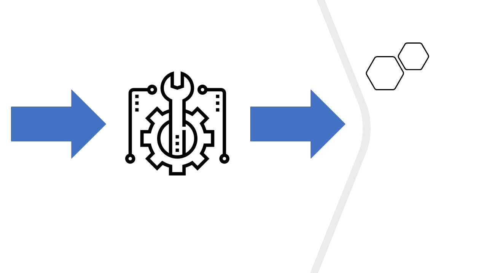
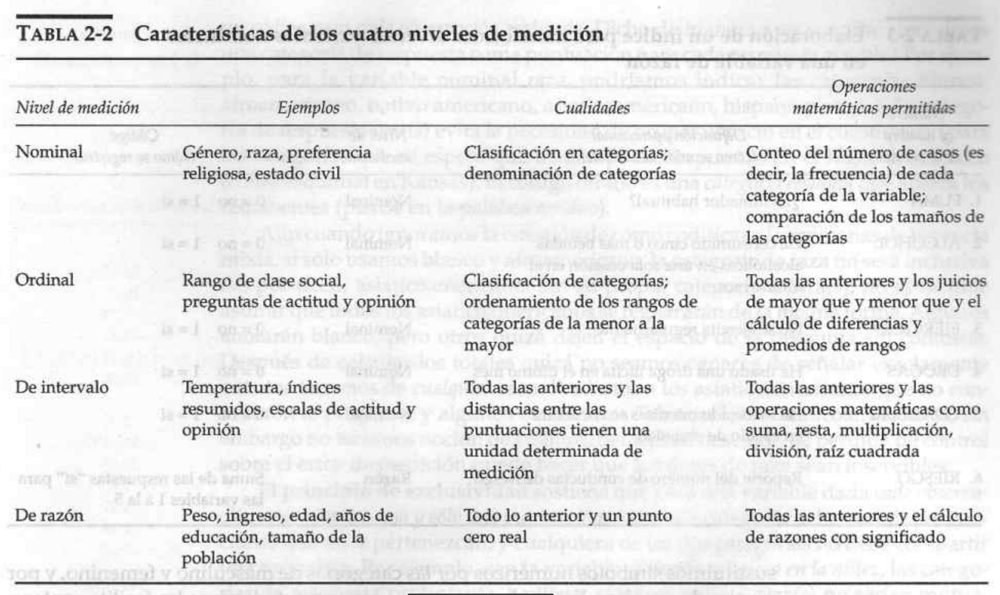

```{r setup_theme0, include = FALSE}
rm(list=ls());gc()
if(!grepl("4.1.2",R.version.string)){stop("Different version (must be 4.1.2)")}


options(servr.daemon = TRUE)
```

```{cat, engine.opts=list(file = "mylibs/zoom.html"), include=F}
<script src="https://lab.hakim.se/zoom-js/js/zoom.js" type="text/javascript"></script>
<script type="text/javascript">
	slideshow.on( "beforeHideSlide", function( slide ) {
		zoom.out();
	} );
	slideshow.on( "afterShowSlide", function( slide ) {
		document.querySelector( ".remark-visible" ).addEventListener( "dblclick", function( event ) {
			event.preventDefault();
			zoom.to( {element: event.target} );
		} );
	} );
</script>
```

```{r setup, include = FALSE}
local({r <- getOption("repos")
       r["CRAN"] <- "https://cran.dcc.uchile.cl/"
       options(repos=r)
})

if(!require(pacman)){install.packages("pacman")}
pacman::p_load(devtools, here, showtext, ggpattern, RefManageR, pagedown, magick, bibtex, DiagrammeR, xaringan, xaringanExtra, xaringanthemer, fontawesome, widgetframe, datapasta, tidyverse, psych, tidyverse, cowplot, pdftools, showtext, compareGroups, ggiraph, sf, distill, data.tree,
               widgetframe, install= T)

if(!require(xaringanBuilder)){devtools::install_github("jhelvy/xaringanBuilder",upgrade = "never")}
if(!require(icons)){remotes::install_github("mitchelloharawild/icons",upgrade = "never")}

test_fontawesome<- function(x="github"){
tryCatch({
  invisible(fontawesome::fa(name = x))
  return(message("fontawesome installed"))
},
# ... but if an error occurs, tell me what happened: 
error=function(error_message) {
  message("Installing fontawesome")
  icons::download_fontawesome()  
})
}

vec_col<-c("#660600","#6F3930","#745248","#786B60","#E6E6E6","#738FBC","#003891","#3C5279","#786B60","#B48448","#EF9D2F","#D99155","#E3D1C2","#E0BC9E","#ABB0BF","#835F69","#5A0D13")
plot_prueba<-barplot(1:length(vec_col), col=vec_col)

#https://coolors.co/21177a-fe4a17-788aa3-45503b
xaringanthemer::style_duo( #ABB0BF
  primary_color = "#FFFFFF",  #555555 gris oscuro
  secondary_color = "#DD3333",#"#FF5252"))) 
  text_color = "#333333", #bc7777
  text_bold_color = "#FF5252",
  #base_color = '#bc7777',
  background_position = 'center',
  header_font_google = google_font("Lato"),#Josefin Sans
  text_font_google   = google_font("Lato", "400", "400i"),
  code_font_google   = google_font("Lato"),
  code_font_size = '53%', #sirve
  padding = "0.4em 2.4em 0.4em 2.4em",
  extra_fonts = list(google_font("Arial Narrow")),
 # title_slide_background_image = "./_figs/bg_portada.svg",
#  title_slide_background_size = "cover",
 # background_image = "./_figs/bg.svg",
  background_size = "cover",
  extra_css =
  list(
  ".remark-slide-scaler" = list("overflow-y" = "auto"), # para no tener limites de extensión
 # ".remark-slide-number" = list("display" = "none"), #oculta el reloj también
 # "pre"= list("line-height"= "0.2em"),
  ".gray"   = list(color = "#aaaaaa"),
  ".black"   = list(color = "#bc7777"),
  ".darkgreen"   = list(color = "#45503B"),
  ".darkred"   = list(color = "#591F0A"),
  ".small" = list("font-size" = "90%"),
  ".pull_c" = list("float" = "center","width" = "30%", "height" = "50%", "padding-left" = "40%"),
  ".pull_c_title" = list("height" = "90%"),
  ".pull_l_70" = list("float"= "left","width"= "72%", "font-size"= "90%"),
  ".pull_r_30" = list("float"= "right","width"= "23%", "font-size"= "90%"),
  ".pull_left"  = list("float"= "left","width"= "47%", "height"= "100%", "padding-right"= "2%"),
  ".pull_right" = list("float"= "right","width"= "47%", "height"= "100%", "padding-left"= "2%"),
  ".small_left"  = list("float"= "left", "width"= "47%", "height"= "50%", "padding-right"= "2%"),
  ".small_right" = list("float"= "right","width"= "47%", "height"= "50%", "padding-left"= "2%"),
  ".left_code" = list("float"="left","width"="47%","height"="100%","padding-right"="2%",    "font"="Roboto"),
  ".code_out"  = list("float"="right","width"="47%","height"="100%","padding-left"="2%",    "font"="Roboto"),
  ".text_180" = list("font-size" = "180%"),
  ".text_170" = list("font-size" = "170%"),
  ".text_160" = list("font-size" = "160%"),    
  ".text_150" = list("font-size" = "150%"),
  ".text_140" = list("font-size" = "140%"),  
  ".text_130" = list("font-size" = "130%"),
  ".text_120" = list("font-size" = "120%"),
  ".text_110" = list("font-size" = "110%"),
  ".text_110" = list("font-size" = "110%"),
  ".text_100" = list("font-size" = "100%"),
  ".code_10" = list("code-inline-font-size"= "60%",
                    "overflow-y" = "scroll !important",
                    "overflow-x" = "scroll !important",
                    "max-height" = "5vh !important",
                    "line-height"= "0.75em"),
   ".code_10_pre" = list("code-inline-font-size"= "60%",
                    "overflow-y" = "scroll !important",
                    "overflow-x" = "scroll !important",
                    "max-height" = "15vh !important",
                    "line-height"= "0.75em",
                    "min-height"="0.5em"
                    ),
  ".code_15" = list("code-inline-font-size"= "15%",
                    "overflow-y" = "scroll !important",
                    "overflow-x" = "scroll !important",
                    "max-height" = "10vh !important"),
  ".text_90" = list("font-size" = "90%"),
  ".text_80" = list("font-size" = "80%"),
  ".text_70" = list("font-size" = "70%"),
  ".text_65" = list("font-size" = "65%"),
  ".text_60" = list("font-size" = "60%"),
  ".text_50" = list("font-size" = "50%"),
  ".text_40" = list("font-size" = "40%"),
  ".text_30" = list("font-size" = "30%"),
  ".text_20" = list("font-size" = "20%"),
  ".line_space_15" = list("line-height" = "1.5em;"),
  ".line_space_13" = list("line-height" = "1.3em;"),
  ".line_space_11" = list("line-height" = "1.1em;"),
  ".line_space_15" = list("line-height" = "1.5em;"),
  ".line_space_09" = list("line-height" = "0.9em;"),
  ".line_space_07" = list("line-height" = "0.7em;"),
  ".line_space_05" = list("line-height" = "0.5em;"),
  ".largest" =  list("font-size" = "2.488em;"),
  ".larger" =  list("font-size" = "2.074em;"),
  ".large" =  list("font-size" = "1.44em;"),
  ".small" =  list("font-size" = "0.833em;"),
  ".smaller" =  list("font-size" = "0.694em;"),
  ".smallest" =  list("font-size" = "0.579em;"),
  ".limity150" = list("max-height" = "150px;",
                     "overflow-y" = "auto;"
      ),
    ".tiny_text" = list(
      "font-size"= "70%"
      ),
    ".large_text" = list(
      "font-size"= "150%"
      ),
    ".slide_blue" = list(
      "background-color" = "#FEDA3F",
      "color" = "#3C3C3B"
      ),
  ".center_image" = list(
    margin  = "0",
    position = "absolute",
    top      = "50%",
    left     = "50%",
    '-ms-transform' = "translate(-50%, -50%)",
    transform = "translate(-50%, -50%)"
    ),
    ".center_down_image" = list(
    margin  = "0",
    position = "absolute",
    top      = "90%",
    left     = "50%",
    '-ms-transform' = "translate(-50%, -50%)",
    transform = "translate(-50%, -50%)"
    ),
    "slides > slide" = list(
    "overflow-x"  = "auto !important",
    "overflow-y" = "auto !important"
    ),
 #   "pre" = list(
#    "white-space"  = "pre !important",
#    "overflow-y" = "scroll !important",
#    "max-height" = "40vh !important",
#    "font-size" = "0.8em"
#    ),
    ".superbigimage" = list(
    "white-space"  = "nowrap",
    "overflow-y" = "scroll"
    )
  )
)

options(htmltools.preserve.raw = FALSE)


#knitr::opts_chunk$set(comment = NA) # lo saqué pa probar por si
knitr::opts_chunk$set(dpi=720)
#options(htmltools.preserve.raw = FALSE)#A recent update to rmarkdown (in version 2.6) changed how HTML widgets are included in the output file to use pandoc's raw HTML blocks. Unfortunately, this feature isn't compatible with the JavaScript markdown library used by xaringan. You can disable this feature and resolve the issue with htmlwidgets in xaringan slides by setting
#https://stackoverflow.com/questions/65766516/xaringan-presentation-not-displaying-html-widgets-even-when-knitting-provided-t/65768952#65768952


xaringanExtra::use_progress_bar(color = "#12636B", location = "top")#, height = "550px")
xaringanExtra::use_animate_css()
xaringanExtra::use_scribble() #son los lapices
xaringanExtra::use_tile_view()
xaringanExtra::use_panelset()
xaringanExtra::use_editable(expires = 1)
xaringanExtra::use_fit_screen()

#https://gist.github.com/gadenbuie/61b27108ceec6c7a55cd9966609128d7

# padding-top: 0.4em;
# padding-right: 2.4em;
# padding-bottom: 0.4em;
# padding-left: 2.4em;
invisible("https://www.youtube.com/watch?v=M3skTMQbCD0")
invisible("https://zane.lol/slides/adirondack/#39")
#https://titanwolf.org/Network/Articles/Article?AID=3896fe2c-1b3b-4ebd-9906-1f9ed1675b35#gsc.tab=0
#https://annakrystalli.me/talks/xaringan/xaringan.html#55
#https://bookdown.org/yihui/rmarkdown/some-tips.html
#https://arm.rbind.io/slides/xaringan.html#90
#https://stackoverflow.com/questions/62069400/font-size-of-figure-in-xaringan-slide-too-small
#https://irene.vrbik.ok.ubc.ca/blog/2021-07-14-xaringan-slides/

#https://evamaerey.github.io/doublecrochet/
#devtools::install_github("paulhendricks/anonymizer")
check_code <- function(expr, available){
  if(available){
    eval(parse(text = expr))
  } else {
    expr
  }
}
path2<-dirname(rstudioapi::getSourceEditorContext()$path)
#knitr::opts_chunk$set(message = FALSE,warning = FALSE, error = FALSE)

```


```{r, load_refs, include=F, eval=T, cache=FALSE}
library(RefManageR)
BibOptions(check.entries = FALSE,
           bib.style = "numeric",
           cite.style = "numeric",
           style = "markdown",
           super = TRUE,
           hyperlink = FALSE,
           dashed = FALSE)
warning(paste0(path2,"/libreria_generica.txt"))

myBib <- ReadBib(paste0(path2,"/libreria_generica.txt"), check = FALSE)

```


class: title-slide, middle, right 

<br>

<br> 
 
.line_space_15[ 
## .text_80[Taller <br> de Reforzamiento]
]

<br>

.line_space_11[
    
<br>

.text_70[[Código en: `r fontawesome::fa(name = "github")`](https://github.com/AGSCL/Taller_UDP)]

.text_110[Clase 1.5. Nivelación]

]

<!---
- Trabajar en proyectos en R (convenciones y buenas prácticas para guardar y abrir datos, códigos, referencias, salidas de código, figuras, etc.)
- Visualización de datos mediante ggplot (lógica de capas, propiedades de los gráficos, paquetes estadísticos complementarios ) 
La aplicación de estos contenidos se hará mediante ejercicios de estadística descriptiva y modelos de regresión logística en R

http://observatorio.ministeriodesarrollosocial.gob.cl/encuesta-social-covid19-cuarta-ronda
--->

.bg-text[


`r withr::with_locale(new = c('LC_TIME' = 'es_ES'), code =format(Sys.time(),'%d de %B, %Y'))`


.text_100[Andrés González Santa Cruz]

.text_65[gonzalez.santacruz.andres@gmail.com] [`r fontawesome::fa(name = "github")`](https://github.com/AGSCL) [`r fontawesome::fa(name = "orcid", fill="green")`](https://orcid.org/0000-0002-5166-9121)
]

<br>
  
```{r echo=FALSE, out.width = '15%'}
knitr::include_graphics('./_style/cropped-logotipo_fsch.png')
```

???
*#_#_#_#_#_#_#_#_#_#_
**NOTA**
*#_#_#_#_#_#_#_#_#_#_

- 

---
layout: true
class: animated, fadeIn
---

### Rel. Con Objetos
- `<-` **convierte en objetos** (También hay "=") ([SCRIPT](https://raw.githubusercontent.com/AGSCL/Curso_R/master/0c963a043f92e3c567b6afb48d406df5a2f38f5c/equal_vs_arrow.png))
- `ls` enlista todos los objetos y funciones definidas que están en "Environment"
- `rm` se utiliza para remover objetos

### Operadores

**Aritméticos Básicos**: Suma (`+`), resta (`-`), multiplicación (`*`), división (`/`), exponentes (`^`) y paréntesis (`()`).

**De comparación**: `<`, `<=`, `>`, `>=`, `==`, `!=`


.center[
** La consola utiliza > al principio para indicar que se puede ejecutar algo (mientras carga, ese signo no estará activo)**
]

???
*#_#_#_#_#_#_#_#_#_#_
**NOTA**
*#_#_#_#_#_#_#_#_#_#_
EXPLICAR CADA UNO DE ELLOS
¿ Por qué = = y no sólo =?, lo veremos más adelante, 
pero es por que se aplica a un vector (a un grupo de números de manera sucesiva, y no a objetos únicos)

---
## Ejercicio (continuación)

- Cargamos la base de datos
```{r data, echo=TRUE}
#head= primeras 6 observaciones; 
#data.frame= formato de datos data.frame; 
#round= aproximar ; 
#rnorm= números aleatorios conforme a distribución normal
set.seed(4567);df_ej<- data.frame(numeros=round(rnorm(1:200)*100,0))
```
- Obtenemos las primeras 3 observaciones
```{r head, echo=TRUE}
set.seed(4567);head(data.frame(numeros=round(rnorm(1:200)*100,0)),2)
```
- Vemos los primeros 2 números y los sumamos
```{r sum, echo=TRUE}
-74-90
#capturamos lo que la consola nos entrega en un objeto
resta<-capture.output(-74-90) 
```

- Ejecuto en la consola lo siguiente: `sessionInfo` (detalles de la sesión y configuración programa) y `dput` (para que otros puedan trabajar fácilmente sobre los datos que trabajas). Permite control y que los datos sean reproducibles (ej. Github).

.details[
```{r dput, echo=TRUE}
dput(head(data.frame(numeros=round(rnorm(1:200)*100,0)),2))

```
]

.details[
```{r session, echo=TRUE}
sessionInfo()
```
]

---
## Conceptos Previos- Funciones

<div class="brown">"To understand computations in R, two slogans are helpful: Everything that exists is an object. Everything that happens is a function call."- John Chambers </div>

<br>

- Una función define relaciones entre distintos objetos

- Permite automatizar tareas

```{r Fig Ej20, fig.align="center", message=FALSE, warning=FALSE, cache=T, echo =F, out.width = "200x"}
#knitr::include_graphics("G:/Mi unidad/Alvacast/Curso/Ejercicio20.png")

```

- Las funciones pueden contener otras funciones ("anidadas"/"nested")

- Hay funciones tan complejas que requieren muchos argumentos, referencias, condiciones, etc.

- Toda función tiene un nombre, un argumento (puede estar definido por defecto) y un cuerpo

- Los resultados de las operaciones pueden arrojar advertencias (para considerar) o errores (la ejecución para). Gran parte de los errores y advertencias están programadas, pueden ser buscadas en la red.

## Conceptos Previos- Funciones(2)

Ejemplo: "head"

- ¿Cuántas filas entrega por defecto?

- Esa especificación es un argumento por defecto

- El cuerpo, no lo vemos

```{r head2, echo=T, size = 'tiny'}
print.function(head)
getAnywhere(head)[2]
```

---
## Conceptos Previos- Paquetes Estadísticos

- Una de las características que hace la diferencia entre otros programas. 

- Un paquete estadístico contiene distintas funciones (comandos). 

- Son extensiones de R: Contienen código, datos y documentación **estandarizada**.

- Los paquetes en general se alojan en repositorios (CRAN, MRAN, GitHub, and BioConductor).

- Las librerías son un directorio local que contiene los paquetes instalados

- En general las librerías tienen archivos de documentación similares a formato Latex, con información de sus versiones, la fuente, etc.

<div class="superbigimage">
```{r Fig-Latex, fig.align="center", message=FALSE, warning=FALSE, cache=T, echo =F, out.width = "400px"}
knitr::include_graphics("_figs/ejemplo_latex.PNG")
```
</div>

---
## Conceptos Previos- Repositorio CRAN

- Abra Rstudio y presione `Alt + T + G` (WIN) o `	Cmd+, [comma] (Chrome, Desktop), Option+Cmd+, [comma] (Safari, FireFox)` (MAC)

```{r Fig Repositorio, fig.align="center", message=FALSE, warning=FALSE, cache=T, echo =F, out.width = "400px"}
knitr::include_graphics("_figs/Repositorios.png")

```

- Veo desde donde consigo los datos, desde que servidor de R

- Esta es una de las direcciones del CRAN (Comprehensive R Archive Network) correspondiente a Chile. 

- Es recomendable definir por defecto un CRAN cercano. 

.center[
`options(repos=structure(c(CRAN="https://cran.dcc.uchile.cl/")))`
]

---
## Instalación de Paquetes Estadísticos

- Abra Rstudio, cree un proyecto de nombre "Curso 2", 
- Abra un Script, escriba en él y ejecútelo (Run) 

.details-code[
```{r crear mean_curso, echo=T, size = 'tiny'}
set.seed(4321) #Creamos una semilla para la generación de datos, 
#de manera que los podamos reproducir
datos<- rnorm(200, 4, .5) #Generamos 200 números aleatorizados, con un promedio 4 y una desviación estándar de 0,5
#siguiendo distribución normal.
promedio_curso <- function(x) {sum(x)/length(x)} #creamos una función que suma 
#datos y los divide por su largo
print(promedio_curso(datos))
print(sum(datos)) #la suma de los datos
print(length(datos)) #el largo de los datos
.libPaths() # get library location
```
]

- Algo que hacíamos en 2 ejecuciones, lo hicimos en una


---
## Instalación de Paquetes Estadísticos(2)

- Ingrese en la consola o en un Script, la instalación del paquete "dplyr",  `install.packages("dplyr")`
- Habiendo hecho esto, usted está instalando el paquete, pero no lo ha activado ni lo ha abierto
- Para activarlo momentáneamente (`library(dplyr)`).
  - Muchos autores no recomiendan "require", sino "library" (https://stackoverflow.com/q/5595512/9975513)
  - Una ventaja de `require` es que entrega un valor binario si el paquete se cargó o no (VERDADERO/FALSO)
  - La amenaza es que si uno corre líneas de código, se obvia el error
  - Esto puede llevar a resultados erróneos (ej: aplicando funciones de otros paquetes con mismo nombre)
- Existen otros argumentos de la función install.packages:
- Ubicación de la librería, Repositorio (CRAN, MRAN, Bioconductor,local, etc.), instalar paquetes dependientes, etc.
- Si no conoce el origen de una función, puede consultarlo anteponiendo "?" o utilizando la función  `help()`
- A veces, los paquetes estadísticos generan contradicciones entre sí (ej: plyr y dplyr). Para ello, se recomienda desactivar o "despegar" un paquete (`detach(package:[NOMBRE_PAQUETE])`)

```{r Fig install, fig.align="center", message=FALSE, warning=FALSE, cache=T, echo =F, out.width = "150x"}
knitr::include_graphics("_figs/install_package.png")

```
.details-code[
```{r tipos_paquete, echo=T,  eval=F}
#OPC 1- una lista de paquetes estadísticos. Por cada fila, verá si existe el paquete.
#Si no, lo instala sin preguntar desde un repositorio CRAN
if(!require(paquete1)){install.packages("paquete1")}
if(!require(paquete2)){install.packages("paquete2")}
if(!require(paquete3)){install.packages("paquete3")}
if(!require(paquete4)){install.packages("paquete4")}
#:#:#:#:#:#:#:#:#:#:#:#:#:#:#:#:#:#:#:#:#:#:#:#:#:#:#:#:#:#:#:#:#:#:#:#:#:#:#:#:
#OPC. 2- Vemos que una lista de paquetes estadísticos se encuentren instalados; 
#si no lo están, aparece un mensaje
for (n in c("paquete1", "paquete2", "paquete3", "paquete4", "paquete..."))
{
  if(!require(n,character.only=TRUE))
  {
   stop(paste0("El paquete '",n,"' no está instalado: por favor instálelo e inténtelo de nuevo!\n"));
   # install.packages(n) # Si prefiere que lo instale automátiamente.
  }
  library(n,character.only=TRUE)
}
```
]

---
## Objetos de Trabajo

Almacenan datos, tienen distintas **estructuras** que le dan soporte. A continuación presentaremos las más básicas, junto con sus propiedades:

### Vectores
- Aloja elementos/valores del mismo tipo (Posteriormente podrá ver los [Tipos de Variables](#12))
- De ahí que elementos de distintos tipos serán coercionados a adoptar el tipo de caracter
- Permite tomar un rango de ellos, excluir otros elementos, especificar los que se obtendrán mediante un criterio lógico (VERDADERO/FALSO).
- Son el fundamento de muchas otras estructuras.
- Permite ser ordenado
- Si se utilizan vectores de distinto largo, las funciones pueden reciclarse
- Constructor de vectores, **combine**: `c()`

### Factores
- Son vectores que alojan variables de tipo categórico u ordinal
- La ventaja es que las etiquetas se graban sólo una vez, en niveles (`levels()`)
- Por tanto, aloja un vector con valores enteros, dependiendo de la cantidad de valores únicos
- Otra es que permite informar a otros algoritmos respecto al tipo de datos que alojan (ej. regresión logística)
-`as.character()`

### Listas
- Contienen elementos de distintos tipos, hasta objetos, de manera ordenada
- De ahí que pueden estar anidados entre ellos
- Los elementos pueden no estar relacionados entre sí
- La función `list()` permite generarla. Es opcional agregarle nombres a cada elemento, pero permite llamarlos con mayor facilidad.

### Matrices
- Forma tabular, bidimensional y de naturaleza homogénea
- Coarta su formato si se incorporan elementos de distinto tipo
- Admite nombres a sus dimensiones (`dimnames`)
- Generalmente numéricos
- [x,y]
- Por defecto, de arriba a abajo (bycol=T)

### Array
- Tabla multidimensional
- Tiene filas, columnas y otras capas

### Data frame
- Marco/Trama/Conjunto de Datos
- Bidimensional
- Heterogéneas
- Similar a una base de datos .csv o una planilla excel (aunque más restringida)
- Los nombres de las columnas no pueden estar vacíos (el programa los llenará)
- Es un dataset que está organizado en columnas (cada columna con su nombre)
- Cada columna debe contener valores del mismo tipo
- Similar a las bases de datos de SAS o SPSS
- Se entiende como una lista de vectores o factores con la misma extensión (largo `length()` de columna 1 será el mismo que el del resto de las columnas)
- Propiedades `names()`, `colnames()`, `rownames()`, `is.data.frame()`, `str()`, `attr()`, `dim()`

### Tibbles
- Una nueva configuración de un data frame
- No fuerza a las columnas de caracteres a comportarse como factores
- No entrega nombres de columnas automáticamente
- Más sensible: da más advertencias
- Es más cauto al reciclar vectores
- No recomendable para bases de datos medianos/grandes (>50,000x10) (preferible data.table's)
- Pueden ser incompatibles con algunos paquetes

???
*#_#_#_#_#_#_#_#_#_#_
**NOTA**
*#_#_#_#_#_#_#_#_#_#_
Usar cbind() para agregar una nueva columna a un data frame
Usar rbind() para agregar una nueva fila a un data frame
Entender el uso de length() en un data frame

---
## Ejemplos, Objetos de Trabajo

- ¿Lista o vector?

```{r vectores1, echo=T, size = 'tiny'}
c(4,6,8,10)
```

-¿Lista o vector?

```{r lista1, echo=T, size = 'tiny'}
c("d",6,"v",10)
```

- Aquí vemos que una matriz  puede tener 2 atributos: número de filas y número de columnas. ¿Cómo ordena los datos por defecto una matriz?

```{r matrices1, echo=T, size = 'tiny'}
matrix(1:4, nrow = 2, ncol = 2) #ATRIBUTOS DE UNA MATRIZ,tener en cuenta para después
```

```{r matrices2, echo=T, size = 'tiny'}
matrix(1:4, nrow = 2, ncol = 2)*matrix(c(46,57,32,88),nrow=2)
```

- Matriz o Array ¿?

.details-code[
```{r array, echo=T, size = 'tiny'}
x<-array(c(52,41,25,85,136,128,28,59,65,16,1,133),c(2,3,2))
dimnames(x)<-list(c("H","M"),c("desempleado","empleado","inactivo"),c("santiago","valparaiso"))
print(x)
##... mmmm... dimnames...¿qué serán? (se verá después)
```
]

---
## Tablas

- De una vía o de 2

```{r tab1, echo=T, size = 'tiny'}
asistentes_curso_2020 <- 
  data.frame(condicion=c("Estudiante Doctorado",".","Académico", "Funcionario", "Estudiante Doctorado",".", "Estudiante Doctorado", "Académico", "Funcionario", ".", "Estudiante"),externo=c("interno", "externo", "interno", "interno", "interno", "externo", "interno", "interno", "interno",  "externo", "interno"),asistencia=c(4, 4, 2, 2, 4, 3, 4, 1, 4, 2, 4))
table(asistentes_curso_2020$condicion) %>% knitr::kable("markdown")
```

- Argumento "Exclude"

```{r tab2, echo=T, size = 'tiny'}
table(asistentes_curso_2020$condicion, exclude=".")%>% knitr::kable("markdown")
```

- Proporciones

```{r tab22, echo=T, size = 'tiny', error=T}
prop.table(table(asistentes_curso_2020$condicion, exclude="."))%>% knitr::kable("markdown")
prop.table(asistentes_curso_2020$condicion) %>% knitr::kable("markdown")#requiere una tabla
```

- De dos vías

```{r tab3, echo=T, size = 'tiny', error=T}
prop.table(table(asistentes_curso_2020$condicion,
                 asistentes_curso_2020$externo #se incluye otra variable
                 ))%>% knitr::kable("markdown")
```

- Dirección (eje). 

```{r tab32, echo=T, size = 'tiny', error=T}
prop.table(table(asistentes_curso_2020$condicion,
                 asistentes_curso_2020$externo
                 ),margin= 2)%>% knitr::kable("markdown") #cambia la manera en que se calculan las proporciones
# 1 = proporciones por filas, 2= por columnas, NULL =frecuencias globales.
```
- Si cambia el eje, pero también el margin, ¿qué ocurre?

- margin.table, Calcula la suma de entradas de una tabla para determinado índice

```{r tab4, echo=T, size = 'tiny', error=T}
margin.table(table(asistentes_curso_2020$condicion,
      asistentes_curso_2020$externo
),1)%>% knitr::kable("markdown")
margin.table(table(asistentes_curso_2020$condicion,
      asistentes_curso_2020$externo
),2)%>% knitr::kable("markdown")
```

- la manera dplyr

```{r tab5, echo=T, size = 'tiny', error=T}
library(janitor)
asistentes_curso_2020 %>% 
janitor::tabyl(condicion, externo) %>% 
  adorn_totals(c("row", "col")) %>% #añade un total para cada uno
  adorn_percentages("col") %>% #calcula porcentajes
  adorn_pct_formatting(2)%>% knitr::kable("markdown") #añade el símbolo de porcentaje y formatea, por ejemplo, cuántos decimales mostrar
```

---
## Ejemplo aplicado

- Seleccionar velocidades altas en base a un vector de valores
- Generar una matriz de distancia recorrida y velocidad (en mph)

.details[
```{r ej_mat_vec, echo=T, size = 'tiny'}
if(!require(dplyr)){install.packages("dplyr")} #si no existe, se instala
library(dplyr) #cargo dplyr
data(cars) #cargo la base de datos cars de dplyr
glimpse(cars) # exploro los datos
vec_vels<-c(23,24,25) # vector de velocidades altas seleccionadas
cars %>% 
  dplyr::filter(speed %in% vec_vels) %>%  #filtro en base a un vector
  janitor::tabyl(speed, dist)%>% knitr::kable("markdown") #matriz de velocidad por distancia
```
]

## Indexación, Subconjuntos y Atributos, Objetos de Trabajo

- Subset
```{r subset, echo=T, size = 'tiny'}
print(c(1,2,3,4,5))[3]
#¿Y ahora?, ¿qué llama la atención?
print(c(1,2,3,4,5)[3:6])
#¿por qué aparece un error?
tryCatch(print(c(1,2,3,4,5)[3:6,6]), error = function(e) "ERROR") ## una función para que en caso de que arroje error, no interrumpa la ejecución del los scripts.
```

## Indexación, Subconjuntos y Atributos, Objetos de Trabajo 2

- Propiedades de una base de datos data.frame 
  - `$` para seleccionar una columna de una base de datos
  - `[,]` que nos permiten visualizar determinados elementos de una base de datos

.details[
```{r df, echo=T, size = 'tiny'}
data("women")
dimnames(women)
str(women)
names(women)
women$height
women[3,1]
women[3,"height"]
```
]

- Ejemplo de un Tibble (requiere instalar un paquete). Véanlo como data.frame (`as.data.frame(cbind(sexo=rep("H","M",8),sexo=rep(c("H","M","M","H"),2),tarea=c("auto","casa", "barrio", "cohete","hipopotamo","nieve","hijo","sal")))`), vean sus propiedades, ¿qué cambió?

.details[
```{r tibble, echo=T, message=FALSE, warning=FALSE}
if(!require(tibble)){install.packages("tibble")};tibble::as_tibble(cbind(sexo=rep("H","M",8),sexo=rep(c("H","M","M","H"),2),objeto=c("auto","casa", "barrio", "cohete","hipopotamo","nieve","hijo","sal")))
```
]

???
*#_#_#_#_#_#_#_#_#_#_
**NOTA**
*#_#_#_#_#_#_#_#_#_#_
El error se produce por llamar a una segunda dimensión que el vector no tiene
Lo que cambia es lo propio de un tibble: la columna duplicada cambia a V2 para no generar confusión y no convierte a factores los strings

---
## Tipos y niveles de medición

.details-code[
```{r tip-niv, echo=T, message=FALSE, warning=FALSE}
gr3<-
DiagrammeR::grViz("
digraph causal {
  # Nodes
  node [shape = plaintext]
  a [label = 'Variable',fontsize=10]
  b [label = 'Cualitativa o atributo\n(Nombradas)',fontsize=10]
  c [label = 'Cuantitativa o numérica\n(Puntuaciones)',fontsize=10]
  d [label = 'Nominal\n(No clasificada)',fontsize=10]
  e [label = 'Ordinal\n(Clasificada)*',fontsize=10]
  f [label = 'Discreta',fontsize=10]
  g [label = 'Continua',fontsize=10]
  # Edges
  edge [color = black,
        arrowhead = vee]
  a -> b      
  a -> c      
  b -> d
  b -> e
  c -> f
  c -> g
  rankdir = TB
{ rank = same; b; c}
  rankdir = LR
{ rank = same; d; e; f; g }
  # Graph
  graph [overlap = true]
}", height=400)#, height = '100%', width = '100%'
gr3
```
]

```{r echo=FALSE, fig.retina = 1, fig.align='center'}
widgetframe::frameWidget(gr3)#,width = "150%"
```

---
## Niveles de Medición

| Niv. Medición | Clasificación | Orden | Un. Medida Constante | Cero Absoluto |
|:------:|:-----:|:---------:|:------:|:------:|
| Nominal | X |  |  |  |
| Ordinal | X | X |  |  |
| Intervalo | X | X | X |  | 
| Razón | X | X | X | X | 
<br>

- Variables categóricas, cualitativas, no métricas
  - Nominales
  - Ordinales
- Variables cuantitativas, métricas
  - Continuas
  - Discretas
- Escalas  
  - De Intervalo
  - Razón o Proporción


???
*#_#_#_#_#_#_#_#_#_#_
**NOTA**
*#_#_#_#_#_#_#_#_#_#_

Comentarios:

Nominales 
• Permiten clasificar las diferentes características de los casos en categorías excluyentes. 
• Ninguna tiene mayor jerarquía que la otra. Por lo tanto, difieren en cualidad, no en magnitud numérica. 
• Se les denominan variables dicotómicas cuando tienen sólo dos categorías de respuesta.

Ordinales 
• Sus valores se pueden clasificar pero también ordenar. 
• Hay categorías, pero además éstas mantienen un orden de mayor a menor e indican jerarquía 
• Se puede afirmar si son iguales o diferentes, y si uno es mayor o menor que el otro

1) De Intervalo 
• Se parecen a las ordinales pero con una propiedad adicional:la diferencia entre dos valores de datos cualesquiera tiene un significado. 
• Es decir, se conoce la distancia exacta entre dos categorías. • Sólo tiene un cero (0) arbitrario (ausencia de cantidad) (ej. temperatura)

2) De Razón o Proporción 
• Tiene las mismas características del intervalo, pero tiene una propiedad adicional: consideran el cero absoluto, que indica “nada” de cantidad. 
• Para valores de este nivel tanto las diferencias como las proporciones tienen significado (ej. altura)

Es muy importante saber las propiedades de cada una, ya que de ello se derivarán nuestros supuestos

---
## Niveles de Medición (continuación)

```{r Fig Var_ritchey, fig.align="center", message=FALSE, warning=FALSE, cache=T, echo =F, out.width = "600x", cap="Ritchey, 2002, p. 47"}

```
$^{Fuente: Ritchey, 2002, p. 47}$


???
*#_#_#_#_#_#_#_#_#_#_
**NOTA**
*#_#_#_#_#_#_#_#_#_#_
Comentarios:
Desde luego hay variables que pueden medirse en más de un nivel, según el propósito de medición.
Por ejemplo: la variable “Uso de internet para estudio/trabajo”
• De razón  medida en “Horas al día” ( 0 a k horas)
• Ordinal  medida mediante las categorías “Muy frecuentemente”; “Frecuentemente”; “Casi nunca”; “Nunca”.


---
## Tipos de Variables

Existen 5 tipos de variables (modos) básicas o "atómicas" en R (dependiendo del tipo de valores que se le asigna a cada objeto). Estos determinan cómo los datos serán formateados, mostrados y tratados (`typeof([OBJETO])` y `class([OBJETO])`, por si quiere saber más [enlace](https://stats.stackexchange.com/questions/3212/mode-class-and-type-of-r-objects) y [enlace2](https://stackoverflow.com/questions/35445112/what-is-the-difference-between-mode-and-class-in-r)).

- Numérico (numeric): valores numéricos, incluye decimales. `{2,1.5,3}`

- Entero (integer): números enteros, no incluye decimales. `{4,8,34}`

- Caracter (character): Variables Cadena (alfanuméricas). `"andres", "pedro"`

- Lógico (logical): valores lógicos, verdadero o falso. `{TRUE/FALSE, 0/1}`

Además, es posible tratar las variables ("casting") como factores. En este caso, las variables corresponden a valores enteros que tienen etiquetas para los distintos valores. Por otra parte, existen estructuras más complejas (tipo abstracto), como las fechas `(dttm, POSixct)`, que provienen de estas formas básicas y que van más allá del alcance de este taller

---
## Otros Valores Especiales

- `NA` (no disponibles), puede entenderse como valores perdidos. Tiende a ser recodificado como "99" o "999" (distinguir de los No Aplica, "88" o "888")

- La `r 1/0` infinidad se entiende como `Inf`

- `r 0/0` es un valor indefinido `NaN` (not a number)

- Sólo hay una propiedad `NULL`, similar a largo 0

```{r crear special_char, echo=T, message=FALSE, warning=FALSE}
is.finite(c(2,3,4,5)/c(0,1)) # se recicla
is.infinite(matrix(c(1,2,5),nrow=2,ncol=2)/matrix(c(0,4),nrow=2,ncol=2))  #va a reciclar la primera observación
is.nan(c(2/5,6/6,0/0))
is.na(c(1,2,NA,4,5))
complete.cases(c(1,2,NA,4,5))
anyNA(c(1,2,NA,4,5))
anyNA(c(1,2,3,4,5))
is.null(c(1,2,3,4,5))
is.null(c(1,2,NA,4,5))
is.null(c())
library(car) #cargo librería
car::recode(c(1,2,NA,4,5), "NA=99") #reemplazo el valor perdido por un número en particular
```

---
## Ejercicio 1

**Juego de Cultura**
- La regla que aplicará es la siguiente: "a todas las palabras que digan deberán agregarle la frase 'por celular'"

- Sus compañeros dicen lo siguiente: `c("Debo comprar tickets para mañana", "Qué bueno sería juntarnos", "Voy a preparar un jugo")`

- La función `paste0` permite pegar elementos sin separación

```{r crear juego1, echo=T}
objeto <- "silencio"
paste0("Simón dice", objeto)
#considere que no agrega espacios, por lo que debe agregarlos usted
paste0("Simón dice", ", \'", objeto,"\'")
```

- Genere un objeto con las palabras utilizadas por sus compañeros de juego

- Agregue la frase "por celular"

---
## Ejercicio 2

- Usted ya instaló el paquete "dplyr"

- El paquete dplyr contiene múltiples funciones y bases de datos que veremos más adelante (https://cran.r-project.org/web/packages/dplyr/dplyr.pdf)

- Llame a la librería

- Cargue la base de datos "starwars"

- (Podría faltar el paquete magrittr, si el programa se lo pide, ¿sabría cómo instalarlo?)

- Ejecute este código: `starwars %>% dplyr::group_by(eye_color) %>% dplyr::summarise(promedio_altura_por_color_de_ojos=mean(height, na.rm=T))`

- Conversemos sobre lo que hizo

---
## Fuentes

- French, T. (2022, Noviembre 17), Data Types in R. [enlace](https://www.r-bloggers.com/2022/11/data-types-in-r-3/?utm_source=phpList&utm_medium=email&utm_campaign=R-bloggers-daily&utm_content=HTML)

- Hansen, M., Nolan, D. & Temple, D. (2008). Introduction to the R Language: Functions. Workshop: Integrating Computing into the Statistics Curricula. U.C. Berkeley.[Enlace](https://www.stat.berkeley.edu/~statcur/Workshop2/Presentations/functions.pdf)

- Wickham, H. & Grolemund, G. Proyecto de traducción colaborativa de "R para Ciencia de Datos". [https://es.r4ds.hadley.nz/](https://es.r4ds.hadley.nz/)

- Ritchey F. (2002). “Estadística para las Ciencias Sociales”. Editorial Mc Graw Hill
Interamericana editores S.A. de CV. México. [www.shorturl.at/pvK37](www.shorturl.at/pvK37)

- El ícono del engranaje fue elaborado por <a href="https://www.flaticon.com/authors/eucalyp" title="Eucalyp">Eucalyp</a> from <a href="https://www.flaticon.com/" title="Flaticon"> www.flaticon.com</a>
- Data Flair. R Tutorials. [https://data-flair.training/blogs/r-data-types/](https://data-flair.training/blogs/r-data-types/)

- Leisch F. (2008). Creating R packages: a tutorial. [http://cran.r-project.org/doc/contrib/Leisch-CreatingPackages.pdf](http://cran.r-project.org/doc/contrib/Leisch-CreatingPackages.pdf)

- R Tutorial. [https://www.statmethods.net/r-tutorial/index.html](https://www.statmethods.net/r-tutorial/index.html)


```{r exp, eval=F,echo=F, results="asis"}
library(pagedown)

#para exportar la presentación a PDF
pagedown::chrome_print(gsub(".Rmd",".html",rstudioapi::getSourceEditorContext()$path),output="pres_2022_3.pdf")
xaringanBuilder::build_pdf(gsub(".Rmd",".Rmd",rstudioapi::getSourceEditorContext()$path),complex_slides = TRUE,output_file="pres_2022_4.pdf")
xaringanBuilder::build_pdf(gsub(".Rmd",".Rmd",rstudioapi::getSourceEditorContext()$path),complex_slides = TRUE,output_file="pres_2022_5.pdf")
```