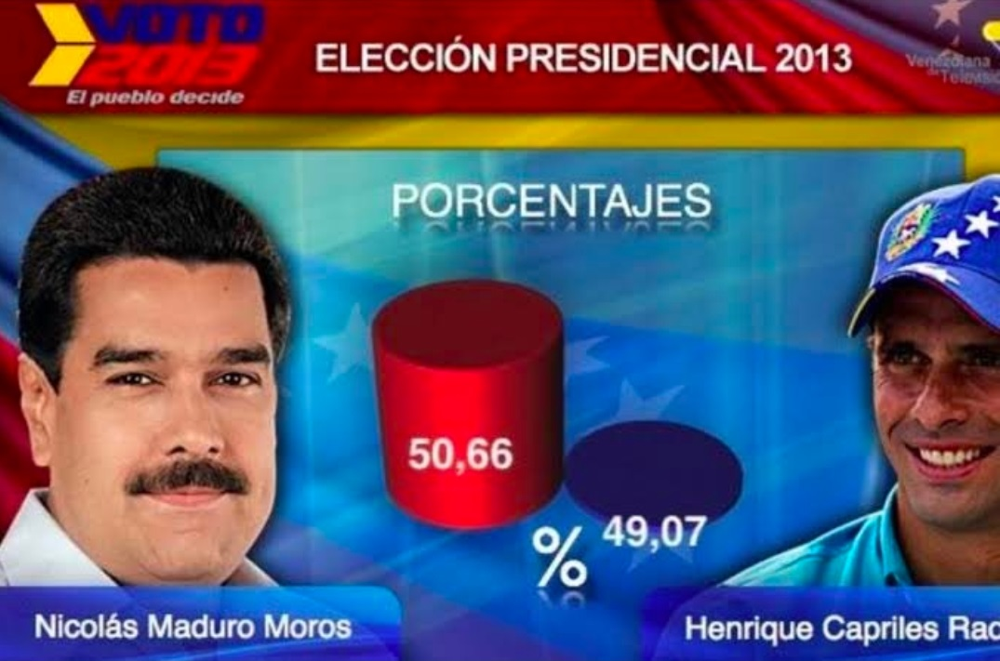

```{r setup_theme0, include = FALSE}
rm(list=ls());gc()
if(!grepl("4.1.2",R.version.string)){stop("Different version (must be 4.1.2)")}


options(servr.daemon = TRUE)
```

```{cat, engine.opts=list(file = "mylibs/zoom.html"), include=F}
<script src="https://lab.hakim.se/zoom-js/js/zoom.js" type="text/javascript"></script>
<script type="text/javascript">
	slideshow.on( "beforeHideSlide", function( slide ) {
		zoom.out();
	} );
	slideshow.on( "afterShowSlide", function( slide ) {
		document.querySelector( ".remark-visible" ).addEventListener( "dblclick", function( event ) {
			event.preventDefault();
			zoom.to( {element: event.target} );
		} );
	} );
</script>
```

```{r setup, include = FALSE}
local({r <- getOption("repos")
       r["CRAN"] <- "https://cran.dcc.uchile.cl/"
       options(repos=r)
})

if(!require(pacman)){install.packages("pacman")}
pacman::p_load(devtools, here, showtext, ggpattern, RefManageR, pagedown, magick, bibtex, DiagrammeR, xaringan, xaringanExtra, xaringanthemer, fontawesome, widgetframe, datapasta, tidyverse, psych, tidyverse, cowplot, pdftools, showtext, compareGroups, ggiraph, sf, distill, data.tree, jsonlite, emo, htmlwidgets,
               widgetframe, install= T)


if(!require(codehover)){devtools::install_github("EvaMaeRey/flipbookr")}
if(!require(codehover)){devtools::install_github("arthurwelle/codehover",upgrade = "never")}
if(!require(xaringanBuilder)){devtools::install_github("jhelvy/xaringanBuilder",upgrade = "never")}
if(!require(icons)){remotes::install_github("mitchelloharawild/icons",upgrade = "never")}

test_fontawesome<- function(x="github"){
tryCatch({
  invisible(fontawesome::fa(name = x))
  return(message("fontawesome installed"))
},
# ... but if an error occurs, tell me what happened: 
error=function(error_message) {
  message("Installing fontawesome")
  icons::download_fontawesome()  
})
}

vec_col<-c("#660600","#6F3930","#745248","#786B60","#E6E6E6","#738FBC","#003891","#3C5279","#786B60","#B48448","#EF9D2F","#D99155","#E3D1C2","#E0BC9E","#ABB0BF","#835F69","#5A0D13")
plot_prueba<-barplot(1:length(vec_col), col=vec_col)

#https://coolors.co/21177a-fe4a17-788aa3-45503b
xaringanthemer::style_duo( #ABB0BF
  primary_color = "#FFFFFF",  #555555 gris oscuro
  secondary_color = "#DD3333",#"#FF5252"))) 
  text_color = "#333333", #bc7777
  text_bold_color = "#FF5252",
  #base_color = '#bc7777',
  background_position = 'center',
  header_font_google = google_font("Lato"),#Josefin Sans
  text_font_google   = google_font("Lato", "400", "400i"),
  code_font_google   = google_font("Lato"),
  code_font_size = '53%', #sirve
  padding = "0.4em 2.4em 0.4em 2.4em",
  extra_fonts = list(google_font("Arial Narrow")),
 # title_slide_background_image = "./_figs/bg_portada.svg",
#  title_slide_background_size = "cover",
 # background_image = "./_figs/bg.svg",
  background_size = "cover",
  extra_css =
  list(
  ".remark-slide-scaler" = list("overflow-y" = "auto"), # para no tener limites de extensión
 # ".remark-slide-number" = list("display" = "none"), #oculta el reloj también
 # "pre"= list("line-height"= "0.2em"),
  ".gray"   = list(color = "#aaaaaa"),
  ".black"   = list(color = "#bc7777"),
  ".darkgreen"   = list(color = "#45503B"),
  ".darkred"   = list(color = "#591F0A"),
  ".small" = list("font-size" = "90%"),
  ".pull_c" = list("float" = "center","width" = "30%", "height" = "50%", "padding-left" = "40%"),
  ".pull_c_title" = list("height" = "90%"),
  ".pull_l_70" = list("float"= "left","width"= "72%", "font-size"= "90%"),
  ".pull_r_30" = list("float"= "right","width"= "23%", "font-size"= "90%"),
  ".pull_left"  = list("float"= "left","width"= "47%", "height"= "100%", "padding-right"= "2%"),
  ".pull_right" = list("float"= "right","width"= "47%", "height"= "100%", "padding-left"= "2%"),
  ".small_left"  = list("float"= "left", "width"= "47%", "height"= "50%", "padding-right"= "2%"),
  ".small_right" = list("float"= "right","width"= "47%", "height"= "50%", "padding-left"= "2%"),
  ".left_code" = list("float"="left","width"="47%","height"="100%","padding-right"="2%",    "font"="Roboto"),
  ".code_out"  = list("float"="right","width"="47%","height"="100%","padding-left"="2%",    "font"="Roboto"),
  ".text_180" = list("font-size" = "180%"),
  ".text_170" = list("font-size" = "170%"),
  ".text_160" = list("font-size" = "160%"),    
  ".text_150" = list("font-size" = "150%"),
  ".text_140" = list("font-size" = "140%"),  
  ".text_130" = list("font-size" = "130%"),
  ".text_120" = list("font-size" = "120%"),
  ".text_110" = list("font-size" = "110%"),
  ".text_110" = list("font-size" = "110%"),
  ".text_100" = list("font-size" = "100%"),
  ".code_10" = list("code-inline-font-size"= "60%",
                    "overflow-y" = "scroll !important",
                    "overflow-x" = "scroll !important",
                    "max-height" = "5vh !important",
                    "line-height"= "0.75em"),
   ".code_10_pre" = list("code-inline-font-size"= "60%",
                    "overflow-y" = "scroll !important",
                    "overflow-x" = "scroll !important",
                    "max-height" = "15vh !important",
                    "line-height"= "0.75em",
                    "min-height"="0.5em"
                    ),
  ".code_15" = list("code-inline-font-size"= "15%",
                    "overflow-y" = "scroll !important",
                    "overflow-x" = "scroll !important",
                    "max-height" = "10vh !important"),
  ".text_90" = list("font-size" = "90%"),
  ".text_80" = list("font-size" = "80%"),
  ".text_70" = list("font-size" = "70%"),
  ".text_65" = list("font-size" = "65%"),
  ".text_60" = list("font-size" = "60%"),
  ".text_50" = list("font-size" = "50%"),
  ".text_40" = list("font-size" = "40%"),
  ".text_30" = list("font-size" = "30%"),
  ".text_20" = list("font-size" = "20%"),
  ".line_space_15" = list("line-height" = "1.5em;"),
  ".line_space_13" = list("line-height" = "1.3em;"),
  ".line_space_11" = list("line-height" = "1.1em;"),
  ".line_space_15" = list("line-height" = "1.5em;"),
  ".line_space_09" = list("line-height" = "0.9em;"),
  ".line_space_07" = list("line-height" = "0.7em;"),
  ".line_space_05" = list("line-height" = "0.5em;"),
  ".largest" =  list("font-size" = "2.488em;"),
  ".larger" =  list("font-size" = "2.074em;"),
  ".large" =  list("font-size" = "1.44em;"),
  ".small" =  list("font-size" = "0.833em;"),
  ".smaller" =  list("font-size" = "0.694em;"),
  ".smallest" =  list("font-size" = "0.579em;"),
  ".limity150" = list("max-height" = "150px;",
                     "overflow-y" = "auto;"
      ),
    ".tiny_text" = list(
      "font-size"= "70%"
      ),
    ".large_text" = list(
      "font-size"= "150%"
      ),
    ".slide_blue" = list(
      "background-color" = "#FEDA3F",
      "color" = "#3C3C3B"
      ),
  ".center_image" = list(
    margin  = "0",
    position = "absolute",
    top      = "50%",
    left     = "50%",
    '-ms-transform' = "translate(-50%, -50%)",
    transform = "translate(-50%, -50%)"
    ),
    ".center_down_image" = list(
    margin  = "0",
    position = "absolute",
    top      = "90%",
    left     = "50%",
    '-ms-transform' = "translate(-50%, -50%)",
    transform = "translate(-50%, -50%)"
    ),
    "slides > slide" = list(
    "overflow-x"  = "auto !important",
    "overflow-y" = "auto !important"
    ),
 #   "pre" = list(
#    "white-space"  = "pre !important",
#    "overflow-y" = "scroll !important",
#    "max-height" = "40vh !important",
#    "font-size" = "0.8em"
#    ),
    ".superbigimage" = list(
    "white-space"  = "nowrap",
    "overflow-y" = "scroll"
    )
  )
)

options(htmltools.preserve.raw = FALSE)


#knitr::opts_chunk$set(comment = NA) # lo saqué pa probar por si
knitr::opts_chunk$set(dpi=720)
#options(htmltools.preserve.raw = FALSE)#A recent update to rmarkdown (in version 2.6) changed how HTML widgets are included in the output file to use pandoc's raw HTML blocks. Unfortunately, this feature isn't compatible with the JavaScript markdown library used by xaringan. You can disable this feature and resolve the issue with htmlwidgets in xaringan slides by setting
#https://stackoverflow.com/questions/65766516/xaringan-presentation-not-displaying-html-widgets-even-when-knitting-provided-t/65768952#65768952


xaringanExtra::use_progress_bar(color = "#12636B", location = "top")#, height = "550px")
xaringanExtra::use_animate_css()
xaringanExtra::use_scribble() #son los lapices
xaringanExtra::use_tile_view()
xaringanExtra::use_panelset()
xaringanExtra::use_editable(expires = 1)
xaringanExtra::use_fit_screen()

#https://gist.github.com/gadenbuie/61b27108ceec6c7a55cd9966609128d7

# padding-top: 0.4em;
# padding-right: 2.4em;
# padding-bottom: 0.4em;
# padding-left: 2.4em;
invisible("https://www.youtube.com/watch?v=M3skTMQbCD0")
invisible("https://zane.lol/slides/adirondack/#39")
#https://titanwolf.org/Network/Articles/Article?AID=3896fe2c-1b3b-4ebd-9906-1f9ed1675b35#gsc.tab=0
#https://annakrystalli.me/talks/xaringan/xaringan.html#55
#https://bookdown.org/yihui/rmarkdown/some-tips.html
#https://arm.rbind.io/slides/xaringan.html#90
#https://stackoverflow.com/questions/62069400/font-size-of-figure-in-xaringan-slide-too-small
#https://irene.vrbik.ok.ubc.ca/blog/2021-07-14-xaringan-slides/

#https://evamaerey.github.io/doublecrochet/
#devtools::install_github("paulhendricks/anonymizer")
check_code <- function(expr, available){
  if(available){
    eval(parse(text = expr))
  } else {
    expr
  }
}
path2<-dirname(rstudioapi::getSourceEditorContext()$path)
#knitr::opts_chunk$set(message = FALSE,warning = FALSE, error = FALSE)

```


```{r, load_refs, include=F, eval=T, cache=FALSE}
library(RefManageR)
BibOptions(check.entries = FALSE,
           bib.style = "numeric",
           cite.style = "numeric",
           style = "markdown",
           super = TRUE,
           hyperlink = FALSE,
           dashed = FALSE)
warning(paste0(path2,"/libreria_generica.txt"))

myBib <- ReadBib(paste0(path2,"/libreria_generica.txt"), check = FALSE)

```


class: title-slide, middle, right 

<br>

<br> 
 
.line_space_15[ 
## .text_80[Taller <br> de Reforzamiento]
]

<br>

.line_space_11[
    
<br>

.text_70[[Código en: `r fontawesome::fa(name = "github")`](https://github.com/AGSCL/Taller_UDP)]

.text_110[Clase 2. Ggplot]

]

<!---
- Para qué
- Gramática}
- asd
- 
--->

.bg-text[


`r withr::with_locale(new = c('LC_TIME' = 'es_ES'), code =format(Sys.time(),'%d de %B, %Y'))`


.text_100[Andrés González Santa Cruz]

.text_65[gonzalez.santacruz.andres@gmail.com] [`r fontawesome::fa(name = "github")`](https://github.com/AGSCL) [`r fontawesome::fa(name = "orcid", fill="green")`](https://orcid.org/0000-0002-5166-9121)
]

<br>
  
```{r echo=FALSE, out.width = '15%'}

```

???
*#_#_#_#_#_#_#_#_#_#_
**NOTA**
*#_#_#_#_#_#_#_#_#_#_


---
class: partial-bg inverse center, middle

background-image: linear-gradient(45deg, #ABB0BF, #555555)
<!---#DD3333--->

## Partamos

---
layout: true
class: animated, fadeIn
---
## dplyr y ggplot

- TIDYVERSE(DPLYR):
  - Manipulación de datos. Similitud a PANDAS (Python)
  - Flujo de trabajo
  - Permite mayor simplicidad en la codificación
  - Concatenación (pipe)
  - Sintaxis entendible
  - Similar a manipulación vía SQL
  - Desventaja: mucho uso de memoria.
- GGPLOT:
  - Gramática de los gráficos por capas (<http://vita.had.co.nz/papers/layered-grammar.pdf>)
  - Permite seguir los pasos y los distintos componentes del gráfico
  - Permite una fácil forma de iteración para distintos gráficos

.pull_left[

```{r Fig badges, fig.align="center", message=FALSE, warning=FALSE, cache=T, echo =F, out.width = "300x"}
#knitr::include_graphics("G:/Mi unidad/Alvacast/Curso/Importar_xlsx.png")
knitr::include_graphics("./_figs/rstudioconf_ohi_hex.jpg")
```

]

.pull_right[

```{r Fig-, fig.align="center", message=FALSE, warning=FALSE, cache=T, echo =F, out.width = "300x"}
#knitr::include_graphics("G:/Mi unidad/Alvacast/Curso/Importar_xlsx.png")
knitr::include_graphics("./_figs/pipe_vs_rest.png")
```

[**Torpedo sobre ggplot*](https://res.cloudinary.com/dyd911kmh/image/upload/v1666806657/Marketing/Blog/ggplot2_cheat_sheet.pdf)

]

???
*#_#_#_#_#_#_#_#_#_#_
**NOTA**
*#_#_#_#_#_#_#_#_#_#_

- Es otra lógica

---
## Elementos

 Gramática          | Explicación
 :----------------    | :-----------------------------
 **Datos**          | Base de datos a graficar
 **Geométrica**     | Forma geométrica que representará los datos
                    | (e.g., diagrama de cajas  y puntos, histogramas)
 **Estética**       | La estética del objeto geométrico
                    | (e.g., color, tamaño, forma)
.line_space_05[
.text_60[
*Traducción del github de @oliviergimenez*
  ]
]

- Signo `+`

- `geom_point()` es un gráfico de puntos, `geom_line()` is un gráfico de líneas, `geom_col()` es un gráfico de columnas o barras, etc.

- `aes()` dinámico/variable

- Algunos argumentos son `color` (colores líneas o puntos), `fill`(rellenar el área), `linetype` para ver el tipo de línea (discontinua, continua, con puntos),`pch` estilo de puntos (forma), `size` tamaño o grueso de las líneas y `alpha` que es la opacidad (transparencia, de 1 a 0)

???
*#_#_#_#_#_#_#_#_#_#_
**NOTA**
*#_#_#_#_#_#_#_#_#_#_

-LOs gráficos se componen de datos, la información que se quiere visualizar y el mapeo (cómo se configura)
- Los componentes del mapping: **capa** (elementos geométricos y transformaciones estadísticas), puntos líneas, y transformaciones como resumen (contar observaciones o dividir para un histograma), las **escalas** ubican los valores en los datos en un espacio estético (colores, forma o tamaño) y también dibujan la leyenda y los ejes, un **coord** que describe las coordenadas cartesianas pero también polares o proyecciones de mapas (latitud), una faceta permite generar y dividir en partes de datos (latticing), y un **tema** controla los despliegues como la fuente y el color de fondo.

- `data= `, `geom_*`, `aes()`
- **+** = añadir capas
- **aes()**, lo que está fuera puede ser fijado (ej., tamaño= 1)
- No se hará una leyenda de eso

---
## Elementos (2)


```{r Fig-2, fig.align="center", message=FALSE, warning=FALSE, cache=T, echo =F, out.width = "300x"}
#knitr::include_graphics("https://rstudio-conf-2020.github.io/r-for-excel/img/rstudio-cheatsheet-ggplot.png")
image_colorize(image_read(path = "https://rstudio-conf-2020.github.io/r-for-excel/img/rstudio-cheatsheet-ggplot.png"),35,"red")
```

---
## Aplicación

.panelset.sideways[

.panel[.panel-name[Estructura hipotética]

- Generamos los datos 

.details-code[
```{r 3, eval=T, echo=T, error=T, message=FALSE, warning=FALSE}
covid19_chile_coq_val <- 
    readr::read_csv("https://raw.githubusercontent.com/ivanMSC/COVID19_Chile/master/covid19_chile.csv") %>% 
    dplyr::select(Fecha, Region, `Nuevo Confirmado`) %>%
    dplyr::mutate(Fecha=as.Date.character(Fecha,tryFormats = "%d-%m-%Y")) %>% 
    dplyr::filter(Region %in% c("Valparaíso","Coquimbo"))

```
]

- Hacemos un código en que definimos que haremos un gráfico desde la base de datos `covid19_chile_coq_val` .

```{r message=FALSE, warning=FALSE, paged.print=FALSE, out.width = '400cm', out.height='400cm', fig.align = "center", eval=T}
library(ggplot2)
covid19_chile_coq_val %>% 
ggplot()
```

]

.panel[.panel-name[Añadimos]

```{r message=FALSE, warning=FALSE, paged.print=FALSE, out.width = '400cm', out.height='400cm', fig.align = "center", eval=T}
covid19_chile_coq_val %>% 
ggplot()+ 
      geom_line(aes(x=as.Date(Fecha), y=`Nuevo Confirmado`, color=Region)) #<<
```

]

.panel[.panel-name[Añadimos una etiqueta para el eje x y un formato]

```{r message=FALSE, warning=FALSE, paged.print=FALSE, out.width = '400cm', out.height='400cm', fig.align = "center", eval=T}
covid19_chile_coq_val %>% 
ggplot()+ 
      geom_line(aes(x=as.Date(Fecha), y=`Nuevo Confirmado`, color=Region))+
      scale_x_date()+ #<<
      xlab("Fecha") #<<
```

]

.panel[.panel-name[Añadimos un tema y la ubicación de leyenda]
```{r message=FALSE, warning=FALSE, paged.print=FALSE, out.width = '400cm', out.height='400cm', fig.align = "center", eval=T, fig.cap= ""}
library(sjPlot)
covid19_chile_coq_val %>% 
ggplot()+ 
      geom_line(aes(x=as.Date(Fecha), y=`Nuevo Confirmado`, color=Region))+
      scale_x_date()+ 
      xlab("Fecha")+ 
      sjPlot::theme_blank()+ #<<
      theme(legend.position="bottom")+#<<
      scale_color_manual(values=c("#DD3333","#333333"))#<<
```
 
] 


.panel[.panel-name[Se dividen los gráficos por región]
```{r message=FALSE, warning=FALSE, paged.print=FALSE, out.width = '400cm', out.height='400cm', fig.align = "center", eval=T, fig.cap= ""}
library(sjPlot)
covid19_chile_coq_val %>% 
ggplot()+ 
      geom_line(aes(x=as.Date(Fecha), y=`Nuevo Confirmado`, color=Region))+
      scale_x_date()+ 
      xlab("Fecha")+ 
      sjPlot::theme_blank()+ 
      theme(legend.position="bottom")+ 
      scale_color_manual(values=c("#DD3333","#333333"))+#<<
      facet_wrap(~Region)#<<
      
#guardamos los datos
ggplot2::ggsave("./_figs/1.png", width = 5, height = 10, dpi = 100)    
```

]

]

---
## Observaciones

- Autoexplicativo

- Los gráficos pueden estar sujetos a sesgos (cc. o icc.)

- Es necesario explicitar cómo se construyó el gráfico

- Misma escala

- Orden de los datos

- Citar fuentes (con caption)


Ejemplos:

- [Datos Victimización](https://www.adnradio.cl/politica/2017/11/06/el-extrano-grafico-que-presento-sebastian-pinera-para-justificar-la-baja-de-victimizacion-3630063.html)

- [Datos ENUSC](https://www.biobiochile.cl/noticias/nacional/chile/2021/08/30/adopcion-homoparental-comision-aprueba-proyecto-en-general-y-pasa-a-votacion-en-sala-del-senado.shtml)

- [Datos CASEN](https://www.eldesconcierto.cl/nacional/2018/08/21/graficos-vuelven-a-penar-a-pinera-la-curiosa-forma-de-presentar-los-datos-de-distrubucion-de-ingresos-en-la-casen.html)

- [Desafíos gobierno](https://www.concierto.cl/2019/11/mega-es-el-canal-mas-denunciado-por-su-cobertura-de-la-crisis/)

- [Tasa de positividad](https://twitter.com/leosoto/status/1280474285199503366?s=20)

- [Días sandwich](https://twitter.com/salinas_chile/status/1336114088863289346/photo/1)

- [Gráfico ritmo vacunación](https://www.biobiochile.cl/noticias/nacional/chile/2021/04/22/grafico-evidencia-como-baja-ritmo-de-vacunacion-minsal-lo-mostro-en-otra-escala.shtml)

- [Aprobación presidencial](https://www.theclinic.cl/2020/11/30/la-version-de-mega-por-cuestionado-grafico-que-mostraba-aprobacion-y-rechazo-de-pinera-en-la-cadem/)


```{r, echo=FALSE,  fig.align="center", out.width=300, error=T}



```

???
*#_#_#_#_#_#_#_#_#_#_
**NOTA**
*#_#_#_#_#_#_#_#_#_#_
- Debe simplificar, no complicar; no debe depender de un texto
- Elegir el título, la escala, leyendas, etc. MUY BIEN
- Gráficos de barra, ordenar de mayor a menor o por algún criterio ordinal si lo hay
- Indicar la fuente de los datos si son ajenos
- Alterar la escala de medición o truncarla (ej. exagerar diferencias)
- Filtrar valores extremos sin reportar
- Agrupar valores que no corresponde agrupar para ocultar anomalías 
- La importancia de ejemplos reproducibles
- En los textos aparece el gráfico de pie/sector. Yo personalmente no lo recomiendo porque requiere mucha información adicional (mejor una tabla)
  - más recomendable utilizarlo para variables nominales con pocas categorías.
- Los gráficos de polígonos como los de líneas, los veremos posteriormente

---
background-image: url("./_figs/71746538_1513071482177691_7543072537354174464_n.jpg")


---
## Aplicación (2)

.panelset.sideways[

.panel[.panel-name[Estructura hipotética]
```{r message=FALSE, warning=FALSE, paged.print=FALSE, out.width = '400cm', out.height='400cm', fig.align = "center", eval=T}
library(jsonlite)

history1 = fromJSON("_data/StreamingHistory0.json", flatten = TRUE)
history2 = fromJSON("_data/StreamingHistory1.json", flatten = TRUE)

st = rbind(history1,history2)
rm(history1,history2)
# what does the dataframe contain.
head(st) %>% 
  knitr::kable("markdown")
```

]

.panel[.panel-name[Usamos la base, la transformamos y hacemos un gráfico de barra]
```{r message=FALSE, warning=FALSE, paged.print=FALSE, out.width = '400cm', out.height='400cm', fig.align = "center", eval=T}
st %>%
  dplyr::count(artistName, sort = TRUE) %>%
  dplyr::top_n(20) %>%
  dplyr::mutate(artistName = reorder(artistName, n)) %>%
  ggplot(aes(x = artistName, y = n)) + #<<
  geom_bar(aes(fill=n),   #<<
           stat="identity") #<<
```
]


.panel[.panel-name[Añadimos una temática con una escala de colores]
```{r message=FALSE, warning=FALSE, paged.print=FALSE, out.width = '400cm', out.height='400cm', fig.align = "center", eval=T}
st %>%
  dplyr::count(artistName, sort = TRUE) %>%
  dplyr::top_n(20) %>%
  dplyr::mutate(artistName = reorder(artistName, n)) %>%
  ggplot(aes(x = artistName, y = n)) + 
  geom_bar(aes(fill=n),   
           stat="identity") + 
    scale_fill_viridis_c(option = "magma",direction = -1) + #<< 
  xlab(NULL)  #<<
```

]

.panel[.panel-name[Se definen etiquetas y se gira el gráfico de barras, se pone el gráfico en mínimo]
```{r message=FALSE, warning=FALSE, paged.print=FALSE, out.width = '400cm', out.height='400cm', fig.align = "center", eval=T}
st %>%
  dplyr::count(artistName, sort = TRUE) %>%
  dplyr::top_n(20) %>%
  dplyr::mutate(artistName = reorder(artistName, n)) %>%
  ggplot(aes(x = artistName, y = n)) + 
  geom_bar(aes(fill=n),   
           stat="identity") + 
  scale_fill_viridis_c(option = "magma",direction = -1) + 
  xlab(NULL) + 
  coord_flip() + #<<
  labs(x = "Artistas", #<<
       title = "Artistsas que más he escuchado el 2021", #<<
       fill = "Recuento") + #<<
  theme_minimal() #<<
```

]

]

---
## Ejercicio 1

- Con los siguientes datos (`mtcars`), llegue al siguiente gráfico:

```{r, include=F, eval=F}
ggplot(data = mtcars) + 
  geom_point(aes(mpg, qsec, colour = factor(am))) +
  facet_grid(~vs)
```

```{r, echo=FALSE,  fig.align="center", out.width=250, error=T}
knitr::include_graphics('./_figs/descarga.png')
```


???
*#_#_#_#_#_#_#_#_#_#_
**NOTA**
*#_#_#_#_#_#_#_#_#_#_

---
## Otros paquetes relacionados

- `ggstatsplot`

- `gganimate`

- `ggplotly`

- `ggvis` 

- [`esquise`](https://dreamrs.github.io/esquisse/)


```{r, echo=FALSE,  fig.align="center", out.width=800, error=T}

knitr::include_graphics('https://dreamrs.github.io/esquisse/reference/figures/esquisse.gif')

```


???
*#_#_#_#_#_#_#_#_#_#_
**NOTA**
*#_#_#_#_#_#_#_#_#_#_

- Hay otros que son más interactivos, otros con información estadísitca

(https://rpubs.com/agscl/plot)
(https://rpubs.com/agscl/com_quar)

---
## Ejercicio demostrativo

`r flipbookr::chunk_reveal("ej_dem")`

.details-code[
```{r ej_dem, eval=T, message=FALSE, warning=FALSE, include=T}
starwars %>% 
ggplot2::ggplot() +
  geom_point(aes(x = birth_year, 
                 y = height),color = "red")+ 
  scale_y_continuous(limits = c(0,200))+
  labs(title = "Un ggplot")+
   theme_bw()
``` 
]
          

---
## Ejercicio 2

- Genere el gráfico que corresponda para analizar la distribución de los datos presentados más abajo. De acuerdo a las lecturas y fuentes que corresponda (busque en internet), indique su distribución.

- set.seed(2125);datos<-runif(100,50,500)

```{r message=FALSE, warning=FALSE, paged.print=FALSE, out.width = '400cm', out.height='400cm', fig.align = "center", eval=F, include=F}
datos %>%
  as.data.frame() %>% 
  ggplot(aes(.))+
  geom_density()+
  labs(y="Densidad", x="Datos", title="Diagrama de densidad de los datos")+
  theme_minimal()
# Uniforme, aunque podría describirse como bimodal, o una distribución dirichlet en la que cada agrupación representa distribuciones latentes superpuestas en torno a una cateogría K; O una funcion de probabilidad binomial con distinto número de  éxitos
```


- Use la base `ChickWeight` y haga un diagrama de puntos entre el tiempo y el peso. Grafique la dispersión de los puntos y añada una línea suavizada (`smooth`) para ver si hay alguna tendencia. Añada etiquetas y un tema en blanco y negro.

```{r message=FALSE, warning=FALSE, paged.print=FALSE, out.width = '400cm', out.height='400cm', fig.align = "center", eval=F, include=F}
library(ggplot2)
ggplot(ChickWeight, aes(Time, weight))+ #incluimos las 2 variables, una en el eje x y el otro en Y
  geom_jitter(width = 0.75)+# esoecificamos os puntos, puede ser geom_point ---> lo hice para separar los puntos
  #######  ocupar una regresión no lineal para ver la relación
  geom_smooth(span = 0.8)+
  #######  utilizamos un tema que simplifique los colores del plot
  theme_bw()+
  #######  especificamos las etiqueta
  ylab("Peso (gramos)")+
  xlab("Tiempo")

```


---
## Ejercicio 3

- Use `ggplot()` y especifique la base de datos `gapminder` como input, pero habiendo filtrado sólo los datos del 2007. (Debe instalar la librería gapminder antes de cargar los datos).

- Agregue la capa `geom_point` al gráfico y cree un  diagrama de puntos (*scatterplot*) mostrando el producto interno bruto per-capita `gdpPercap` en el eje x y la esperanza de vida `lifeExp` en el eje y.

- Use la estética color para indicar cada continente con un color diferente

- Use la estética de tamaño para ajustar el tamaño de los puntos según el tamaño de la población

- Use `scale_size_area()` para que el tamaño de los puntos refleje las diferencias de la población actual y configure el tamaño máximo de los puntos (`max_size`) de cada punto a 15.

- Determine el nivel de opacidad/transparencia de cada punto a 70% mediante el parámetro `alpha` (no debe ser visible en las leyendas).

.text_40[
*(Quartango Blog, 2020, Julio 28, https://www.r-bloggers.com/2020/07/specify-additional-aesthetics-for-points/)*
]

???
*#_#_#_#_#_#_#_#_#_#_
**NOTA**
*#_#_#_#_#_#_#_#_#_#_

- respuesta:
gapminder %>% dplyr::filter(year==2007) %>% 
ggplot() + 
  geom_point(aes(x = gdpPercap, y = lifeExp, size = pop,
                 color = continent),alpha = 0.5)+ #sale de la leyenda si lo saca de estética.
                 scale_size_area(max_size = 15)

---
## Ejercicio 4

- Cargue la base de datos disponible desde https://github.com/pjcarozzi/riclpm/raw/main/documentos/data/elsoc_onoffline.Rdata, despliéguela (si quiere, lea una descripción de las variables en https://multivariada.netlify.app/assignment/11-code/ o de la fuente indicada en el programa sobre las variables de la encuesta). Las primeras columnas corresponden a las columnas C08_02 y C08_04 del estudio longitudinal ELSOC. Los números después de la w indican la ola de aplicación.

- Hay una variable que es claramente continua. Genere un histograma con aprox. (sugerido) 30 quiebres

- Genere un gráfico de barras con la frecuencia de los distintos niveles educacionales


```{r message=FALSE, warning=FALSE, paged.print=FALSE, out.width = '400cm', out.height='400cm', fig.align = "center", eval=F, include=F}
load(url("https://github.com/pjcarozzi/riclpm/raw/main/documentos/data/elsoc_onoffline.Rdata"))

elsoc %>% 
ggplot(aes(x=edad))+
geom_histogram(bins=30)+
labs(x="Edad", y="Frecuencia", title="Histograma de edad")
```


???
*#_#_#_#_#_#_#_#_#_#_
**NOTA**
*#_#_#_#_#_#_#_#_#_#_


---
class: center, middle

# Gracias!    

<br>
  
<div class="centered"> Contacto: gonzalez.santacruz.andres@gmail.com </div>

<br>

<br>

<br>

```{r, echo=FALSE,  fig.align="center", out.width=300, error=T}


```
<br>
  

---
## Fuentes

- Yıldırım, S. (2021, Marzo 02) The Flawless Pipes of Tidyverse. Exploratory data analysis made easy. https://towardsdatascience.com/the-flawless-pipes-of-tidyverse-bb2ab3c5399f

- Ballari, D. (2018). Funcion ggplot() de ggplot2. https://rpubs.com/daniballari/ggplot

- Hadley Wickham (2010) A Layered Grammar of Graphics, Journal of Computational and Graphical Statistics, 19:1, 3-28, DOI: 10.1198/jcgs.2009.07098

- Nordmann E, McAleer P, Toivo W, Paterson H, DeBruine LM. Data Visualization Using R for Researchers Who Do Not Use R. Advances in Methods and Practices in Psychological Science. 2022;5(2). doi:10.1177/25152459221074654

- Hyndman, R. (2010, Agosto 06). Twenty rules for good graphics. https://robjhyndman.com/hyndsight/graphics/

- Plavskin, E. (2019, November 12). Intro to ggplot. https://learn.gencore.bio.nyu.edu/intro-to-ggplot/

- Donovan, K. (2019, Julio 11). Data Analysis and Processing with R based on IBIS data. https://bookdown.org/kdonovan125/ibis_data_analysis_r4/creating-graphs-with-ggplot2.html

- Patil, I. (2021). Visualizations with statistical details: The 'ggstatsplot' approach. Journal of Open Source Software, 6(61), 3167, doi:10.21105/joss.03167

- Lowndes, J. & Horst, A. (2021, Enero 08). R for Excel Users. RStudio Conference 2020. https://rstudio-conf-2020.github.io/r-for-excel/ggplot2.html


```{r exp, eval=F,echo=F, results="asis"}
library(pagedown)

#para exportar la presentación a PDF
pagedown::chrome_print(gsub(".Rmd",".html",rstudioapi::getSourceEditorContext()$path),output="pres_2022_3.pdf")
xaringanBuilder::build_pdf(gsub(".Rmd",".Rmd",rstudioapi::getSourceEditorContext()$path),complex_slides = TRUE,output_file="pres_2022_4.pdf")
xaringanBuilder::build_pdf(gsub(".Rmd",".Rmd",rstudioapi::getSourceEditorContext()$path),complex_slides = TRUE,output_file="pres_2022_5.pdf")
```
