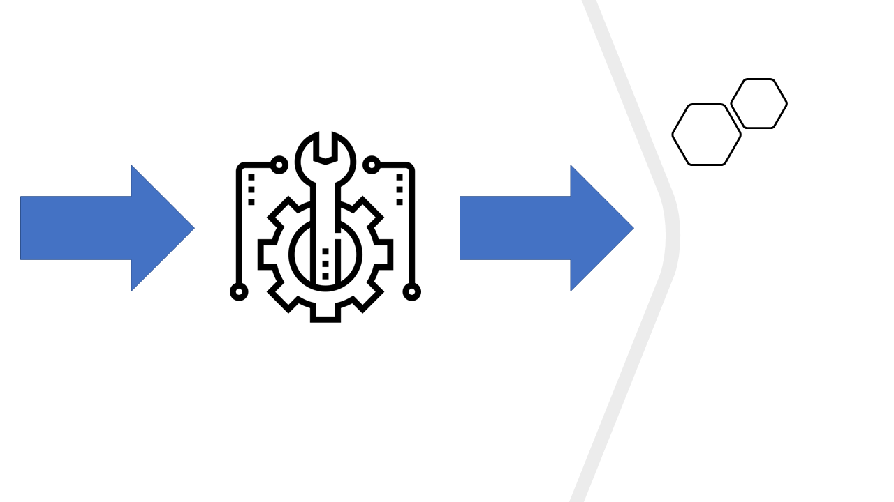
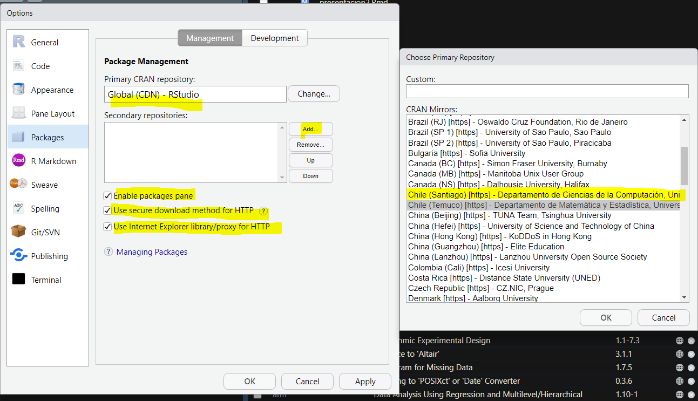
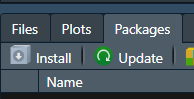
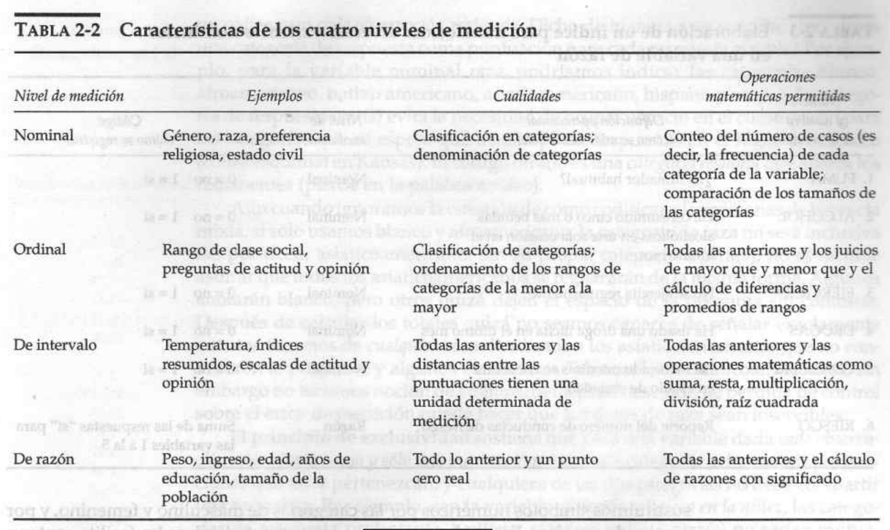

class: title-slide, middle, right 

```{css, echo = F}
/* -------------------------------------------------------
 *
 *     !! This file was generated by xaringanthemer !!
 *
 *  Changes made to this file directly will be overwritten
 *  if you used xaringanthemer in your xaringan slides Rmd
 *
 *  Issues or likes?
 *    - https://github.com/gadenbuie/xaringanthemer
 *    - https://www.garrickadenbuie.com
 *
 *  Need help? Try:
 *    - vignette(package = "xaringanthemer")
 *    - ?xaringanthemer::style_xaringan
 *    - xaringan wiki: https://github.com/yihui/xaringan/wiki
 *    - remarkjs wiki: https://github.com/gnab/remark/wiki
 *
 *  Version: 0.4.1
 *
 * ------------------------------------------------------- */
@import url(https://fonts.googleapis.com/css?family=Lato:400,400i&display=swap);
@import url(https://fonts.googleapis.com/css?family=Lato&display=swap);
@import url(https://fonts.googleapis.com/css?family=Lato&display=swap);
@import url(https://fonts.googleapis.com/css?family=Arial+Narrow&display=swap);

:root {
  /* Fonts */
  --text-font-family: Lato;
  --text-font-is-google: 1;
  --text-font-family-fallback: -apple-system, BlinkMacSystemFont, avenir next, avenir, helvetica neue, helvetica, Ubuntu, roboto, noto, segoe ui, arial;
  --text-font-base: sans-serif;
  --header-font-family: Lato;
  --header-font-is-google: 1;
  --header-font-family-fallback: Georgia, serif;
  --code-font-family: Lato;
  --code-font-is-google: 1;
  --base-font-size: 20px;
  --text-font-size: 1rem;
  --code-font-size: 53%;
  --code-inline-font-size: 1em;
  --header-h1-font-size: 2.75rem;
  --header-h2-font-size: 2.25rem;
  --header-h3-font-size: 1.75rem;

  /* Colors */
  --text-color: #333333;
  --header-color: #DD3333;
  --background-color: #FFFFFF;
  --link-color: #DD3333;
  --text-bold-color: #FF5252;
  --code-highlight-color: rgba(255,255,0,0.5);
  --inverse-text-color: #FFFFFF;
  --inverse-background-color: #DD3333;
  --inverse-header-color: #FFFFFF;
  --inverse-link-color: #DD3333;
  --title-slide-background-color: #FFFFFF;
  --title-slide-text-color: #DD3333;
  --header-background-color: #DD3333;
  --header-background-text-color: #FFFFFF;
  --primary: #FFFFFF;
  --secondary: #DD3333;
}

html {
  font-size: var(--base-font-size);
}

body {
  font-family: var(--text-font-family), var(--text-font-family-fallback), var(--text-font-base);
  font-weight: 400;
  color: var(--text-color);
}
h1, h2, h3 {
  font-family: var(--header-font-family), var(--header-font-family-fallback);
  font-weight: 600;
  color: var(--header-color);
}
.remark-slide-content {
  background-color: var(--background-color);
  font-size: 1rem;
  padding: 0.4em 2.4em 0.4em 2.4em;
  width: 100%;
  height: 100%;
}
.remark-slide-content h1 {
  font-size: var(--header-h1-font-size);
}
.remark-slide-content h2 {
  font-size: var(--header-h2-font-size);
}
.remark-slide-content h3 {
  font-size: var(--header-h3-font-size);
}
.remark-code, .remark-inline-code {
  font-family: var(--code-font-family), Menlo, Consolas, Monaco, Liberation Mono, Lucida Console, monospace;
}
.remark-code {
  font-size: var(--code-font-size);
}
.remark-inline-code {
  font-size: var(--code-inline-font-size);
  color: #DD3333;
}
.remark-slide-number {
  color: #333333;
  opacity: 1;
  font-size: 0.9rem;
}
strong {
  font-weight: bold;
  color: var(--text-bold-color);
}
a, a > code {
  color: var(--link-color);
  text-decoration: none;
}
.footnote {
  position: absolute;
  bottom: 60px;
  padding-right: 4em;
  font-size: 0.9em;
}
.remark-code-line-highlighted {
  background-color: var(--code-highlight-color);
}
.inverse {
  background-color: var(--inverse-background-color);
  color: var(--inverse-text-color);
  
}
.inverse h1, .inverse h2, .inverse h3 {
  color: var(--inverse-header-color);
}
.inverse a, .inverse a > code {
  color: var(--inverse-link-color);
}
.title-slide, .title-slide h1, .title-slide h2, .title-slide h3 {
  color: var(--title-slide-text-color);
}
.title-slide {
  background-color: var(--title-slide-background-color);
}
.title-slide .remark-slide-number {
  display: none;
}
/* Two-column layout */
.left-column {
  width: 20%;
  height: 92%;
  float: left;
}
.left-column h2, .left-column h3 {
  color: #DD333399;
}
.left-column h2:last-of-type, .left-column h3:last-child {
  color: #DD3333;
}
.right-column {
  width: 75%;
  float: right;
  padding-top: 1em;
}
.pull-left {
  float: left;
  width: 47%;
}
.pull-right {
  float: right;
  width: 47%;
}
.pull-right + * {
  clear: both;
}
img, video, iframe {
  max-width: 100%;
}
blockquote {
  border-left: solid 5px #DD333380;
  padding-left: 1em;
}
.remark-slide table {
  margin: auto;
  border-top: 1px solid #666;
  border-bottom: 1px solid #666;
}
.remark-slide table thead th {
  border-bottom: 1px solid #ddd;
}
th, td {
  padding: 5px;
}
.remark-slide thead, .remark-slide tfoot, .remark-slide tr:nth-child(even) {
  background: #FFFFFF;
}
table.dataTable tbody {
  background-color: var(--background-color);
  color: var(--text-color);
}
table.dataTable.display tbody tr.odd {
  background-color: var(--background-color);
}
table.dataTable.display tbody tr.even {
  background-color: #FFFFFF;
}
table.dataTable.hover tbody tr:hover, table.dataTable.display tbody tr:hover {
  background-color: rgba(255, 255, 255, 0.5);
}
.dataTables_wrapper .dataTables_length, .dataTables_wrapper .dataTables_filter, .dataTables_wrapper .dataTables_info, .dataTables_wrapper .dataTables_processing, .dataTables_wrapper .dataTables_paginate {
  color: var(--text-color);
}
.dataTables_wrapper .dataTables_paginate .paginate_button {
  color: var(--text-color) !important;
}

/* Horizontal alignment of code blocks */
.remark-slide-content.left pre,
.remark-slide-content.center pre,
.remark-slide-content.right pre {
  text-align: start;
  width: max-content;
  max-width: 100%;
}
.remark-slide-content.left pre,
.remark-slide-content.right pre {
  min-width: 50%;
  min-width: min(40ch, 100%);
}
.remark-slide-content.center pre {
  min-width: 66%;
  min-width: min(50ch, 100%);
}
.remark-slide-content.left pre {
  margin-left: unset;
  margin-right: auto;
}
.remark-slide-content.center pre {
  margin-left: auto;
  margin-right: auto;
}
.remark-slide-content.right pre {
  margin-left: auto;
  margin-right: unset;
}

/* Slide Header Background for h1 elements */
.remark-slide-content.header_background > h1 {
  display: block;
  position: absolute;
  top: 0;
  left: 0;
  width: 100%;
  background: var(--header-background-color);
  color: var(--header-background-text-color);
  padding: 2rem 2.4em 1.5rem 2.4em;
  margin-top: 0;
  box-sizing: border-box;
}
.remark-slide-content.header_background {
  padding-top: 7rem;
}

@page { margin: 0; }
@media print {
  .remark-slide-scaler {
    width: 100% !important;
    height: 100% !important;
    transform: scale(1) !important;
    top: 0 !important;
    left: 0 !important;
  }
}

.primary {
  color: var(--primary);
}
.bg-primary {
  background-color: var(--primary);
}
.secondary {
  color: var(--secondary);
}
.bg-secondary {
  background-color: var(--secondary);
}

/* Extra CSS */
.remark-slide-scaler {
  overflow-y: auto;
}
.gray {
  color: #aaaaaa;
}
.black {
  color: #bc7777;
}
.darkgreen {
  color: #45503B;
}
.darkred {
  color: #591F0A;
}
.small {
  font-size: 90%;
}
.pull_c {
  float: center;
  width: 30%;
  height: 50%;
  padding-left: 40%;
}
.pull_c_title {
  height: 90%;
}
.pull_l_70 {
  float: left;
  width: 72%;
  font-size: 90%;
}
.pull_r_30 {
  float: right;
  width: 23%;
  font-size: 90%;
}
.pull_left {
  float: left;
  width: 47%;
  height: 100%;
  padding-right: 2%;
}
.pull_right {
  float: right;
  width: 47%;
  height: 100%;
  padding-left: 2%;
}
.small_left {
  float: left;
  width: 47%;
  height: 50%;
  padding-right: 2%;
}
.small_right {
  float: right;
  width: 47%;
  height: 50%;
  padding-left: 2%;
}
.left_code {
  float: left;
  width: 47%;
  height: 100%;
  padding-right: 2%;
  font: Roboto;
}
.code_out {
  float: right;
  width: 47%;
  height: 100%;
  padding-left: 2%;
  font: Roboto;
}
.text_180 {
  font-size: 180%;
}
.text_170 {
  font-size: 170%;
}
.text_160 {
  font-size: 160%;
}
.text_150 {
  font-size: 150%;
}
.text_140 {
  font-size: 140%;
}
.text_130 {
  font-size: 130%;
}
.text_120 {
  font-size: 120%;
}
.text_110 {
  font-size: 110%;
}
.text_110 {
  font-size: 110%;
}
.text_100 {
  font-size: 100%;
}
.code_10 {
  code-inline-font-size: 60%;
  overflow-y: scroll !important;
  overflow-x: scroll !important;
  max-height: 5vh !important;
  line-height: 0.75em;
}
.code_10_pre {
  code-inline-font-size: 60%;
  overflow-y: scroll !important;
  overflow-x: scroll !important;
  max-height: 15vh !important;
  line-height: 0.75em;
  min-height: 0.5em;
}
.code_15 {
  code-inline-font-size: 15%;
  overflow-y: scroll !important;
  overflow-x: scroll !important;
  max-height: 10vh !important;
}
.text_90 {
  font-size: 90%;
}
.text_80 {
  font-size: 80%;
}
.text_70 {
  font-size: 70%;
}
.text_65 {
  font-size: 65%;
}
.text_60 {
  font-size: 60%;
}
.text_50 {
  font-size: 50%;
}
.text_40 {
  font-size: 40%;
}
.text_30 {
  font-size: 30%;
}
.text_20 {
  font-size: 20%;
}
.line_space_15 {
  line-height: 1.5em;;
}
.line_space_13 {
  line-height: 1.3em;;
}
.line_space_11 {
  line-height: 1.1em;;
}
.line_space_15 {
  line-height: 1.5em;;
}
.line_space_09 {
  line-height: 0.9em;;
}
.line_space_07 {
  line-height: 0.7em;;
}
.line_space_05 {
  line-height: 0.5em;;
}
.largest {
  font-size: 2.488em;;
}
.larger {
  font-size: 2.074em;;
}
.large {
  font-size: 1.44em;;
}
.small {
  font-size: 0.833em;;
}
.smaller {
  font-size: 0.694em;;
}
.smallest {
  font-size: 0.579em;;
}
.limity150 {
  max-height: 150px;;
  overflow-y: auto;;
}
.tiny_text {
  font-size: 70%;
}
.large_text {
  font-size: 150%;
}
.slide_blue {
  background-color: #FEDA3F;
  color: #3C3C3B;
}
.center_image {
  margin: 0;
  position: absolute;
  top: 50%;
  left: 50%;
  -ms-transform: translate(-50%, -50%);
  transform: translate(-50%, -50%);
}
.center_left_img {
  top: 50%;
  left: 35%;
}
.center_left_image {
  margin: 0;
  position: absolute;
  top: 50%;
  left: 35%;
  -ms-transform: translate(-50%, -50%);
  transform: translate(-50%, -50%);
}
.center_down_image {
  margin: 0;
  position: absolute;
  top: 90%;
  left: 50%;
  -ms-transform: translate(-50%, -50%);
  transform: translate(-50%, -50%);
}
.center_top_image {
  margin: 0;
  position: absolute;
  top: 10%; /* Adjust to place the image at the top */
  left: 50%;
  -ms-transform: translate(-50%, -50%);
  transform: translate(-50%, -50%);
}
slides > slide {
  overflow-x: auto !important;
  overflow-y: auto !important;
}
.superbigimage {
  white-space: nowrap;
  overflow-y: scroll;
}
```

```{r setup_theme0, include = FALSE}
rm(list=ls());gc()

# # Read in file with correct encoding
# contents <- readLines("xaringan-themer.css", encoding = "Windows-1252")
# 
# # Replace offending character
# clean_contents <- gsub("\x93", "", contents)
# 
# # Write cleaned contents back out with desired encoding
# writeLines(clean_contents, "xaringan-themer3.css", useBytes = TRUE)

if(!grepl("4.1.2",R.version.string)){stop("Different version (must be 4.1.2)")}
pacman::p_unlock(lib.loc = .libPaths()) #para no tener problemas reinstalando paquetes

if(!require(devtools)){install.packages("devtools", type = "win.binary", dependencies=T)}

options(servr.daemon = TRUE)
```

```{cat, engine.opts=list(file = "mylibs/zoom.html"), include=F}
<script src="https://lab.hakim.se/zoom-js/js/zoom.js" type="text/javascript"></script>
<script type="text/javascript">
	slideshow.on( "beforeHideSlide", function( slide ) {
		zoom.out();
	} );
	slideshow.on( "afterShowSlide", function( slide ) {
		document.querySelector( ".remark-visible" ).addEventListener( "dblclick", function( event ) {
			event.preventDefault();
			zoom.to( {element: event.target} );
		} );
	} );
</script>
```

```{r setup, include = FALSE}
local({r <- getOption("repos")
       r["CRAN"] <- "https://cran.dcc.uchile.cl/"
       options(repos=r)
})

if(!require(pacman)){install.packages("pacman")}

if(!require(rcanvas)){devtools::install_github("daranzolin/rcanvas")}

pacman::p_load(devtools, here, showtext, ggpattern, RefManageR, pagedown, magick, bibtex, DiagrammeR, xaringan, xaringanExtra, xaringanthemer, fontawesome, widgetframe, datapasta, tidyverse, psych, tidyverse, cowplot, pdftools, showtext, compareGroups, ggiraph, sf, distill, data.tree,
               widgetframe, install= T)

if(!require(xaringanBuilder)){devtools::install_github("jhelvy/xaringanBuilder",upgrade = "never")}
if(!require(icons)){remotes::install_github("mitchelloharawild/icons",upgrade = "never")}

test_fontawesome<- function(x="github"){
tryCatch({
  invisible(fontawesome::fa(name = x))
  return(message("fontawesome installed"))
},
# ... but if an error occurs, tell me what happened: 
error=function(error_message) {
  message("Installing fontawesome")
  icons::download_fontawesome()  
})
}

vec_col<-c("#660600","#6F3930","#745248","#786B60","#E6E6E6","#738FBC","#003891","#3C5279","#786B60","#B48448","#EF9D2F","#D99155","#E3D1C2","#E0BC9E","#ABB0BF","#835F69","#5A0D13")
plot_prueba<-barplot(1:length(vec_col), col=vec_col)

#https://coolors.co/21177a-fe4a17-788aa3-45503b
xaringanthemer::style_duo( #ABB0BF
  primary_color = "#FFFFFF",  #555555 gris oscuro
  secondary_color = "#DD3333",#"#FF5252"))) 
  text_color = "#333333", #bc7777
  text_bold_color = "#FF5252",
  #base_color = '#bc7777',
  background_position = 'center',
  header_font_google = google_font("Lato"),#Josefin Sans
  text_font_google   = google_font("Lato", "400", "400i"),
  code_font_google   = google_font("Lato"),
  code_font_size = '53%', #sirve
  padding = "0.4em 2.4em 0.4em 2.4em",
  extra_fonts = list(google_font("Arial Narrow")),
 # title_slide_background_image = "./_figs/bg_portada.svg",
#  title_slide_background_size = "cover",
 # background_image = "./_figs/bg.svg",
  background_size = "cover",
  extra_css =
  list(
  ".remark-slide-scaler" = list("overflow-y" = "auto"), # para no tener limites de extensión
 # ".remark-slide-number" = list("display" = "none"), #oculta el reloj también
 # "pre"= list("line-height"= "0.2em"),
  ".gray"   = list(color = "#aaaaaa"),
  ".black"   = list(color = "#bc7777"),
  ".darkgreen"   = list(color = "#45503B"),
  ".darkred"   = list(color = "#591F0A"),
  ".small" = list("font-size" = "90%"),
  ".pull_c" = list("float" = "center","width" = "30%", "height" = "50%", "padding-left" = "40%"),
  ".pull_c_title" = list("height" = "90%"),
  ".pull_l_70" = list("float"= "left","width"= "72%", "font-size"= "90%"),
  ".pull_r_30" = list("float"= "right","width"= "23%", "font-size"= "90%"),
  ".pull_left"  = list("float"= "left","width"= "47%", "height"= "100%", "padding-right"= "2%"),
  ".pull_right" = list("float"= "right","width"= "47%", "height"= "100%", "padding-left"= "2%"),
  ".small_left"  = list("float"= "left", "width"= "47%", "height"= "50%", "padding-right"= "2%"),
  ".small_right" = list("float"= "right","width"= "47%", "height"= "50%", "padding-left"= "2%"),
  ".left_code" = list("float"="left","width"="47%","height"="100%","padding-right"="2%",    "font"="Roboto"),
  ".code_out"  = list("float"="right","width"="47%","height"="100%","padding-left"="2%",    "font"="Roboto"),
  ".text_180" = list("font-size" = "180%"),
  ".text_170" = list("font-size" = "170%"),
  ".text_160" = list("font-size" = "160%"),    
  ".text_150" = list("font-size" = "150%"),
  ".text_140" = list("font-size" = "140%"),  
  ".text_130" = list("font-size" = "130%"),
  ".text_120" = list("font-size" = "120%"),
  ".text_110" = list("font-size" = "110%"),
  ".text_110" = list("font-size" = "110%"),
  ".text_100" = list("font-size" = "100%"),
  ".code_10" = list("code-inline-font-size"= "60%",
                    "overflow-y" = "scroll !important",
                    "overflow-x" = "scroll !important",
                    "max-height" = "5vh !important",
                    "line-height"= "0.75em"),
   ".code_10_pre" = list("code-inline-font-size"= "60%",
                    "overflow-y" = "scroll !important",
                    "overflow-x" = "scroll !important",
                    "max-height" = "15vh !important",
                    "line-height"= "0.75em",
                    "min-height"="0.5em"
                    ),
  ".code_15" = list("code-inline-font-size"= "15%",
                    "overflow-y" = "scroll !important",
                    "overflow-x" = "scroll !important",
                    "max-height" = "10vh !important"),
  ".text_90" = list("font-size" = "90%"),
  ".text_80" = list("font-size" = "80%"),
  ".text_70" = list("font-size" = "70%"),
  ".text_65" = list("font-size" = "65%"),
  ".text_60" = list("font-size" = "60%"),
  ".text_50" = list("font-size" = "50%"),
  ".text_40" = list("font-size" = "40%"),
  ".text_30" = list("font-size" = "30%"),
  ".text_20" = list("font-size" = "20%"),
  ".line_space_15" = list("line-height" = "1.5em;"),
  ".line_space_13" = list("line-height" = "1.3em;"),
  ".line_space_11" = list("line-height" = "1.1em;"),
  ".line_space_15" = list("line-height" = "1.5em;"),
  ".line_space_09" = list("line-height" = "0.9em;"),
  ".line_space_07" = list("line-height" = "0.7em;"),
  ".line_space_05" = list("line-height" = "0.5em;"),
  ".largest" =  list("font-size" = "2.488em;"),
  ".larger" =  list("font-size" = "2.074em;"),
  ".large" =  list("font-size" = "1.44em;"),
  ".small" =  list("font-size" = "0.833em;"),
  ".smaller" =  list("font-size" = "0.694em;"),
  ".smallest" =  list("font-size" = "0.579em;"),
  ".limity150" = list("max-height" = "150px;",
                     "overflow-y" = "auto;"
      ),
    ".tiny_text" = list(
      "font-size"= "70%"
      ),
    ".large_text" = list(
      "font-size"= "150%"
      ),
    ".slide_blue" = list(
      "background-color" = "#FEDA3F",
      "color" = "#3C3C3B"
      ),
  ".center_image" = list(
    margin  = "0",
    position = "absolute",
    top      = "50%",
    left     = "50%",
    '-ms-transform' = "translate(-50%, -50%)",
    transform = "translate(-50%, -50%)"
    ),
    ".center_down_image" = list(
    margin  = "0",
    position = "absolute",
    top      = "90%",
    left     = "50%",
    '-ms-transform' = "translate(-50%, -50%)",
    transform = "translate(-50%, -50%)"
    ),
    "slides > slide" = list(
    "overflow-x"  = "auto !important",
    "overflow-y" = "auto !important"
    ),
 #   "pre" = list(
#    "white-space"  = "pre !important",
#    "overflow-y" = "scroll !important",
#    "max-height" = "40vh !important",
#    "font-size" = "0.8em"
#    ),
    ".superbigimage" = list(
    "white-space"  = "nowrap",
    "overflow-y" = "scroll"
    )
  )
)

options(htmltools.preserve.raw = FALSE)


#knitr::opts_chunk$set(comment = NA) # lo saqué pa probar por si
knitr::opts_chunk$set(dpi=720)
#options(htmltools.preserve.raw = FALSE)#A recent update to rmarkdown (in version 2.6) changed how HTML widgets are included in the output file to use pandoc's raw HTML blocks. Unfortunately, this feature isn't compatible with the JavaScript markdown library used by xaringan. You can disable this feature and resolve the issue with htmlwidgets in xaringan slides by setting
#https://stackoverflow.com/questions/65766516/xaringan-presentation-not-displaying-html-widgets-even-when-knitting-provided-t/65768952#65768952


xaringanExtra::use_progress_bar(color = "#12636B", location = "top")#, height = "550px")
xaringanExtra::use_animate_css()
xaringanExtra::use_scribble() #son los lapices
xaringanExtra::use_tile_view()
xaringanExtra::use_panelset()
xaringanExtra::use_editable(expires = 1)
xaringanExtra::use_fit_screen()

#https://gist.github.com/gadenbuie/61b27108ceec6c7a55cd9966609128d7

# padding-top: 0.4em;
# padding-right: 2.4em;
# padding-bottom: 0.4em;
# padding-left: 2.4em;
invisible("https://www.youtube.com/watch?v=M3skTMQbCD0")
invisible("https://zane.lol/slides/adirondack/#39")
#https://titanwolf.org/Network/Articles/Article?AID=3896fe2c-1b3b-4ebd-9906-1f9ed1675b35#gsc.tab=0
#https://annakrystalli.me/talks/xaringan/xaringan.html#55
#https://bookdown.org/yihui/rmarkdown/some-tips.html
#https://arm.rbind.io/slides/xaringan.html#90
#https://stackoverflow.com/questions/62069400/font-size-of-figure-in-xaringan-slide-too-small
#https://irene.vrbik.ok.ubc.ca/blog/2021-07-14-xaringan-slides/

#https://evamaerey.github.io/doublecrochet/
#devtools::install_github("paulhendricks/anonymizer")
check_code <- function(expr, available){
  if(available){
    eval(parse(text = expr))
  } else {
    expr
  }
}
path2<-dirname(rstudioapi::getSourceEditorContext()$path)
#knitr::opts_chunk$set(message = FALSE,warning = FALSE, error = FALSE)

```

<br> 
 
.line_space_15[ 
## .text_80[Gestión, representación y <br> análisis de datos cuantitativos]
]

<br>

.line_space_11[
    
<br>

.text_70[[Código en: `r fontawesome::fa(name = "github")`](https://github.com/AGSCL/Curso_UDP)]

.text_110[Clase 2. Funciones, objetos, cargas de datos]

]


.bg-text[


`r withr::with_locale(new = c('LC_TIME' = 'es_ES'), code =format(Sys.time(),'%d de %B, %Y'))`


.text_100[José Ruiz-Tagle Maturana]

.text_65[jose.ruiztagle@mail.udp.cl] [`r fontawesome::fa(name = "orcid", fill="green")`](https://orcid.org/0000-0002-4866-5701)

.text_100[Andrés González Santa Cruz]

.text_65[andres.gonzalezs@mail.udp.cl] [`r fontawesome::fa(name = "github")`](https://github.com/AGSCL) [`r fontawesome::fa(name = "orcid", fill="green")`](https://orcid.org/0000-0002-5166-9121)
]

<br>
  
```{r echo=FALSE, out.width = '15%'}
knitr::include_graphics('./_style/cropped-logotipo_fsch.png')
```

???
*#_#_#_#_#_#_#_#_#_#_
**NOTA**
*#_#_#_#_#_#_#_#_#_#_
- Hoy veremos la Carga de datos: Qué es una función y un paquete; Bases de datos (formatos, pro y contras), Estructura de datos (identificar, variables y niveles de medición, valores); Funciones y usos básicos en R: operadores, objetos, funciones, vectores, data.frames, estructura de funciones y estructuras de control

---
layout: true
class: animated, fadeIn
---
## Funciones

.right[
<div class="brown">"To understand computations in R, two slogans are helpful: Everything that exists is an object. Everything that happens is a function call."- John Chambers </div>
]

<br>

- Una función define relaciones entre distintos objetos

- Permite automatizar tareas

```{r Fig Ej20, fig.align="center", message=FALSE, warning=FALSE, cache=T, echo =F, out.width = "200x"}
#knitr::include_graphics("G:/Mi unidad/Alvacast/Curso/Ejercicio20.png")

```

- Las funciones pueden contener otras funciones ("anidadas"/"nested")

- Hay funciones tan complejas que requieren muchos argumentos, referencias, condiciones, etc.

- Toda función tiene un nombre, un argumento (puede estar definido por defecto) y un cuerpo

- Los resultados de las operaciones pueden arrojar advertencias (para considerar) o errores (la ejecución para). Gran parte de los errores y advertencias están programadas, pueden ser buscadas en la red.

---
## Funciones(2)

Ejemplo: "head"

- ¿Cuántas filas entrega por defecto?

- Esa especificación es un argumento por defecto

- El cuerpo, no lo vemos

```{r head2, echo=T, size = 'tiny'}
print.function(head)
getAnywhere(head)[2]
```

---
## Paquetes Estadísticos

- Una de las características que hace la diferencia entre otros programas. 

- Un paquete estadístico contiene distintas funciones (comandos). 

- Son extensiones de R: Contienen código, datos y documentación **estandarizada**.

- Los paquetes en general se alojan en repositorios (CRAN, MRAN, GitHub, and BioConductor).

- Las librerías son un directorio local que contiene los paquetes instalados

- En general las librerías tienen archivos de documentación similares a formato Latex, con información de sus versiones, la fuente, etc.

<div class="superbigimage">
```{r Fig-Latex, fig.align="center", message=FALSE, warning=FALSE, cache=T, echo =F, out.width = "400px"}
knitr::include_graphics("_figs/ejemplo_latex.PNG")
```
</div>

---
## Repositorio CRAN

- Abra Rstudio y presione `Alt + T + G` (WIN) o `	Cmd+, [comma] (Chrome, Desktop), Option+Cmd+, [comma] (Safari, FireFox)` (MAC)

```{r Fig Repositorio, fig.align="center", message=FALSE, warning=FALSE, cache=T, echo =F, out.width = "400px"}


```

- Veo desde donde consigo los datos, desde que servidor de R

- Esta es una de las direcciones del CRAN (Comprehensive R Archive Network) correspondiente a Chile. 

- Es recomendable definir por defecto un CRAN cercano. 

.center[
`options(repos=structure(c(CRAN="https://cran.dcc.uchile.cl/")))`
]

---
## Instalación de Paquetes Estadísticos

- Abra Rstudio, cree un proyecto de nombre "Curso 2", 
- Abra un Script, escriba en él y ejecútelo (Run) 

.details-code[
```{r crear mean_curso, echo=T, size = 'tiny'}
datos <- c(25,26,20,38,36) # creamos un vector numérico con 5 datos
# Si quisieramos calcular la media, deberiamos sumar y dividir por el número de datos
media_datos <- (25+26+20+38+36)/5
media_datos
# Pero es más eficiente si utilizamos la función mean()
mean(datos)
```
]

- Algo que hacíamos en 2 ejecuciones, lo hicimos en una

---
## Instalación de Paquetes Estadísticos(2)

- Ingrese en la consola o en un Script, la instalación del paquete "dplyr",  `install.packages("dplyr")`
- Habiendo hecho esto, usted está instalando el paquete, pero no lo ha activado ni lo ha abierto
- Para activarlo momentáneamente (`library(dplyr)`).
  - Muchos autores no recomiendan "require", sino "library" (https://stackoverflow.com/q/5595512/9975513)
  - Una ventaja de `require` es que entrega un valor binario si el paquete se cargó o no (VERDADERO/FALSO)
  - La amenaza es que si uno corre líneas de código, se obvia el error
  - Esto puede llevar a resultados erróneos (ej: aplicando funciones de otros paquetes con mismo nombre)
- Existen otros argumentos de la función install.packages:
- Ubicación de la librería, Repositorio (CRAN, MRAN, Bioconductor,local, etc.), instalar paquetes dependientes, etc.
- Si no conoce el origen de una función, puede consultarlo anteponiendo "?" o utilizando la función  `help()`
- A veces, los paquetes estadísticos generan contradicciones entre sí (ej: plyr y dplyr). Para ello, se recomienda desactivar o "despegar" un paquete (`detach(package:[NOMBRE_PAQUETE])`)

```{r Fig install, fig.align="center", message=FALSE, warning=FALSE, cache=T, echo =F, out.width = "150x"}


```
.details-code[
```{r tipos_paquete, echo=T,  eval=F}
#OPC 1- una lista de paquetes estadísticos. Por cada fila, verá si existe el paquete.
#Si no, lo instala sin preguntar desde un repositorio CRAN
if(!require(paquete1)){install.packages("paquete1")}
if(!require(paquete2)){install.packages("paquete2")}
if(!require(paquete3)){install.packages("paquete3")}
if(!require(paquete4)){install.packages("paquete4")}
#:#:#:#:#:#:#:#:#:#:#:#:#:#:#:#:#:#:#:#:#:#:#:#:#:#:#:#:#:#:#:#:#:#:#:#:#:#:#:#:
#OPC. 2- Vemos que una lista de paquetes estadísticos se encuentren instalados; 
#si no lo están, aparece un mensaje
for (n in c("paquete1", "paquete2", "paquete3", "paquete4", "paquete..."))
{
  if(!require(n,character.only=TRUE))
  {
   stop(paste0("El paquete '",n,"' no está instalado: por favor instálelo e inténtelo de nuevo!\n"));
   # install.packages(n) # Si prefiere que lo instale automátiamente.
  }
  library(n,character.only=TRUE)
}
```
]

- Puede ver otros tipos de instaladores como `renv::install()`, `pacman::p_load(, install=T)` o `pak::pkg_install()`.

---
## Ejemplo para partir con un script

````markdown
#Para cambiar el repositorio
options(repos=structure(c(CRAN="https://cran.dcc.uchile.cl/"))) 

# Limpiar entorno
rm(list = ls()) # limpiar completamente el entorno global environment
gc() # limpiar la memoria virtual utilizada por R
rm() # limpiar un objeto específico

#si no tiene pacman, lo instala
if(!require(pacman)){install.packages("pacman")}

##### Instalar paquetes requeridos (OPCION PRINCIPAL)

if(!require(tidyverse)){install.packages("tidyverse")}
if(!require(psych)){install.packages("psych")}
if(!require(Hmisc)){install.packages("Hmisc")}

##### Cargar paquetes (OTRA ALTERNATIVA)
try(pacman::p_load(tidyverse,   # Probablemente el paquete conjunto de paquetes más últil que usarán en R
               foreign,         # Paquete import datos
               Hmisc,           # Paquete con funciones variadas
               psych,           # Paquete con algunas funciones comúnmente utilizadas (https://personality-project.org/r/psych/intro.pdf)
               install = F))    # solo cargar, no instalar

````

---
# Objetos de Trabajo

Almacenan datos, tienen distintas **estructuras** que le dan soporte. A continuación presentaremos las más básicas, junto con sus propiedades:

### Vectores
- Aloja elementos/valores del mismo tipo (Posteriormente podrá ver los [Tipos de Variables](#12))
- De ahí que elementos de distintos tipos serán coercionados a adoptar el tipo de caracter
- Permite tomar un rango de ellos, excluir otros elementos, especificar los que se obtendrán mediante un criterio lógico (VERDADERO/FALSO).
- Son el fundamento de muchas otras estructuras.
- Permite ser ordenado
- Si se utilizan vectores de distinto largo, las funciones pueden reciclarse
- Constructor de vectores, **combine**: `c()`

### Factores
- Son vectores que alojan variables de tipo categórico u ordinal
- La ventaja es que las etiquetas se graban sólo una vez, en niveles (`levels()`)
- Por tanto, aloja un vector con valores enteros, dependiendo de la cantidad de valores únicos
- Otra es que permite informar a otros algoritmos respecto al tipo de datos que alojan (ej. regresión logística)
-`as.character()`

### Listas
- Contienen elementos de distintos tipos, hasta objetos, de manera ordenada
- De ahí que pueden estar anidados entre ellos
- Los elementos pueden no estar relacionados entre sí
- La función `list()` permite generarla. Es opcional agregarle nombres a cada elemento, pero permite llamarlos con mayor facilidad.

---
# Objetos de Trabajo (2)

.pull-left[
### Matrices
- Forma tabular, bidimensional y de naturaleza homogénea
- Coarta su formato si se incorporan elementos de distinto tipo
- Admite nombres a sus dimensiones (`dimnames`)
- Generalmente numéricos
- [x,y]
- Por defecto, de arriba a abajo (bycol=T)

### Array
- Tabla multidimensional
- Tiene filas, columnas y otras capas
]
.pull-right[
### Data frame
- Marco/Trama/Conjunto de Datos
- Bidimensional
- Heterogéneas
- Similar a una base de datos .csv o una planilla excel (aunque más restringida)
- Los nombres de las columnas no pueden estar vacíos (el programa los llenará)
- Es un dataset que está organizado en columnas (cada columna con su nombre)
- Cada columna debe contener valores del mismo tipo
- Similar a las bases de datos de SAS o SPSS
- Se entiende como una lista de vectores o factores con la misma extensión (largo `length()` de columna 1 será el mismo que el del resto de las columnas)
- Propiedades `names()`, `colnames()`, `rownames()`, `is.data.frame()`, `str()`, `attr()`, `dim()`

### Tibbles
- Una nueva configuración de un data frame
- No fuerza a columnas de caracteres a factores
- No entrega nombres de columnas automáticamente
- Más sensible: da más advertencias
- Es más cauto al reciclar vectores
- No recomendable para bases grandes
- Pueden ser incompatibles con algunos paquetes
]

???
*#_#_#_#_#_#_#_#_#_#_
**NOTA**
*#_#_#_#_#_#_#_#_#_#_
Usar cbind() para agregar una nueva columna a un data frame
Usar rbind() para agregar una nueva fila a un data frame
Entender el uso de length() en un data frame

---
## Ejemplos, Objetos de Trabajo

- ¿Lista o vector?
.details-code[
```{r vectores1, echo=T, size = 'tiny'}
c(4,6,8,10)
```
]
-¿Lista o vector?
.details-code[
```{r lista1, echo=T, size = 'tiny'}
c("d",6,"v",10)
```
]
- Aquí vemos que una matriz  puede tener 2 atributos: número de filas y número de columnas. ¿Cómo ordena los datos por defecto una matriz?
.details-code[
```{r matrices1, echo=T, size = 'tiny'}
matrix(1:4, nrow = 2, ncol = 2) #ATRIBUTOS DE UNA MATRIZ,tener en cuenta para después
```
]
.details-code[
```{r matrices2, echo=T, size = 'tiny'}
matrix(1:4, nrow = 2, ncol = 2)*matrix(c(46,57,32,88),nrow=2)
```
]
- Matriz o Array ¿?

.details-code[
```{r array, echo=T, size = 'tiny'}
x<-array(c(52,41,25,85,136,128,28,59,65,16,1,133),c(2,3,2))
dimnames(x)<-list(c("H","M"),c("desempleado","empleado","inactivo"),c("santiago","valparaiso"))
print(x)
##... mmmm... dimnames...¿qué serán? (se verá después)
```
]

---
## Operadores

**Aritméticos Básicos**: Suma (`+`), resta (`-`), multiplicación (`*`), división (`/`), exponentes (`^`) y paréntesis (`()`).

**De comparación**: `<`, `<=`, `>`, `>=`, `==`, `!=`

.center[
** La consola utiliza > al principio para indicar que se puede ejecutar algo (mientras carga, ese signo no estará activo)**
]

???
*#_#_#_#_#_#_#_#_#_#_
**NOTA**
*#_#_#_#_#_#_#_#_#_#_
EXPLICAR CADA UNO DE ELLOS
¿ Por qué = = y no sólo =?, lo veremos más adelante, 
pero es por que se aplica a un vector (a un grupo de números de manera sucesiva, y no a objetos únicos)

---
## Indexación, Subconjuntos y Atributos, Objetos de Trabajo

- Subset
.details-code[
```{r subset, echo=T, size = 'tiny', results="hold"}
print(c(1,2,3,4,5))[3]
#¿Y ahora?, ¿qué llama la atención?
print(c(1,2,3,4,5)[3:6])
#¿por qué aparece un error?
tryCatch(print(c(1,2,3,4,5)[3:6,6]), error = function(e) "ERROR") ## una función para que en caso de que arroje error, no interrumpa la ejecución del los scripts.
```
]

---
## Indexación, Subconjuntos y Atributos, Objetos de Trabajo 2

- Propiedades de una base de datos data.frame 
  - `$` para seleccionar una columna de una base de datos
  - `[,]` que nos permiten visualizar determinados elementos de una base de datos

.details[
.details-code[
```{r df, echo=T, size = 'tiny', results="hold"}
data("women")
dimnames(women)
str(women)
names(women)
women$height
women[3,1]
women[3,"height"]
```
]
]

- Bases de datos

.details[
.details-code[
```{r df2, echo=T, size = 'tiny'}
subset(women,subset= height<80, select=weight) #tiene 2 argumentos, para "filtrar" casos, y para seleccionar columnas
colnames(women)<- c("altura","peso")
```
]
]

- Ejemplo de un Tibble (requiere instalar un paquete). Véanlo como data.frame (`as.data.frame(cbind(sexo=rep("H","M",8),sexo=rep(c("H","M","M","H"),2),tarea=c("auto","casa", "barrio", "cohete","hipopotamo","nieve","hijo","sal")))`), vean sus propiedades, ¿qué cambió?

.details[
.details-code[
```{r tibble, echo=T, message=FALSE, warning=FALSE}
if(!require(tibble)){install.packages("tibble")};tibble::as_tibble(cbind(sexo=rep("H","M",8),sexo=rep(c("H","M","M","H"),2),objeto=c("auto","casa", "barrio", "cohete","hipopotamo","nieve","hijo","sal")))
```
]
]

???
*#_#_#_#_#_#_#_#_#_#_
**NOTA**
*#_#_#_#_#_#_#_#_#_#_
El error se produce por llamar a una segunda dimensión que el vector no tiene
Lo que cambia es lo propio de un tibble: la columna duplicada cambia a V2 para no generar confusión y no convierte a factores los strings

Ver el caso del subset

---
## Ejercicio 1

- Abra la [Guía de ejercicios 1.R](https://raw.githubusercontent.com/AGSCL/udp_2023/main/Gu%C3%ADa%20de%20ejercicios%201.R)

???
*#_#_#_#_#_#_#_#_#_#_
**NOTA**
*#_#_#_#_#_#_#_#_#_#_
JRT:
- que creen objetos, listas y vectores y los guarden
- operadores
- cargar un paquete, y ocupen una función de un paquete (epiDisplay; data marryage)

---
## Tipos y niveles de medición

.details-code[
```{r tip-niv, echo=T, message=FALSE, warning=FALSE}
gr3<-
DiagrammeR::grViz("
digraph causal {
  # Nodes
  node [shape = plaintext]
  variable [label = 'Variable',fontsize=10]
  cualitativa [label = 'Cualitativa o atributo\n(Nombradas)',fontsize=10]
  cuantitativa [label = 'Cuantitativa o numérica\n(Puntuaciones)',fontsize=10]
  nominal [label = 'Nominal\n(No clasificada)',fontsize=10]
  ordinal [label = 'Ordinal\n(Clasificada)*',fontsize=10]
  discreta [label = 'Discreta',fontsize=10]
  continua [label = 'Continua',fontsize=10]
  # Edges
  edge [color = black,
        arrowhead = vee]
  variable -> cualitativa      
  variable -> cuantitativa      
  cualitativa -> nominal
  cualitativa -> ordinal
  cuantitativa -> discreta
  cuantitativa -> continua
  rankdir = TB
{ rank = same; cualitativa; cuantitativa}
  rankdir = LR
{ rank = same; nominal; ordinal; discreta; continua }
  # Graph
  graph [overlap = true]
}", height=700,width = '80%')#, height = '100%', width = '100%'
```
]
.center_left_img[
```{r echo=FALSE, fig.align='center', warning=F, fig.width=15, fig.height=10}
widgetframe::frameWidget(gr3, height ="80%", width = "80%")#
```
]

---
## Niveles de Medición

| Niv. Medición | Clasificación | Orden | Un. Medida Constante | Cero Absoluto |
|:------:|:-----:|:---------:|:------:|:------:|
| Nominal | X |  |  |  |
| Ordinal | X | X |  |  |
| Intervalo | X | X | X |  | 
| Razón | X | X | X | X | 
<br>

- Variables categóricas, cualitativas, no métricas
  - Nominales
  - Ordinales
- Variables cuantitativas, métricas
  - Continuas
  - Discretas
- Escalas  
  - De Intervalo
  - Razón o Proporción


???
*#_#_#_#_#_#_#_#_#_#_
**NOTA**
*#_#_#_#_#_#_#_#_#_#_

Comentarios:

Nominales 
• Permiten clasificar las diferentes características de los casos en categorías excluyentes. 
• Ninguna tiene mayor jerarquía que la otra. Por lo tanto, difieren en cualidad, no en magnitud numérica. 
• Se les denominan variables dicotómicas cuando tienen sólo dos categorías de respuesta.

Ordinales 
• Sus valores se pueden clasificar pero también ordenar. 
• Hay categorías, pero además éstas mantienen un orden de mayor a menor e indican jerarquía 
• Se puede afirmar si son iguales o diferentes, y si uno es mayor o menor que el otro

1) De Intervalo 
• Se parecen a las ordinales pero con una propiedad adicional:la diferencia entre dos valores de datos cualesquiera tiene un significado. 
• Es decir, se conoce la distancia exacta entre dos categorías. • Sólo tiene un cero (0) arbitrario (ausencia de cantidad) (ej. temperatura)

2) De Razón o Proporción 
• Tiene las mismas características del intervalo, pero tiene una propiedad adicional: consideran el cero absoluto, que indica “nada” de cantidad. 
• Para valores de este nivel tanto las diferencias como las proporciones tienen significado (ej. altura)

Es muy importante saber las propiedades de cada una, ya que de ello se derivarán nuestros supuestos

---
## Niveles de Medición (continuación)

```{r Fig Var_ritchey, fig.align="center", message=FALSE, warning=FALSE, cache=T, echo =F, out.width = "600x", cap="Ritchey, 2002, p. 47"}

```
$^{Fuente: Ritchey, 2002, p. 47}$


???
*#_#_#_#_#_#_#_#_#_#_
**NOTA**
*#_#_#_#_#_#_#_#_#_#_
Comentarios:
Desde luego hay variables que pueden medirse en más de un nivel, según el propósito de medición.
Por ejemplo: la variable “Uso de internet para estudio/trabajo”
• De razón  medida en “Horas al día” ( 0 a k horas)
• Ordinal  medida mediante las categorías “Muy frecuentemente”; “Frecuentemente”; “Casi nunca”; “Nunca”.


---
## Tipos de Variables

Existen 5 tipos de variables (modos) básicas o "atómicas" en R (dependiendo del tipo de valores que se le asigna a cada objeto). Estos determinan cómo los datos serán formateados, mostrados y tratados (`typeof([OBJETO])` y `class([OBJETO])`, por si quiere saber más [enlace](https://stats.stackexchange.com/questions/3212/mode-class-and-type-of-r-objects) y [enlace2](https://stackoverflow.com/questions/35445112/what-is-the-difference-between-mode-and-class-in-r)).

- Numérico (numeric): valores numéricos, incluye decimales. `{2,1.5,3}`

- Entero (integer): números enteros, no incluye decimales. `{4,8,34}`

- Caracter (character): Variables Cadena (alfanuméricas). `"andres", "pedro"`

- Lógico (logical): valores lógicos, verdadero o falso. `{TRUE/FALSE, 0/1}`

Además, es posible tratar las variables ("casting") como factores. En este caso, las variables corresponden a valores enteros que tienen etiquetas para los distintos valores. Por otra parte, existen estructuras más complejas (tipo abstracto), como las fechas `(dttm, POSixct)`, que provienen de estas formas básicas y que van más allá del alcance de este taller

---
## Otros Valores Especiales

- `NA` (no disponibles), puede entenderse como valores perdidos. Tiende a ser recodificado como "99" o "999" (distinguir de los No Aplica, "88" o "888")

- La `r 1/0` infinidad se entiende como `Inf`

- `r 0/0` es un valor indefinido `NaN` (not a number)

- Sólo hay una propiedad `NULL`, similar a largo 0

```{r crear special_char, echo=T, message=FALSE, warning=FALSE}
is.finite(c(2,3,4,5)/c(0,1)) # se recicla
is.infinite(matrix(c(1,2,5),nrow=2,ncol=2)/matrix(c(0,4),nrow=2,ncol=2))  #va a reciclar la primera observación
is.nan(c(2/5,6/6,0/0))
is.na(c(1,2,NA,4,5))
complete.cases(c(1,2,NA,4,5))
anyNA(c(1,2,NA,4,5))
anyNA(c(1,2,3,4,5))
```

---
## Otros Valores Especiales (2)
  
```{r crear special_char2, echo=T, message=FALSE, warning=FALSE}
is.null(c(1,2,3,4,5))
is.null(c(1,2,NA,4,5))
is.null(c())
library(car) #cargo librería
car::recode(c(1,2,NA,4,5), "NA=99") #reemplazo el valor perdido por un número en particular
```

- con un data frame

.details[
.details-code[
```{r dfmiss, echo=T, message=FALSE, warning=FALSE, results="hold"}
data("airquality")
str(airquality)
airquality$Solar.R[airquality$Solar.R == 99] <- NA # reemplazo los 99's por NAs en una variable
airquality$Ozone[is.na(airquality$Ozone)] <- median(airquality$Ozone, na.rm=T) # reemplazo los NAs en recuento de Ozono con la mediana
```
]
]

---
## Ejercicio 2

- En la siguiente tabla hay una base de datos sobre diamantes (proveniente del paquete `ggplot2`). Investíguela e identifique sus variables y sus propiedades en base al programa disponible. Justifique.

.text_70[
- Lea la descripción de la función en los archivos de documentación o en otra fuente
- ¿Qué nivel es `color`?, 
- ¿Qué nivel es `price`?, 
- ¿Qué nivel es `depth`?, 
- ¿Qué nivel es `cut`?
]

---
<div style="border: 1px solid #ddd; padding: 5px; overflow-y: scroll; height:600px; overflow-x: scroll; width:100%">
```{r tab_exp, eval=T, echo=FALSE, message=FALSE, warning=FALSE}
require(tidyverse)
data("diamonds")
rpivotTable::rpivotTable(data = diamonds, rows="color",cols = c("cut"), vals = "x", rendererName = "Table", locale="es")
```
</div>

---
# Importar Datos de Fuentes Externas

---
## importar importa

.pull-left[
- Rstudio tiene una opción para incorporar bases de datos de manera más fácil

```{r Fig Import_dataset, fig.align="center", message=FALSE, warning=FALSE, cache=T, echo =F, out.width = "400px"}
#knitr::include_graphics("G:/Mi unidad/Alvacast/Curso/Import_dataset.png")
knitr::include_graphics("./_figs/Import_dataset.png")
```

- Existen muchos tipos de datos (.csv, .sav, .Rds, .xlsx, etc.)
- En este caso, vamos a ver el CSV (archivo de texto separado por comas)
- Pero puede estar separado por distintos caracteres (";", ",", "\\\ t o TAB" )
- Los elementos que definen a una importación de un csv que hay que tener en consideración son los siguientes:
  - Elemento separador de celdas
  - Norma de codificación de texto (UTF-8, Latin1,etc.)
  - Punto de partida de recogida de datos
  - ¿Primera fila como nombre de las columnas?
  - Separador de Decimales
]

.pull-right[
```{r Fig Import_csv, fig.align="center", message=FALSE, warning=FALSE, cache=T, echo =F, out.width = "800px"}
# Si lo guarda en la misma carpeta que el proyecto, puede cargar la base desde "paste0(getwd(),"/","Gastos_casa_csv.txt")
# Otra forma no tan recomendable es "read.delim(file.choose())
# De todas formas, en esta instancia nos interesa ver el cuadro de ayuda de Rstudio
knitr::include_graphics("./_figs/gastos_casa_csv_foto.png")
```

- Cargue la base de datos enviada por correo electrónico (si no le llegó, bájela por [aquí](https://raw.githubusercontent.com/AGSCL/Curso_R/master/Gastos_casa_csv.txt).

.details-code[
```{r cargar_csv, echo=T, warning=F, size = 'tiny'}
#Gastos_casa_csv <- read.delim("G:/Mi unidad/Alvacast/Curso/Gastos_casa_csv.txt") 
#
##CADA UNO DEBE CAMBIAR LA RUTA DE OBTENCIÓN DEL ARCHIVO, DEPENDIENDO DEL DIRECTORIO DONDE LO GUARDOÓ. SE ACONSEJA GUARDARLO EN LA MISMA CARPETA QUE EL PROYECTO.
  
Gastos_casa_csv <- read.delim("https://raw.githubusercontent.com/AGSCL/Curso_R/master/Gastos_casa_csv.txt") 

```
]
]

---
## Configuración de Datos 

- Bajar [BASE DE DATOS](https://raw.githubusercontent.com/AGSCL/Curso_R/master/0c963a043f92e3c567b6afb48d406df5a2f38f5c/coronavirus.xlsx)
```{r Fig Import_xlsx, fig.align="center", message=FALSE, warning=FALSE, cache=T, echo =F, out.width = "800px"}
#knitr::include_graphics("G:/Mi unidad/Alvacast/Curso/Importar_xlsx.png")
knitr::include_graphics("./_figs/_coronavirus.png")
```
- Los elementos que definen a una importación de un excel (*.xlsx) que hay que tener en consideración son los siguientes:

.text_70[
  -Nombre que se le asignará a base de datos
  
  -Nombre de la hoja de excel que se quiere importar a R
  
  -Rango de datos (para evitar lo que ocurrió con los gastos de la casa)
  
  -Saltar algunas filas hasta llegar al nombre de las columnas (generalmente útil si las primeras filas no son de utilidad para diferenciar los datos, como el nombre del autor, la fecha,o nombres de un conjunto de filas, etc.)
  
  -NA (cómo se tratan los valores perdidos)
  
  -Checklist si se considera la primera columna como nombres de columna (si utilizó el argumento skip, este último antecede esta opción)
  
  -Si quiere abrir un **visor de datos (View()) - ojo con las mayúsculas**
]

???
*#_#_#_#_#_#_#_#_#_#_
**NOTA**
*#_#_#_#_#_#_#_#_#_#_

- Asegurarse de que bajen la base de datos


---
## Ejercicio 3

De la siguiente página del Ministerio de Ciencias: https://github.com/MinCiencia/Datos-COVID19/

Describa las variables y juzgue su nivel y tipo de medición. Vea la estructura de la base de datos. Reemplace los 0's con `NA` y genere un promedio después de esto

- Obtenga el producto 31, para los nacimientos del 2021 en formato largo (_std) en formato separado por comas.

- Obtenga el producto 82, para los fines de semana. 

---
class: center, middle

# Gracias!

<br>
  
<div class="centered"> Contacto: CANVAS </div>

<br>

<br>

<br>

```{r, echo=FALSE,  fig.align="center", out.width=300, error=T}
knitr::include_graphics('./_style/cropped-logotipo_fsch.png')
```
<br>

---
## Fuentes


- Bååth, R. (2012). A collection of questions and solutions to problems presented at Rasmus Bååth's Bayesian probabilities workshop. Obtenido desde: https://github.com/rasmusab/bayesianprobabilitiesworkshop

- Song, W. T. (2005). Relationships among some univariate distributions. In IIE Transactions (Vol. 37, Issue 7, pp. 651–656). Informa UK Limited. https://doi.org/10.1080/07408170590948512

- Johnson, R. & Kuby, P. (2008). Estadística Elemental: lo esencial México: Cengage Learning.

- Leemis, L. & McQuestion, JT. (2008). Teacher's corner: Univariate distribution relationships. The American Statistician, 62, (1), 53. Obtenido desde: http://www.math.wm.edu/~leemis/2008amstat.pdf

- Pagano, R. (1998). Estadística para las ciencias del Comportamiento. México: Thompson.

- Ritchey, F. (2008). Estadística para las Ciencias Sociales. México: McGrawll Hill.

- Selçuk Korkmaz. Levels of measurement. https://twitter.com/selcukorkmaz/status/1655142126005485569?t=vBtl94WjJe0Ss8brfqI14A&s=03

```{r exp, eval=F,echo=F, results="asis"}
library(pagedown)
gsub(".Rmd",".html",rstudioapi::getSourceEditorContext()$path)
#para exportar la presentación a PDF
xaringanBuilder::build_pdf(gsub(".Rmd",".html",rstudioapi::getSourceEditorContext()$path),complex_slides = TRUE,output_file="Clase2_GRA.pdf")
#xaringanBuilder::build_pdf(gsub(".Rmd",".Rmd",rstudioapi::getSourceEditorContext()$path),complex_slides = TRUE,output_file="pres_2023_23.pdf")
```
