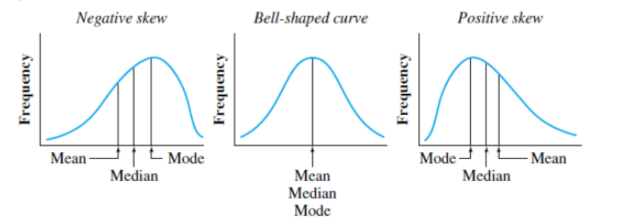

class: title-slide, middle, right 

```{css, echo = F}
/* -------------------------------------------------------
 *
 *     !! This file was generated by xaringanthemer !!
 *
 *  Changes made to this file directly will be overwritten
 *  if you used xaringanthemer in your xaringan slides Rmd
 *
 *  Issues or likes?
 *    - https://github.com/gadenbuie/xaringanthemer
 *    - https://www.garrickadenbuie.com
 *
 *  Need help? Try:
 *    - vignette(package = "xaringanthemer")
 *    - ?xaringanthemer::style_xaringan
 *    - xaringan wiki: https://github.com/yihui/xaringan/wiki
 *    - remarkjs wiki: https://github.com/gnab/remark/wiki
 *
 *  Version: 0.4.1
 *
 * ------------------------------------------------------- */
@import url(https://fonts.googleapis.com/css?family=Lato:400,400i&display=swap);
@import url(https://fonts.googleapis.com/css?family=Lato&display=swap);
@import url(https://fonts.googleapis.com/css?family=Lato&display=swap);
@import url(https://fonts.googleapis.com/css?family=Arial+Narrow&display=swap);

:root {
  /* Fonts */
  --text-font-family: Lato;
  --text-font-is-google: 1;
  --text-font-family-fallback: -apple-system, BlinkMacSystemFont, avenir next, avenir, helvetica neue, helvetica, Ubuntu, roboto, noto, segoe ui, arial;
  --text-font-base: sans-serif;
  --header-font-family: Lato;
  --header-font-is-google: 1;
  --header-font-family-fallback: Georgia, serif;
  --code-font-family: Lato;
  --code-font-is-google: 1;
  --base-font-size: 20px;
  --text-font-size: 1rem;
  --code-font-size: 53%;
  --code-inline-font-size: 1em;
  --header-h1-font-size: 2.75rem;
  --header-h2-font-size: 2.25rem;
  --header-h3-font-size: 1.75rem;

  /* Colors */
  --text-color: #333333;
  --header-color: #DD3333;
  --background-color: #FFFFFF;
  --link-color: #DD3333;
  --text-bold-color: #FF5252;
  --code-highlight-color: rgba(255,255,0,0.5);
  --inverse-text-color: #FFFFFF;
  --inverse-background-color: #DD3333;
  --inverse-header-color: #FFFFFF;
  --inverse-link-color: #DD3333;
  --title-slide-background-color: #FFFFFF;
  --title-slide-text-color: #DD3333;
  --header-background-color: #DD3333;
  --header-background-text-color: #FFFFFF;
  --primary: #FFFFFF;
  --secondary: #DD3333;
}

html {
  font-size: var(--base-font-size);
}

body {
  font-family: var(--text-font-family), var(--text-font-family-fallback), var(--text-font-base);
  font-weight: 400;
  color: var(--text-color);
}
h1, h2, h3 {
  font-family: var(--header-font-family), var(--header-font-family-fallback);
  font-weight: 600;
  color: var(--header-color);
}
.remark-slide-content {
  background-color: var(--background-color);
  font-size: 1rem;
  padding: 0.4em 2.4em 0.4em 2.4em;
  width: 100%;
  height: 100%;
}
.remark-slide-content h1 {
  font-size: var(--header-h1-font-size);
}
.remark-slide-content h2 {
  font-size: var(--header-h2-font-size);
}
.remark-slide-content h3 {
  font-size: var(--header-h3-font-size);
}
.remark-code, .remark-inline-code {
  font-family: var(--code-font-family), Menlo, Consolas, Monaco, Liberation Mono, Lucida Console, monospace;
}
.remark-code {
  font-size: var(--code-font-size);
}
.remark-inline-code {
  font-size: var(--code-inline-font-size);
  color: #DD3333;
}
.remark-slide-number {
  color: #333333;
  opacity: 1;
  font-size: 0.9rem;
}
strong {
  font-weight: bold;
  color: var(--text-bold-color);
}
a, a > code {
  color: var(--link-color);
  text-decoration: none;
}
.footnote {
  position: absolute;
  bottom: 60px;
  padding-right: 4em;
  font-size: 0.9em;
}
.remark-code-line-highlighted {
  background-color: var(--code-highlight-color);
}
.inverse {
  background-color: var(--inverse-background-color);
  color: var(--inverse-text-color);
  
}
.inverse h1, .inverse h2, .inverse h3 {
  color: var(--inverse-header-color);
}
.inverse a, .inverse a > code {
  color: var(--inverse-link-color);
}
.title-slide, .title-slide h1, .title-slide h2, .title-slide h3 {
  color: var(--title-slide-text-color);
}
.title-slide {
  background-color: var(--title-slide-background-color);
}
.title-slide .remark-slide-number {
  display: none;
}
/* Two-column layout */
.left-column {
  width: 20%;
  height: 92%;
  float: left;
}
.left-column h2, .left-column h3 {
  color: #DD333399;
}
.left-column h2:last-of-type, .left-column h3:last-child {
  color: #DD3333;
}
.right-column {
  width: 75%;
  float: right;
  padding-top: 1em;
}
.pull-left {
  float: left;
  width: 47%;
}
.pull-right {
  float: right;
  width: 47%;
}
.pull-right + * {
  clear: both;
}
img, video, iframe {
  max-width: 100%;
}
blockquote {
  border-left: solid 5px #DD333380;
  padding-left: 1em;
}
.remark-slide table {
  margin: auto;
  border-top: 1px solid #666;
  border-bottom: 1px solid #666;
}
.remark-slide table thead th {
  border-bottom: 1px solid #ddd;
}
th, td {
  padding: 5px;
}
.remark-slide thead, .remark-slide tfoot, .remark-slide tr:nth-child(even) {
  background: #FFFFFF;
}
table.dataTable tbody {
  background-color: var(--background-color);
  color: var(--text-color);
}
table.dataTable.display tbody tr.odd {
  background-color: var(--background-color);
}
table.dataTable.display tbody tr.even {
  background-color: #FFFFFF;
}
table.dataTable.hover tbody tr:hover, table.dataTable.display tbody tr:hover {
  background-color: rgba(255, 255, 255, 0.5);
}
.dataTables_wrapper .dataTables_length, .dataTables_wrapper .dataTables_filter, .dataTables_wrapper .dataTables_info, .dataTables_wrapper .dataTables_processing, .dataTables_wrapper .dataTables_paginate {
  color: var(--text-color);
}
.dataTables_wrapper .dataTables_paginate .paginate_button {
  color: var(--text-color) !important;
}

/* Horizontal alignment of code blocks */
.remark-slide-content.left pre,
.remark-slide-content.center pre,
.remark-slide-content.right pre {
  text-align: start;
  width: max-content;
  max-width: 100%;
}
.remark-slide-content.left pre,
.remark-slide-content.right pre {
  min-width: 50%;
  min-width: min(40ch, 100%);
}
.remark-slide-content.center pre {
  min-width: 66%;
  min-width: min(50ch, 100%);
}
.remark-slide-content.left pre {
  margin-left: unset;
  margin-right: auto;
}
.remark-slide-content.center pre {
  margin-left: auto;
  margin-right: auto;
}
.remark-slide-content.right pre {
  margin-left: auto;
  margin-right: unset;
}

/* Slide Header Background for h1 elements */
.remark-slide-content.header_background > h1 {
  display: block;
  position: absolute;
  top: 0;
  left: 0;
  width: 100%;
  background: var(--header-background-color);
  color: var(--header-background-text-color);
  padding: 2rem 2.4em 1.5rem 2.4em;
  margin-top: 0;
  box-sizing: border-box;
}
.remark-slide-content.header_background {
  padding-top: 7rem;
}

@page { margin: 0; }
@media print {
  .remark-slide-scaler {
    width: 100% !important;
    height: 100% !important;
    transform: scale(1) !important;
    top: 0 !important;
    left: 0 !important;
  }
}

.primary {
  color: var(--primary);
}
.bg-primary {
  background-color: var(--primary);
}
.secondary {
  color: var(--secondary);
}
.bg-secondary {
  background-color: var(--secondary);
}

/* Extra CSS */
.remark-slide-scaler {
  overflow-y: auto;
}
.gray {
  color: #aaaaaa;
}
.black {
  color: #bc7777;
}
.darkgreen {
  color: #45503B;
}
.darkred {
  color: #591F0A;
}
.small {
  font-size: 90%;
}
.pull_c {
  float: center;
  width: 30%;
  height: 50%;
  padding-left: 40%;
}
.pull_c_title {
  height: 90%;
}
.pull_l_70 {
  float: left;
  width: 72%;
  font-size: 90%;
}
.pull_r_30 {
  float: right;
  width: 23%;
  font-size: 90%;
}
.pull_left {
  float: left;
  width: 47%;
  height: 100%;
  padding-right: 2%;
}
.pull_right {
  float: right;
  width: 47%;
  height: 100%;
  padding-left: 2%;
}
.small_left {
  float: left;
  width: 47%;
  height: 50%;
  padding-right: 2%;
}
.small_right {
  float: right;
  width: 47%;
  height: 50%;
  padding-left: 2%;
}
.left_code {
  float: left;
  width: 47%;
  height: 100%;
  padding-right: 2%;
  font: Roboto;
}
.code_out {
  float: right;
  width: 47%;
  height: 100%;
  padding-left: 2%;
  font: Roboto;
}
.text_180 {
  font-size: 180%;
}
.text_170 {
  font-size: 170%;
}
.text_160 {
  font-size: 160%;
}
.text_150 {
  font-size: 150%;
}
.text_140 {
  font-size: 140%;
}
.text_130 {
  font-size: 130%;
}
.text_120 {
  font-size: 120%;
}
.text_110 {
  font-size: 110%;
}
.text_110 {
  font-size: 110%;
}
.text_100 {
  font-size: 100%;
}
.code_10 {
  code-inline-font-size: 60%;
  overflow-y: scroll !important;
  overflow-x: scroll !important;
  max-height: 5vh !important;
  line-height: 0.75em;
}
.code_10_pre {
  code-inline-font-size: 60%;
  overflow-y: scroll !important;
  overflow-x: scroll !important;
  max-height: 15vh !important;
  line-height: 0.75em;
  min-height: 0.5em;
}
.code_15 {
  code-inline-font-size: 15%;
  overflow-y: scroll !important;
  overflow-x: scroll !important;
  max-height: 10vh !important;
}
.text_90 {
  font-size: 90%;
}
.text_80 {
  font-size: 80%;
}
.text_70 {
  font-size: 70%;
}
.text_65 {
  font-size: 65%;
}
.text_60 {
  font-size: 60%;
}
.text_50 {
  font-size: 50%;
}
.text_40 {
  font-size: 40%;
}
.text_30 {
  font-size: 30%;
}
.text_20 {
  font-size: 20%;
}
.line_space_15 {
  line-height: 1.5em;;
}
.line_space_13 {
  line-height: 1.3em;;
}
.line_space_11 {
  line-height: 1.1em;;
}
.line_space_15 {
  line-height: 1.5em;;
}
.line_space_09 {
  line-height: 0.9em;;
}
.line_space_07 {
  line-height: 0.7em;;
}
.line_space_05 {
  line-height: 0.5em;;
}
.largest {
  font-size: 2.488em;;
}
.larger {
  font-size: 2.074em;;
}
.large {
  font-size: 1.44em;;
}
.small {
  font-size: 0.833em;;
}
.smaller {
  font-size: 0.694em;;
}
.smallest {
  font-size: 0.579em;;
}
.limity150 {
  max-height: 150px;;
  overflow-y: auto;;
}
.tiny_text {
  font-size: 70%;
}
.large_text {
  font-size: 150%;
}
.slide_blue {
  background-color: #FEDA3F;
  color: #3C3C3B;
}
.center_image {
  margin: 0;
  position: absolute;
  top: 50%;
  left: 50%;
  -ms-transform: translate(-50%, -50%);
  transform: translate(-50%, -50%);
}
.center_left_img {
  top: 50%;
  left: 35%;
}
.center_left_image {
  margin: 0;
  position: absolute;
  top: 50%;
  left: 35%;
  -ms-transform: translate(-50%, -50%);
  transform: translate(-50%, -50%);
}
.center_down_image {
  margin: 0;
  position: absolute;
  top: 90%;
  left: 50%;
  -ms-transform: translate(-50%, -50%);
  transform: translate(-50%, -50%);
}
.center_top_image {
  margin: 0;
  position: absolute;
  top: 10%; /* Adjust to place the image at the top */
  left: 50%;
  -ms-transform: translate(-50%, -50%);
  transform: translate(-50%, -50%);
}
slides > slide {
  overflow-x: auto !important;
  overflow-y: auto !important;
}
.superbigimage {
  white-space: nowrap;
  overflow-y: scroll;
}
```

```{r setup_theme0, include = FALSE}
rm(list=ls());gc()

# # Read in file with correct encoding
# contents <- readLines("xaringan-themer.css", encoding = "Windows-1252")
# 
# # Replace offending character
# clean_contents <- gsub("\x93", "", contents)
# 
# # Write cleaned contents back out with desired encoding
# writeLines(clean_contents, "xaringan-themer3.css", useBytes = TRUE)

if(!grepl("4.1.2",R.version.string)){stop("Different version (must be 4.1.2)")}
pacman::p_unlock(lib.loc = .libPaths()) #para no tener problemas reinstalando paquetes

if(!require(devtools)){install.packages("devtools", type = "win.binary", dependencies=T)}

options(servr.daemon = TRUE)
```

```{cat, engine.opts=list(file = "mylibs/zoom.html"), include=F}
<script src="https://lab.hakim.se/zoom-js/js/zoom.js" type="text/javascript"></script>
<script type="text/javascript">
	slideshow.on( "beforeHideSlide", function( slide ) {
		zoom.out();
	} );
	slideshow.on( "afterShowSlide", function( slide ) {
		document.querySelector( ".remark-visible" ).addEventListener( "dblclick", function( event ) {
			event.preventDefault();
			zoom.to( {element: event.target} );
		} );
	} );
</script>
```

```{r setup, include = FALSE}
local({r <- getOption("repos")
       r["CRAN"] <- "https://cran.dcc.uchile.cl/"
       options(repos=r)
})

if(!require(pacman)){install.packages("pacman")}

if(!require(rcanvas)){devtools::install_github("daranzolin/rcanvas")}

pacman::p_load(devtools, here, showtext, ggpattern, RefManageR, pagedown, magick, bibtex, DiagrammeR, xaringan, xaringanExtra, xaringanthemer, fontawesome, widgetframe, datapasta, tidyverse, psych, tidyverse, cowplot, pdftools, showtext, compareGroups, ggiraph, sf, distill, data.tree,
               widgetframe, install= T)

if(!require(xaringanBuilder)){devtools::install_github("jhelvy/xaringanBuilder",upgrade = "never")}
if(!require(icons)){remotes::install_github("mitchelloharawild/icons",upgrade = "never")}

test_fontawesome<- function(x="github"){
tryCatch({
  invisible(fontawesome::fa(name = x))
  return(message("fontawesome installed"))
},
# ... but if an error occurs, tell me what happened: 
error=function(error_message) {
  message("Installing fontawesome")
  icons::download_fontawesome()  
})
}

vec_col<-c("#660600","#6F3930","#745248","#786B60","#E6E6E6","#738FBC","#003891","#3C5279","#786B60","#B48448","#EF9D2F","#D99155","#E3D1C2","#E0BC9E","#ABB0BF","#835F69","#5A0D13")
plot_prueba<-barplot(1:length(vec_col), col=vec_col)

#https://coolors.co/21177a-fe4a17-788aa3-45503b
xaringanthemer::style_duo( #ABB0BF
  primary_color = "#FFFFFF",  #555555 gris oscuro
  secondary_color = "#DD3333",#"#FF5252"))) 
  text_color = "#333333", #bc7777
  text_bold_color = "#FF5252",
  #base_color = '#bc7777',
  background_position = 'center',
  header_font_google = google_font("Lato"),#Josefin Sans
  text_font_google   = google_font("Lato", "400", "400i"),
  code_font_google   = google_font("Lato"),
  code_font_size = '53%', #sirve
  padding = "0.4em 2.4em 0.4em 2.4em",
  extra_fonts = list(google_font("Arial Narrow")),
 # title_slide_background_image = "./_figs/bg_portada.svg",
#  title_slide_background_size = "cover",
 # background_image = "./_figs/bg.svg",
  background_size = "cover",
  extra_css =
  list(
  ".remark-slide-scaler" = list("overflow-y" = "auto"), # para no tener limites de extensión
 # ".remark-slide-number" = list("display" = "none"), #oculta el reloj también
 # "pre"= list("line-height"= "0.2em"),
  ".gray"   = list(color = "#aaaaaa"),
  ".black"   = list(color = "#bc7777"),
  ".darkgreen"   = list(color = "#45503B"),
  ".darkred"   = list(color = "#591F0A"),
  ".small" = list("font-size" = "90%"),
  ".pull_c" = list("float" = "center","width" = "30%", "height" = "50%", "padding-left" = "40%"),
  ".pull_c_title" = list("height" = "90%"),
  ".pull_l_70" = list("float"= "left","width"= "72%", "font-size"= "90%"),
  ".pull_r_30" = list("float"= "right","width"= "23%", "font-size"= "90%"),
  ".pull_left"  = list("float"= "left","width"= "47%", "height"= "100%", "padding-right"= "2%"),
  ".pull_right" = list("float"= "right","width"= "47%", "height"= "100%", "padding-left"= "2%"),
  ".small_left"  = list("float"= "left", "width"= "47%", "height"= "50%", "padding-right"= "2%"),
  ".small_right" = list("float"= "right","width"= "47%", "height"= "50%", "padding-left"= "2%"),
  ".left_code" = list("float"="left","width"="47%","height"="100%","padding-right"="2%",    "font"="Roboto"),
  ".code_out"  = list("float"="right","width"="47%","height"="100%","padding-left"="2%",    "font"="Roboto"),
  ".text_180" = list("font-size" = "180%"),
  ".text_170" = list("font-size" = "170%"),
  ".text_160" = list("font-size" = "160%"),    
  ".text_150" = list("font-size" = "150%"),
  ".text_140" = list("font-size" = "140%"),  
  ".text_130" = list("font-size" = "130%"),
  ".text_120" = list("font-size" = "120%"),
  ".text_110" = list("font-size" = "110%"),
  ".text_110" = list("font-size" = "110%"),
  ".text_100" = list("font-size" = "100%"),
  ".code_10" = list("code-inline-font-size"= "60%",
                    "overflow-y" = "scroll !important",
                    "overflow-x" = "scroll !important",
                    "max-height" = "5vh !important",
                    "line-height"= "0.75em"),
   ".code_10_pre" = list("code-inline-font-size"= "60%",
                    "overflow-y" = "scroll !important",
                    "overflow-x" = "scroll !important",
                    "max-height" = "15vh !important",
                    "line-height"= "0.75em",
                    "min-height"="0.5em"
                    ),
  ".code_15" = list("code-inline-font-size"= "15%",
                    "overflow-y" = "scroll !important",
                    "overflow-x" = "scroll !important",
                    "max-height" = "10vh !important"),
  ".text_90" = list("font-size" = "90%"),
  ".text_80" = list("font-size" = "80%"),
  ".text_70" = list("font-size" = "70%"),
  ".text_65" = list("font-size" = "65%"),
  ".text_60" = list("font-size" = "60%"),
  ".text_50" = list("font-size" = "50%"),
  ".text_40" = list("font-size" = "40%"),
  ".text_30" = list("font-size" = "30%"),
  ".text_20" = list("font-size" = "20%"),
  ".line_space_15" = list("line-height" = "1.5em;"),
  ".line_space_13" = list("line-height" = "1.3em;"),
  ".line_space_11" = list("line-height" = "1.1em;"),
  ".line_space_15" = list("line-height" = "1.5em;"),
  ".line_space_09" = list("line-height" = "0.9em;"),
  ".line_space_07" = list("line-height" = "0.7em;"),
  ".line_space_05" = list("line-height" = "0.5em;"),
  ".largest" =  list("font-size" = "2.488em;"),
  ".larger" =  list("font-size" = "2.074em;"),
  ".large" =  list("font-size" = "1.44em;"),
  ".small" =  list("font-size" = "0.833em;"),
  ".smaller" =  list("font-size" = "0.694em;"),
  ".smallest" =  list("font-size" = "0.579em;"),
  ".limity150" = list("max-height" = "150px;",
                     "overflow-y" = "auto;"
      ),
    ".tiny_text" = list(
      "font-size"= "70%"
      ),
    ".large_text" = list(
      "font-size"= "150%"
      ),
    ".slide_blue" = list(
      "background-color" = "#FEDA3F",
      "color" = "#3C3C3B"
      ),
  ".center_image" = list(
    margin  = "0",
    position = "absolute",
    top      = "50%",
    left     = "50%",
    '-ms-transform' = "translate(-50%, -50%)",
    transform = "translate(-50%, -50%)"
    ),
    ".center_down_image" = list(
    margin  = "0",
    position = "absolute",
    top      = "90%",
    left     = "50%",
    '-ms-transform' = "translate(-50%, -50%)",
    transform = "translate(-50%, -50%)"
    ),
    "slides > slide" = list(
    "overflow-x"  = "auto !important",
    "overflow-y" = "auto !important"
    ),
 #   "pre" = list(
#    "white-space"  = "pre !important",
#    "overflow-y" = "scroll !important",
#    "max-height" = "40vh !important",
#    "font-size" = "0.8em"
#    ),
    ".superbigimage" = list(
    "white-space"  = "nowrap",
    "overflow-y" = "scroll"
    )
  )
)

options(htmltools.preserve.raw = FALSE)


#knitr::opts_chunk$set(comment = NA) # lo saqué pa probar por si
knitr::opts_chunk$set(dpi=720)
#options(htmltools.preserve.raw = FALSE)#A recent update to rmarkdown (in version 2.6) changed how HTML widgets are included in the output file to use pandoc's raw HTML blocks. Unfortunately, this feature isn't compatible with the JavaScript markdown library used by xaringan. You can disable this feature and resolve the issue with htmlwidgets in xaringan slides by setting
#https://stackoverflow.com/questions/65766516/xaringan-presentation-not-displaying-html-widgets-even-when-knitting-provided-t/65768952#65768952


xaringanExtra::use_progress_bar(color = "#12636B", location = "top")#, height = "550px")
xaringanExtra::use_animate_css()
xaringanExtra::use_scribble() #son los lapices
xaringanExtra::use_tile_view()
xaringanExtra::use_panelset()
xaringanExtra::use_editable(expires = 1)
xaringanExtra::use_fit_screen()

#https://gist.github.com/gadenbuie/61b27108ceec6c7a55cd9966609128d7

# padding-top: 0.4em;
# padding-right: 2.4em;
# padding-bottom: 0.4em;
# padding-left: 2.4em;
invisible("https://www.youtube.com/watch?v=M3skTMQbCD0")
invisible("https://zane.lol/slides/adirondack/#39")
#https://titanwolf.org/Network/Articles/Article?AID=3896fe2c-1b3b-4ebd-9906-1f9ed1675b35#gsc.tab=0
#https://annakrystalli.me/talks/xaringan/xaringan.html#55
#https://bookdown.org/yihui/rmarkdown/some-tips.html
#https://arm.rbind.io/slides/xaringan.html#90
#https://stackoverflow.com/questions/62069400/font-size-of-figure-in-xaringan-slide-too-small
#https://irene.vrbik.ok.ubc.ca/blog/2021-07-14-xaringan-slides/

#https://evamaerey.github.io/doublecrochet/
#devtools::install_github("paulhendricks/anonymizer")
check_code <- function(expr, available){
  if(available){
    eval(parse(text = expr))
  } else {
    expr
  }
}
path2<-dirname(rstudioapi::getSourceEditorContext()$path)
#knitr::opts_chunk$set(message = FALSE,warning = FALSE, error = FALSE)

```

<br> 
 
.line_space_15[ 
## .text_80[Estadística Aplicada y <br> Procesamiento de Datos con R]
]

<br>

.line_space_11[
    
<br>

.text_70[[Código en: `r fontawesome::fa(name = "github")`](https://github.com/AGSCL/Curso_UDP)]

.text_110[Clase 3. Exploración de datos: Medidas de resumen y tendencia central]

]


.bg-text[


`r withr::with_locale(new = c('LC_TIME' = 'es_ES'), code =format(Sys.time(),'%d de %B, %Y'))`


.text_100[Andrés González Santa Cruz]

.text_65[andres.gonzalezs@mail.udp.cl] [`r fontawesome::fa(name = "github")`](https://github.com/AGSCL) [`r fontawesome::fa(name = "orcid", fill="green")`](https://orcid.org/0000-0002-5166-9121)
]

.text_100[José Ruiz-Tagle Maturana]

.text_65[jose.ruiztagle@mail.udp.cl] [`r fontawesome::fa(name = "orcid", fill="green")`](https://orcid.org/0000-0002-4866-5701)

<br>
  
```{r echo=FALSE, out.width = '15%'}
knitr::include_graphics('./_style/cropped-logotipo_fsch.png')
```

???
*#_#_#_#_#_#_#_#_#_#_
**NOTA**
*#_#_#_#_#_#_#_#_#_#_
- Exploración de datos
  -	Medidas de tendencia central, dispersión, posición y forma.
  -	Tablas resumen. 
  -	Visualización básica de datos: R base
    ▪	Histogramas
    ▪	Barras
    ▪	Boxplots

---
layout: true
class: animated, fadeIn
---
## Definiciones (1)

- **Frecuencias $f$ **: Número de veces que un evento se repite
    - Absoluta $f$
    - Relativa $f_i$ 
    - Acumulada $N_i$ 
    - Relativa acumulada $F_i$ 

- **Distribución de frecuencias**: Valores de los datos y frecuencia de aparición en orden. En algunos casos se agrupan por intervalos ("(56 -89])"

<br>

???
*#_#_#_#_#_#_#_#_#_#_
**NOTA**
*#_#_#_#_#_#_#_#_#_#_
- **Frecuencias**= Rango/n° intervalos de clase= 53/10= 5.3 redondeado a 5
- **Relativas**= proporción del número del total de datos en c/intervalo (f/N)
- **Acumuladas**= número de datos que caen debajo del límite superior de cada intervalo
- **% acumulados**= porcentaje de datos que caen por debajo del límite real superior de c/intervalo

**Tabla de frecuencias**? es un listado que asocia cada valor de una variable con su frecuencia. Busca contestar ¿Cuántos sujetos caen
en cada categoría o puntuación?. forma más simple de organizar los datos de una variable, sea cual sea su escala de medición.

.red[- ¿Se les ocurre por qué se ocupa la notación "(" y "]"?, el que incluye es la llave, no el paréntesis "("]


**RECORDATORIO**:

- **Espacio muestral $\Omega$ **: Posibles resultados de un experimento aleatorio

- **Función de densidad $f(x)$ **: Se utiliza para explicar el reparto de probabilidad. Curva continua.

- Espacio muestral no es lo mismo que el espacio probabilístico, este último es más amplio. Tiende a representarse con llaves {}

**Distribución de probabilidad ** : Una distribución de probabilidad describe el reparto de los valores de una variable aleatoria en una población. La función de probabilidad se encuentra [0,1]. Propiedades: siempre es positivo; 0 si el valor no está recorrido. La fx de densidad es la derivada de la fx de distribución
- **Densidad** reemplaza el histograma con una curva suavizada. El área bajo la curva representa el n total de sujetos y es igual a una proporción de 100%

---
## Resumiendo los datos: Tabla de frecuencia

```{r}
#Datos creados artificialmente
set.seed(3872) #semilla aleatoria
muestra_vacunades<-
cbind.data.frame(sexo=sample(rep(0:1,40), 40, replace=F),edad=sample(rep(18:65,40),40,replace=F))

#Dividir en número de clases
factorx <- factor(cut(muestra_vacunades$edad, breaks=nclass.Sturges(muestra_vacunades$edad)))
#Tabular y transformar en una tabla de datos
xout <- as.data.frame(table(factorx))
#Añadir la frecuencia acumulada y proporciones
# ver help(transform) para saber más sobre esta función
xout <- transform(xout, freq_cum = cumsum(Freq), freq_rel = prop.table(Freq), freq_rel_cum=cumsum(prop.table(Freq)))

colnames(xout) <- c("Intervalo de clase", "Frecuencia", "Frec. acumulada", "Frec. relativa", "Frec. relativa acumulada")

knitr::kable(xout,"markdown",
             col.names= c('Intervalo',"$f$", "$f_i$","$N_i$","$F_i$"), escape=T)
```


???
*#_#_#_#_#_#_#_#_#_#_
**NOTA**
*#_#_#_#_#_#_#_#_#_#_

Cómo se determina matemáticamente el número de clases:

- Una forma óptima para obtener un número de clases es La Regla de sturges:
`k=1+3.322log(n)` o `k=1+log2(n)`

- Hay otras formas como Scott y FD (Freedman-Diaconis), Dixon y Kronmal, y Velleman

- Los histogramas utilizan el criterio de Sturges

- Otro criterio está en el Johnson & Kuby de la raíz cuadada de n (si n<125) `sqrt(length(muestra_vacunades$edad))` o `r sqrt(length(muestra_vacunades$edad))`

---
## Tablas

.pull-left[
- De una vía o de 2

.details-code[
```{r tab1, echo=T}
asistentes_curso_2020 <- 
  data.frame(condicion=c("Estudiante Doctorado",".","Académico", "Funcionario", "Estudiante Doctorado",".", "Estudiante Doctorado", "Académico", "Funcionario", ".", "Estudiante"),externo=c("interno", "externo", "interno", "interno", "interno", "externo", "interno", "interno", "interno",  "externo", "interno"),asistencia=c(4, 4, 2, 2, 4, 3, 4, 1, 4, 2, 4))

knitr::kable(table(asistentes_curso_2020$condicion), "markdown")
```
]

- Argumento "Exclude"

.details-code[
```{r tab2, echo=T}
knitr::kable(table(asistentes_curso_2020$condicion, exclude="."), "markdown")
```
]
]

.pull-right[
- Proporciones

.details-code[
```{r tab22, echo=T, error=T}
knitr::kable(prop.table(table(asistentes_curso_2020$condicion, exclude=".")), "markdown")

knitr::kable(prop.table(asistentes_curso_2020$condicion), "markdown")#requiere una tabla
```
]

- De dos vías

.details-code[
```{r tab3, echo=T, error=T}
knitr::kable(
  prop.table(table(asistentes_curso_2020$condicion,
                 asistentes_curso_2020$externo #se incluye otra variable
                 )), "markdown")
```
]
]

---
## Tablas 2

- Dirección (eje). 

.pull-left[
.details-code[
```{r tab32, echo=T, error=T}
knitr::kable(
prop.table(table(asistentes_curso_2020$condicion,
                 asistentes_curso_2020$externo
                 ),margin= 2), "markdown") #cambia la manera en que se calculan las proporciones
# 1 = proporciones por filas, 2= por columnas, NULL =frecuencias globales.
```
]
- Si cambia el eje, pero también el margin, ¿qué ocurre?
]
.pull-right[
- `margin.table`, Calcula la suma de entradas de una tabla para determinado índice

.details-code[
```{r tab4, echo=T, error=T}
knitr::kable(
  margin.table(table(asistentes_curso_2020$condicion,
      asistentes_curso_2020$externo
),1), "markdown")
```
]
.details-code[
```{r tab42, echo=T, error=T}
knitr::kable(
margin.table(table(asistentes_curso_2020$condicion,
      asistentes_curso_2020$externo
),2), "markdown")
```
]
]

---
## Ejemplo aplicado

- Seleccionar velocidades altas en base a un vector de valores
- Generar una matriz de distancia recorrida y velocidad (en mph)

.details[
.details-code[
```{r ej_mat_vec, echo=T, size = 'tiny'}
if(!require(dplyr)){install.packages("dplyr")} #si no existe, se instala
data(cars) #cargo la base de datos cars de dplyr
str(cars) # exploro los datos
vec_vels<-c(23,24,25) # vector de velocidades altas seleccionadas
```
]
]

.details-code[
```{r ej_mat_vec2, echo=T, size = 'tiny'}
sel_cars<- subset(cars, subset=speed %in% vec_vels)

knitr::kable(
  table(sel_cars$speed, sel_cars$dist),  # filtro en base a un vector
   "markdown") #matriz de velocidad por distancia
```
]


---
## Gráficos de barras

- Sirve para variables categóricas. No obstante, para ello, debemos utilizar una matriz de recuentos por categoría
- Tenemos una condición ausente (".")
- Tenemos otra etiqueta que no cabrá en el gráfico de barras y no aparecerá

.pull_left[
.details-code[
```{r ,"bar1", eval=T, echo=T, paged.print=TRUE}
#OPC1. R Base, Tabla
barplot(table(asistentes_curso_2020$condicion),
        col = "darkred", #color de las barras
        main= "Asistentes a Taller R y Rstudio 2020", #título
        xlab= "Recuento", #etiqeuta 
        names.arg = c("No indica", "Académico", "Estudiante", "Estudiante Doc", "Funcionario"), #definimos etiquetas
        ylab= "Condición", #si se fijan, las etiquetas están rotadas
        horiz=T, #El argumento permite rotar la tabla
        beside=T,
        xlim=c(0,4) #le damos un poco más de espacio
        )
```
]
]

.pull_right[
.details-code[
```{r, "bar2", echo=T, warning=F, echo=T}
#OPC1. R Base, Tabla
barplot(table(asistentes_curso_2020$condicion),
        col = "darkred", #color de las barras
        main= "Asistentes a Taller R y Rstudio 2020", #título
        xlab= "Recuento", #etiqeuta 
        names.arg = c("No indica", "Académico", "Estudiante", "Estudiante Doc", "Funcionario"), #definimos etiquetas
        ylab= "Condición", #si se fijan, las etiquetas están rotadas
        horiz=T, #El argumento permite rotar la tabla
        beside=T,
        xlim=c(0,4) #le damos un poco más de espacio
        )
```
]
]

---
## Gráficos de mosaico


.pull_left[
.details-code[
```{r ,"mosaic1", eval=T, echo=T, paged.print=TRUE}
#Recuerde la base de desempleados que generamos
x<-array(c(52,41,25,85,136,128,28,59,65,16,1,133),c(2,3,2))
dimnames(x)<-list(c("H","M"),c("desempleado","empleado","inactivo"),c("santiago","valparaiso"))

#_#_#_#_#_#_
#OPC1. R Base, Tabla o Array

# Especificar los colores
colors <-  c("white", "#bc7777")

# Crear el gráfico mosico
mosaicplot(x, 
           main="Gráfico de mosaico", #título
           col=colors, #colores
           ylab="Condición",
           xlab= "Región"
           )
```
]
]
.pull_right[

- `~` (ojo con su rol)

.details-code[
```{r, "mosaic2", echo=T, warning=F, echo=T}
set.seed(4321) #Creamos una semilla para la generación de datos, 
#de manera que los podamos reproducir
datos<- cbind.data.frame(nota= rnorm(200, 4, .5),#Generamos 200 números aleatorizados, con un promedio 4 y una desviación estándar de 0,5
                         color_fav= sample(c("blanco","gris","rojo","negro"),200, replace=T) #Color favorito aleatorizado entre esos 4 colores, conforme a la semilla
                         )

#agregamos la columna para ver si pasa de curso
datos$pasa<- ifelse(datos$nota>3.944,1,0)

#_#_#_#_#_
#OPC2. R Base, Virgulilla ~
mosaicplot(~ pasa+ color_fav, 
           data = datos, 
           main= "Color favorito y aprobación curso",
           ylab="Color favorito", #etiqueta vertical
           xlab= "Pasa de curso (1=Sí)", #etiqueta horizontal
           col= c("white","gray","red","black"))
```
]
]

---
## Definiciones (2)

- **Rango R **: Dato máximo menos dato mínimo

- **Media (M)**: Suma de las puntuaciones dividido por el número de observaciones

$$\frac{1}{n} \sum_{i=1}^{n} a_{i} = \frac{a_{1} + a_{2} \dots + a_{n} }{n}$$

- **Tendencia central**: Centro de los datos ordenados según magnitud

- **Mediana (Mdn)**: Puntuación de la mitad en una distribución ordenada

$$Mdn=L_i+ \frac{(\frac{N}{2}-F_{i-1})}{f_i}*a_i$$
.pull-left[
Número impar de observaciones: 
$x_{\left( \frac{n+1}{2} \right)}$

Numero empatado de observaciones: 
$\frac{x_{\left( \frac{n}{2} \right)} + x_{\left( \frac{n}{2} + 1 \right)}}{2}$
]

.pull-right[
.small[
Sea:
- $L_i$ = limite inferior de la en el que se encuentra la mediana
- $\frac{N}{2}$ = frecuencias absolutas
- $f_i$ = frecuencia absoluta del intervalo
- $F_{i-1}$ = frecuencia acumulada anterior al intervalo mediano
- $a_i$ = amplitud del intervalo
- $n$ = número de observaciones
- $x_i$ = i-ésimo valor observado
]
]
.pull-left[
- **Moda (Mo)**: Puntuación más frecuente

para datos agrupados en una tabla de frecuencias: 
$Mo=L_i+ (\frac{d_1}{d_1 + d_2})*a_i$
]
.pull-right[

.small[
Sea:
- $L_i$= límite inferior de la clase modal (mayor frecuencia)
- $d_1$= diferencia entre la frecuencia de la clase modal y la clase anterior
- $d_2$= diferencia entre la frecuencia de la clase modal y la clase posterior
- $a_i$= ancho de la clase (diferencia entre el valor menor y mayor del intervalo)
]

.center[ .red[*“Hay dos panes. Usted se come dos. Yo ninguno. Consumo promedio: un pan por persona"* ] ]
]

<br>

```{css, echo = F}
.reduced_opacity {
  opacity: 0.5;
}
.div-parent {
   overflow: hidden
}

.div-child {
   transform: rotate(90deg);
}
.div-child2 {
   transform: rotate(270deg);
}
```

???
*#_#_#_#_#_#_#_#_#_#_
**NOTA**
*#_#_#_#_#_#_#_#_#_#_
- La tendencia central sirve en determinadas distribuciones que agrupan más datos en medio. Ej., la normal. Una uniforme no tiene mucho sentido, tal vez en tales casos es mejor ver la distribución.
- Hablamos de la media aritmética. Hay otros tipos de medias: ponderadas, geométricas, armónicas
- Cuidado con aplicar la media a variables ordinales. Si bien puede ocurrir, debe interpretarse con cautela. Requiere variables de intervalo/razón
- Cuidado con aplicar medidas de tendencia central en presencia de valores extremos (en ese caso, se utiliza una media suavizada o ajustada). Tampoco utilizarla en distribuciones muy asimétricas

  - $ L_i $ = limite inferior del intervalo en el que se encuentra la mediana
  - $ \frac{N}{2} $ frecuencias absolutas
  - $ f_i $ frecuencia absoluta del intervalo
  - $ F_{i-1} $ frecuencia acumulada anterior al intervalo mediano
  - $ a_i $ amplitud del intervalo
  - $ x_i $ valor observado

- La moda puede aplicarse a datos categóricos
- Identificar el intervalo que tiene mayor freq absoluta
- En la ecuación d1 es la diferencia entre el intervalo modal y el anterior, y el d2 es la diferencia del intervalo modal con el posterior
- Las distribuciones pueden ser unimodales, bimodales o multimodales. si todos presentan la misma frecuencia, son rectangulares
- La moda es muy limitada en términos de información, pero es aplicable a todos los niveles de medición

- **Mediana**.  Su notación matemática no está estandarizada. A veces puede ser med{}
  - Las variables continuas también tienen la propiedad de ordenarse?. Percentil 50. El 50% tiene 7 o menos puntos
  - Más útil cuando la distribución es sesgada
  - Si son observaciones pares, se obtiene la media de aquellas puntuaciones intermedias;
  - si son impares, se elije la del medio
  - Tiende a ubicarse en la posición (n/2)*.5
  - Sensible al tamaño de la muestra
  - Sensible a puntuaciones (ej., un grupo con valores muy bajos vs. valores muy altos)

---
## Medidas de Tendencia Central

- Media y mediana 

.details-code[

```{r media, echo=T, warning=F}
Gastos_casa_csv <- read.delim("https://raw.githubusercontent.com/AGSCL/Curso_R/master/Gastos_casa_csv.txt") 

mean(Gastos_casa_csv$monto, na.rm=T) #Utilizar este argumento para omitir los casos perdidos.
```

]

.details-code[
```{r mediana, echo=T, warning=F}
median(Gastos_casa_csv$monto, na.rm=T) #Utilizar este argumento para omitir los casos perdidos.
```

]

- En el caso de la moda necesitaremos aplicar una función, que tomará todos los valores únicos de un determinado vector, y que obtendrá el que posee la mayor cantidad de observaciones del vector que calzan con el valor único.

.details-code[
```{r moda, echo=T, warning=F}
Mode <- function(x) {
  ux <- unique(x)
  ux[which.max(tabulate(match(x, ux)))]
}
gastos_casa_csv_2<-cbind(Gastos_casa_csv, monto_en_miles=round(Gastos_casa_csv$monto/1000,0))
Mode(gastos_casa_csv_2$monto_en_miles)
```
]
- ¿Qué ocurrió con los resultados? Esta función no tiene la opción de remover valores perdidos, por lo que una opción plausible será ingresar una base de datos sin valores perdidos ("listwise deletion of missing values").

.details-code[
```{r moda_corr, echo=T, warning=F}
gastos_casa_csv_2_naomit<-na.omit(gastos_casa_csv_2) #
Mode(gastos_casa_csv_2_naomit$monto_en_miles)
```
]

- ¿Qué hizo la función na.omit?. lo mismo que `Mode(gastos_casa_csv_2[-c(231:1226),4])`.

.center[**Analicen qué se hizo aquí**]

---
## Medidas de dispersión
- **Rango**: $Max - Min$
.details-code[
```{r rango, echo=T, warning=F}
gastos_casa_csv_2_naomit<-na.omit(gastos_casa_csv_2) #
max(gastos_casa_csv_2_naomit$monto_en_miles)-min(gastos_casa_csv_2_naomit$monto_en_miles)
```
]
- **Rango Intercuartílico (RIC)**: $Q_3-Q_1$
.details-code[
```{r ric, echo=T, warning=F}
gastos_casa_csv_2_naomit<-na.omit(gastos_casa_csv_2) #
IQR(gastos_casa_csv_2_naomit$monto_en_miles)
```
]
- **Varianza**: $\frac{1}{n} \sum_{i=1}^{n} (x_i-\bar{x})^2$
.details-code[
```{r varianza, echo=T, warning=F}
gastos_casa_csv_2_naomit<-na.omit(gastos_casa_csv_2) #
var(gastos_casa_csv_2_naomit$monto_en_miles)
```
]
- **Desviación estándar**: $\sqrt{\frac{1}{n} \sum_{i=1}^{n} (x_i-\bar{x})^2}$
.details-code[
```{r desv, echo=T, warning=F}
gastos_casa_csv_2_naomit<-na.omit(gastos_casa_csv_2) #
sd(gastos_casa_csv_2_naomit$monto_en_miles)
```
]

---
## Variaciones descriptivas

.pull-left[
- Otro software
.details-code[
```{r psych_desc, echo=T, warning=F}
if(!require(psych)){install.packages("psych")}
psych::describe(gastos_casa_csv_2_naomit$monto)
```
]
- y agrupar por contribuyente
.details-code[
```{r psych_desc_by, echo=T, warning=F}
psych::describeBy(gastos_casa_csv_2_naomit$monto, group=gastos_casa_csv_2_naomit$ejecutor)
```
]
]

.pull-right[

.details-code[
```{r hmisc_desc, echo=T, warning=F, message=F}
if(!require(Hmisc)){install.packages("Hmisc")}
#No permite compararlo por grupos, por lo que dividimos la base de datos por persona.
Hmisc::describe(~ monto, data= gastos_casa_csv_2_naomit[gastos_casa_csv_2_naomit$ejecutor=="Persona1",])
```
]

.details-code[

```{r hmisc_desc2, echo=T, warning=F, message=F}
Hmisc::describe(~ monto, data= subset(gastos_casa_csv_2_naomit, ejecutor=="Persona2"))
```

]

- Paquetes para explorar más allá de este curso: comparegroups, tableone, codebook, etc.
]


???
*#_#_#_#_#_#_#_#_#_#_
**NOTA**
*#_#_#_#_#_#_#_#_#_#_

La función describe permite obtener las principales medidas de centralización (media, mediana, moda), dispersión (desviación típica), posición (cuartiles y percentiles) y formaa (curtosis y asimetría)

#Para mayor información, consultar https://www.rdocumentation.org/packages/psych/versions/2.0.12/topics/describeBy


---
class: reduced_opacity

background-image: url("./_figs/casen.jpg")
background-position: top center
background-size: 80%

.down[
.left[
[**Leer noticia**](https://www.latercera.com/pulso/noticia/ingreso-laboral-promedio-mensual-en-chile-fue-de-635134-en-2020/OJHFRY3ZWRGUROC4GBSRW5EXNM/)

.text_60[
.left["La mayor parte de los hogares (un 22,5%) percibieron ingresos netos entre $500.000 y $750.000, en tanto, el 18,1% entre $250.000 y $500.000. Mientras que, 5,4% ]
.left[recibe ingresos mayores de $3.000.000, y solo 0,6% percibe ingresos mayores a $7.000.000."]
    ]
  ]
]

---
## Histograma y Densidad

- Gráfico de barras que representa una distribución de frecuencias
- La densidad suaviza la distribución sobre las probabilidades según la posición en el eje X
- Para los histogramas se generó el siguiente script: `hist(datos, main= "Histograma de los datos presentados",  ylab = "Frecuencia")`, y para la densidad (KDE) se generó este otro script: `plot(density(datos), main= "Histograma de los datos presentados")`

.pull_left[
.details-code[
```{r echo=T, out.width = '100%', fig.retina = 1, fig.align='center'}
require(dplyr)
data("ChickWeight") # cargamos la base de Chickweight
#help("ChickWeight") # para mayor información

hist(ChickWeight$weight, 
     main= "Histograma de las gallinas", # título gráfico
     xlab= "Peso (en gramos)", #etiqueta horizontal
     ylab = "Frecuencia") #etiqueta vertical
```
]
]

.pull_right[
.details-code[
```{r echo=T, out.width = '100%', fig.retina = 1, fig.align='center'}
plot(density(ChickWeight$weight), 
     main="Densidad de los datos presentados", # main= título
     lwd=2, #lwd= ancho línea
     ylab="Densidad") #etiqueta vertical

```
]
]

???
*#_#_#_#_#_#_#_#_#_#_
**NOTA**
*#_#_#_#_#_#_#_#_#_#_
Vamos a ir viendo otros gráficos útiles para explorar datos

---
## Definiciones (3)

- **Medidas de posición** : Describen la posición de un dato en relación con el resto ("de posición relativa")

- **Percentiles ** $P{x}$ : Valor sobre la escala de medida sobre la cual se ubica un porcentaje de los datos de la distribución total. 

$$ X_L + (i/f_i) (f_p acumulada- f_L acumulada)$$

- **Cuartiles** $Q{x}$ : Valores de una variable en cuartos

  + ¿Qué percentil sería el rango mínimo?
  
  + ¿Qué percentil sería el rango máximo?

<br>

???
*****************NOTA******************************
 - Hablamos de la mediana, a la que describimos como el 50% de los datos o el percentil 50, o el segundo cuartil
 - Cuando las variables no se distribuyen de manera normal,  uno tiende a reportar la mediana y el rango intercuartil (Q1 -Q3)
 - También está el decil, el quintil, etc.
 - Con esta medida estamos dividiendo en partes la distirbución de la muestra
 - $X_L$ valor límite real inferior del intervalo que contiene al punto percentil ; $f_p$ acumulada=frecuencia de datos que están por debajo del punto percentil; $f_L$ acumulada= frecuencia de datos que está debajo delímite real inferior del intervalo que contiene al punto percentil ; $f_i$ = Frecuencia del intervalo que contiene al punto percentil; $i$ = Amplitud del intervalo

---
## Aplicación


.pull_left[

- Forma manual de calcularlo

.details-code[

```{r percentile, echo=T, warning=F, size = 'tiny'}
options(scipen = 999) #para que no muestre números en notación científica
#sin seeedJ

set.seed(2515)
ejemplo<-round(rnorm(30,5),0)

sort(ejemplo)[(length(ejemplo)/100)*40] #<<
```

]

- Cuartiles

.details-code[

```{r percentile2, echo=T, warning=F, size = 'tiny'}
options(scipen = 999) #para que no muestre números en notación científica
#sin seeedJ
quantile(ejemplo, seq(1:4)*.25)
```

]
]

.pull_right[

- Percentiles

.details-code[
```{r percentile3, echo=T, warning=F, size = 'tiny'}
quantile(ejemplo,.4)
```
]

- Quintiles

.details-code[

```{r percentile4, echo=T, warning=F, size = 'tiny'}
quantile(ejemplo,seq(1:4)*.2)
```

]

]


---
## Asimetría

- Simetría: Misma cantidad de observaciones a ambos lados del centro

```{r, echo=F, warning=F, message=F, size = 'tiny', out.width=500, fig.align='center'}
#
image_colorize(image_read(path = "./_figs/asimetria_dists.PNG"),35,"red")
```
$^{Fuente: Pagano, 1999, p. 55}$


???
*#_#_#_#_#_#_#_#_#_#_
**NOTA**
*#_#_#_#_#_#_#_#_#_#_
- **Gracias al bueno de Karl Pearson**
- Unimodal y simétrica
- Las clases anteriores hablamos de las distribuciones unimodales, bimodales o multimodales, y si todos presentan la misma frecuencia, son rectangulares
- En algunos casos presenta una cola en un lado y no en otro. La asimetría a la derecha o positiva. Esta es bastante común cuando hay recuentos, conteos y distribuciones poisson, la cantidad de hijos por familia en países en desarrollo o desarrollados, etc.

- Común en efecto piso (se acumulan obs. en el mínimo) o techo (en el extremo derecho)

- Poner ejemplo distribución normal
- Poner ejemplo poisson
- Curvas simétricas o asimétricas
- Hablar de distribución bimodal, sesgado a la derecha, izq, etc.
- es unimodadal y simétrica, la media, la mediana y la moda serán iguales.
- distribución es sesgada, la media y la mediana no serán iguales.
- negativamente sesgada, la media será menor que la mediana.
- Asimetría positiva indica que los valores más extremos se encuentran por sobre la media.


---
## Asimetría (2) (entra en la prueba)

¿Sesgada o simétrica?

¿Cuántas modas?

.red[.center[su turno]]

```{r, echo=F, warning=F, message=F, out.width=500, fig.align='center'}
image_colorize(image_read(path = "./_figs/asimetria_dists2.PNG"),35,"red")
```
$^{Fuente: Pagano, 1999, p. 55}$

???
*#_#_#_#_#_#_#_#_#_#_
**NOTA**
*#_#_#_#_#_#_#_#_#_#_
- a, b y c --> simétricas /// d, e y f --> sesgadas

---
## Diagramas de caja

.details-code[

```{r ejercicio, echo=T, out.width = "500x", fig.align='center'}
boxplot(weight ~ Diet,  #FORMATO FÓRMULA
        data = ChickWeight,
        # se encuentra la variable dependiente (Y) y la variable independiente (X)
        frame = FALSE,
        notch = TRUE,
        xlab= "Tipo de Dieta",
        ylab="Peso (en gramos)", #etiquetas
        col = c("white", "#bc7777")) #etiquetas
```

]

???
*#_#_#_#_#_#_#_#_#_#_
**NOTA**
*#_#_#_#_#_#_#_#_#_#_

- Boxplot: 
    - IQR (cajas),  
    - bigotes (Q1 +/- 1.5 * IQR (Q3-Q1) si hay puntos alejados, valores aberrantes), 
    - puntos alejados (anomalías o _outliers_)

---
## Ejercicio 1

- Crear un vector numérico con los siguientes datos: 25, 26, 27, 28, 28, 29, 25, 30, 29. Encuentre la media y la mediana.

- En la clase se midió el grupo de sangre de 36 estudiantes de una clase como sigue: B, A, O, B, A, O, O, A, AB, O, A, A, B, O, O, AB, O, A, O, A, O, O, AB, B, A, O, B, A, B, O, B, A, O, B, A, B. Crear un vector categórico y representar estos datos como una tabla de frecuencias

  - ¿cuál es la moda?

- Indique si el contenido de las frases es correcto o no, y por qué:

  - "Si la mediana es 60, el el 50% tiene 60 años o menos en la muestra descrita"
  
  - "La persona X está el doble de satisfecha con el producto, ya que indicó estar 'muy de acuerdo' con que la frase 'me encuentro satisfecho', en comparación a la persona Y que indicó estar 'de acuerdo' con la frase"
  
  
---
## Ejercicio 2

De la base de datos de *`drogas y jóvenes 2007`* (`dyj_2007`), y de la suma de los datos de prevalencia año de sustancias (`sumaprev`)...

```{r}
#Abrimos una base de datos formato SPSS
dyj_2007 <- haven::read_sav("https://github.com/AGSCL/udp_2023/raw/main/_data/Drogas%20y%20jovenes_2007.sav")

invisible("Generamos una suma de los datos de prevalencia año de sustancias")
dyj_2007$sumaprev<-rowSums(dyj_2007[, 2:15])
```

- Encuentre la varianza

- Obtenga la desviación estándar de la prevalencia año de sustancias

- Obténgala por sexo (p1)

De algunas de las base de datos de permisos de circulación pagados y tramitados en la Municipalidad de Cochamó el 2016 (https://datos.gob.cl/dataset/permisoscirculacion2016cochamo), 

- Obtenga el porcentaje por columna, según corresponda al tipo de variable y nivel de medición.

- Obtenga la media y la mediana, según corresponda al tipo de variable y nivel de medición.

- **EXTRA**: Obtenga una tabla de 2 vías, según corresponda al tipo de variable y nivel de medición.
  

---
## Ejercicio 3

+ Actividad en grupos (trabajo en equipo) 

 + **Grupo 1**: Requiero evaluar el desempeño sobresaliente de una clase. Tengo un cuestionario que entrega puntajes de 0 a 20, aunque el problema es que en los últimos 3 cursos que he dictado y que he aplicado el cuestionario, he obtenido puntuaciones no muy comparables (ej., rango primera prueba= 12-20; segunda= 3-8; tercera= 7-11) ¿Qué indicador se le ocurre?
 
 + **Grupo 2**: Soy un legislador salvadoreño y requiero legislar para asignar un bono a la población económicamente más vulnerable. Nuestra moneda oficial es el bitcoin, aunque debido a su volatilidad, se hace complicado definir un monto.
 
 + **Grupo 1**: Indíqueme de la siguiente muestra, cuál es el valor máximo que podría adoptar el 40% de las observaciones:  `r set.seed(2515);paste0(capture.output(as.character(dput(round(rnorm(30,5),0))))[1],capture.output(as.character(dput(round(rnorm(30,5),0))))[2])`
 
 + **Grupo 2**: Reemplace la X por una nota de la siguiente frase: "Del grupo de puntajes del 1 al 10 obtenidas por el curso 4°B del liceo 7-B de Pirinco, el 60% obtuvo un puntaje de X o menos". Los datos son los siguientes: `r set.seed(2515);paste0(capture.output(as.character(dput(round(rnorm(30,6,2),0))))[1],capture.output(as.character(dput(round(rnorm(30,6,2),0))))[2])`

---
## Ejercicio 4

- Describa la personalidad según el signo del zodiaco al cual pertenecen las personas

.details-code[
```{r, echo=T}
set.seed(3422);cbind.data.frame(tipo_personalidad=sample(rep(c("A","B"),80), 78, replace=F),
                                signo=sample(rep(c("leo", "virgo", "escorpión", "sagitario", "acuario", "piscis"),40), 78, replace=F))-> zodiaco_perso

```
]

---
## Ejercicio 5

- Importar `casen_red.sav` (https://raw.githubusercontent.com/AGSCL/udp_2023/main/_data/casen_red.sav)

- Complete la [guía de ejercicios](https://github.com/AGSCL/udp_2023/blob/main/Gu%C3%ADa%20Estadistica%20descriptiva.R)

---
class: center, middle

# Gracias!

<br>
  
<div class="centered"> Contacto: CANVAS </div>

<br>

<br>

<br>

```{r, echo=FALSE,  fig.align="center", out.width=300, error=T}
knitr::include_graphics('./_style/cropped-logotipo_fsch.png')
```
<br>


---
## Fuentes

- Canales, M. (2014). Metodologías de Investigación Social: Introducción a Los Oficios (2° Ed.) (págs. 11-28). Santiago: LOM Ediciones.

- Chile. Ministerio de Ciencia, Tecnología, Conocimiento e Innovación (2020). Datos-COVID19. Obtenido desde: https://github.com/MinCiencia/Datos-COVID19

- Chile. Ministerio de Desarrollo Social (MIDEPLAN) (2021, Julio). CASEN 2020: Encuesta de caracterización socioeconómica nacional en Pandemia. Ingresos de los hogares. Santiago, Chile: Observatorio MIDEPLAN. Obtenido desde: http://observatorio.ministeriodesarrollosocial.gob.cl/storage/docs/casen/2020/Resultados_Ingresos_casen2020_en_pandemia.pdf

- Johnson, R. & Kuby, P. (2008). Estadística Elemental: lo esencial México: Cengage Learning.

- Pagano, R. (1998). Estadística para las ciencias del Comportamiento. México: Thompson.

- Ritchey, F. (2008). Estadística para las Ciencias Sociales. México: McGrawll Hill.


```{r exp, eval=F,echo=F, results="asis"}
library(pagedown)
gsub(".Rmd",".html",rstudioapi::getSourceEditorContext()$path)
#para exportar la presentación a PDF
xaringanBuilder::build_pdf(gsub(".Rmd",".html",rstudioapi::getSourceEditorContext()$path),complex_slides = TRUE,output_file="Clase3.pdf")
#xaringanBuilder::build_pdf(gsub(".Rmd",".Rmd",rstudioapi::getSourceEditorContext()$path),complex_slides = TRUE,output_file="pres_2023_23.pdf")
```
