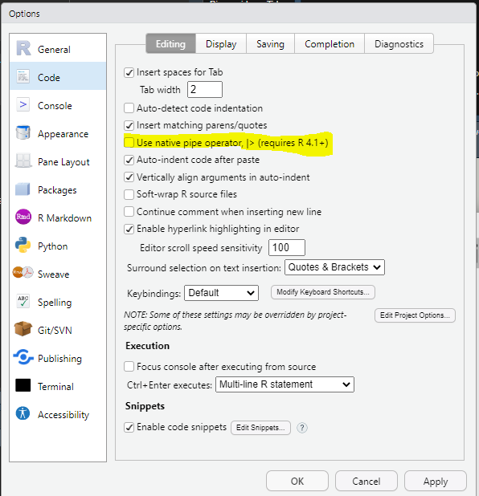

class: title-slide, middle, right 

```{css, echo = F}
/* -------------------------------------------------------
 *
 *     !! This file was generated by xaringanthemer !!
 *
 *  Changes made to this file directly will be overwritten
 *  if you used xaringanthemer in your xaringan slides Rmd
 *
 *  Issues or likes?
 *    - https://github.com/gadenbuie/xaringanthemer
 *    - https://www.garrickadenbuie.com
 *
 *  Need help? Try:
 *    - vignette(package = "xaringanthemer")
 *    - ?xaringanthemer::style_xaringan
 *    - xaringan wiki: https://github.com/yihui/xaringan/wiki
 *    - remarkjs wiki: https://github.com/gnab/remark/wiki
 *
 *  Version: 0.4.1
 *
 * ------------------------------------------------------- */
@import url(https://fonts.googleapis.com/css?family=Lato:400,400i&display=swap);
@import url(https://fonts.googleapis.com/css?family=Lato&display=swap);
@import url(https://fonts.googleapis.com/css?family=Lato&display=swap);
@import url(https://fonts.googleapis.com/css?family=Arial+Narrow&display=swap);

:root {
  /* Fonts */
  --text-font-family: Lato;
  --text-font-is-google: 1;
  --text-font-family-fallback: -apple-system, BlinkMacSystemFont, avenir next, avenir, helvetica neue, helvetica, Ubuntu, roboto, noto, segoe ui, arial;
  --text-font-base: sans-serif;
  --header-font-family: Lato;
  --header-font-is-google: 1;
  --header-font-family-fallback: Georgia, serif;
  --code-font-family: Lato;
  --code-font-is-google: 1;
  --base-font-size: 20px;
  --text-font-size: 1rem;
  --code-font-size: 53%;
  --code-inline-font-size: 1em;
  --header-h1-font-size: 2.75rem;
  --header-h2-font-size: 2.25rem;
  --header-h3-font-size: 1.75rem;

  /* Colors */
  --text-color: #333333;
  --header-color: #DD3333;
  --background-color: #FFFFFF;
  --link-color: #DD3333;
  --text-bold-color: #FF5252;
  --code-highlight-color: rgba(255,255,0,0.5);
  --inverse-text-color: #FFFFFF;
  --inverse-background-color: #DD3333;
  --inverse-header-color: #FFFFFF;
  --inverse-link-color: #DD3333;
  --title-slide-background-color: #FFFFFF;
  --title-slide-text-color: #DD3333;
  --header-background-color: #DD3333;
  --header-background-text-color: #FFFFFF;
  --primary: #FFFFFF;
  --secondary: #DD3333;
}

html {
  font-size: var(--base-font-size);
}

body {
  font-family: var(--text-font-family), var(--text-font-family-fallback), var(--text-font-base);
  font-weight: 400;
  color: var(--text-color);
}
h1, h2, h3 {
  font-family: var(--header-font-family), var(--header-font-family-fallback);
  font-weight: 600;
  color: var(--header-color);
}
.remark-slide-content {
  background-color: var(--background-color);
  font-size: 1rem;
  padding: 0.4em 2.4em 0.4em 2.4em;
  width: 100%;
  height: 100%;
}
.remark-slide-content h1 {
  font-size: var(--header-h1-font-size);
}
.remark-slide-content h2 {
  font-size: var(--header-h2-font-size);
}
.remark-slide-content h3 {
  font-size: var(--header-h3-font-size);
}
.remark-code, .remark-inline-code {
  font-family: var(--code-font-family), Menlo, Consolas, Monaco, Liberation Mono, Lucida Console, monospace;
}
.remark-code {
  font-size: var(--code-font-size);
}
.remark-inline-code {
  font-size: var(--code-inline-font-size);
  color: #DD3333;
}
.remark-slide-number {
  color: #333333;
  opacity: 1;
  font-size: 0.9rem;
}
strong {
  font-weight: bold;
  color: var(--text-bold-color);
}
a, a > code {
  color: var(--link-color);
  text-decoration: none;
}
.footnote {
  position: absolute;
  bottom: 60px;
  padding-right: 4em;
  font-size: 0.9em;
}
.remark-code-line-highlighted {
  background-color: var(--code-highlight-color);
}
.inverse {
  background-color: var(--inverse-background-color);
  color: var(--inverse-text-color);
  
}
.inverse h1, .inverse h2, .inverse h3 {
  color: var(--inverse-header-color);
}
.inverse a, .inverse a > code {
  color: var(--inverse-link-color);
}
.title-slide, .title-slide h1, .title-slide h2, .title-slide h3 {
  color: var(--title-slide-text-color);
}
.title-slide {
  background-color: var(--title-slide-background-color);
}
.title-slide .remark-slide-number {
  display: none;
}
/* Two-column layout */
.left-column {
  width: 20%;
  height: 92%;
  float: left;
}
.left-column h2, .left-column h3 {
  color: #DD333399;
}
.left-column h2:last-of-type, .left-column h3:last-child {
  color: #DD3333;
}
.right-column {
  width: 75%;
  float: right;
  padding-top: 1em;
}
.pull-left {
  float: left;
  width: 47%;
}
.pull-right {
  float: right;
  width: 47%;
}
.pull-right + * {
  clear: both;
}
img, video, iframe {
  max-width: 100%;
}
blockquote {
  border-left: solid 5px #DD333380;
  padding-left: 1em;
}
.remark-slide table {
  margin: auto;
  border-top: 1px solid #666;
  border-bottom: 1px solid #666;
}
.remark-slide table thead th {
  border-bottom: 1px solid #ddd;
}
th, td {
  padding: 5px;
}
.remark-slide thead, .remark-slide tfoot, .remark-slide tr:nth-child(even) {
  background: #FFFFFF;
}
table.dataTable tbody {
  background-color: var(--background-color);
  color: var(--text-color);
}
table.dataTable.display tbody tr.odd {
  background-color: var(--background-color);
}
table.dataTable.display tbody tr.even {
  background-color: #FFFFFF;
}
table.dataTable.hover tbody tr:hover, table.dataTable.display tbody tr:hover {
  background-color: rgba(255, 255, 255, 0.5);
}
.dataTables_wrapper .dataTables_length, .dataTables_wrapper .dataTables_filter, .dataTables_wrapper .dataTables_info, .dataTables_wrapper .dataTables_processing, .dataTables_wrapper .dataTables_paginate {
  color: var(--text-color);
}
.dataTables_wrapper .dataTables_paginate .paginate_button {
  color: var(--text-color) !important;
}

/* Horizontal alignment of code blocks */
.remark-slide-content.left pre,
.remark-slide-content.center pre,
.remark-slide-content.right pre {
  text-align: start;
  width: max-content;
  max-width: 100%;
}
.remark-slide-content.left pre,
.remark-slide-content.right pre {
  min-width: 50%;
  min-width: min(40ch, 100%);
}
.remark-slide-content.center pre {
  min-width: 66%;
  min-width: min(50ch, 100%);
}
.remark-slide-content.left pre {
  margin-left: unset;
  margin-right: auto;
}
.remark-slide-content.center pre {
  margin-left: auto;
  margin-right: auto;
}
.remark-slide-content.right pre {
  margin-left: auto;
  margin-right: unset;
}

/* Slide Header Background for h1 elements */
.remark-slide-content.header_background > h1 {
  display: block;
  position: absolute;
  top: 0;
  left: 0;
  width: 100%;
  background: var(--header-background-color);
  color: var(--header-background-text-color);
  padding: 2rem 2.4em 1.5rem 2.4em;
  margin-top: 0;
  box-sizing: border-box;
}
.remark-slide-content.header_background {
  padding-top: 7rem;
}

@page { margin: 0; }
@media print {
  .remark-slide-scaler {
    width: 100% !important;
    height: 100% !important;
    transform: scale(1) !important;
    top: 0 !important;
    left: 0 !important;
  }
}

.primary {
  color: var(--primary);
}
.bg-primary {
  background-color: var(--primary);
}
.secondary {
  color: var(--secondary);
}
.bg-secondary {
  background-color: var(--secondary);
}

/* Extra CSS */
.remark-slide-scaler {
  overflow-y: auto;
}
.gray {
  color: #aaaaaa;
}
.black {
  color: #bc7777;
}
.darkgreen {
  color: #45503B;
}
.darkred {
  color: #591F0A;
}
.small {
  font-size: 90%;
}
.pull_c {
  float: center;
  width: 30%;
  height: 50%;
  padding-left: 40%;
}
.pull_c_title {
  height: 90%;
}
.pull_l_70 {
  float: left;
  width: 72%;
  font-size: 90%;
}
.pull_r_30 {
  float: right;
  width: 23%;
  font-size: 90%;
}
.pull_left {
  float: left;
  width: 47%;
  height: 100%;
  padding-right: 2%;
}
.pull_right {
  float: right;
  width: 47%;
  height: 100%;
  padding-left: 2%;
}
.small_left {
  float: left;
  width: 47%;
  height: 50%;
  padding-right: 2%;
}
.small_right {
  float: right;
  width: 47%;
  height: 50%;
  padding-left: 2%;
}
.left_code {
  float: left;
  width: 47%;
  height: 100%;
  padding-right: 2%;
  font: Roboto;
}
.code_out {
  float: right;
  width: 47%;
  height: 100%;
  padding-left: 2%;
  font: Roboto;
}
.text_180 {
  font-size: 180%;
}
.text_170 {
  font-size: 170%;
}
.text_160 {
  font-size: 160%;
}
.text_150 {
  font-size: 150%;
}
.text_140 {
  font-size: 140%;
}
.text_130 {
  font-size: 130%;
}
.text_120 {
  font-size: 120%;
}
.text_110 {
  font-size: 110%;
}
.text_110 {
  font-size: 110%;
}
.text_100 {
  font-size: 100%;
}
.code_10 {
  code-inline-font-size: 60%;
  overflow-y: scroll !important;
  overflow-x: scroll !important;
  max-height: 5vh !important;
  line-height: 0.75em;
}
.code_10_pre {
  code-inline-font-size: 60%;
  overflow-y: scroll !important;
  overflow-x: scroll !important;
  max-height: 15vh !important;
  line-height: 0.75em;
  min-height: 0.5em;
}
.code_15 {
  code-inline-font-size: 15%;
  overflow-y: scroll !important;
  overflow-x: scroll !important;
  max-height: 10vh !important;
}
.text_90 {
  font-size: 90%;
}
.text_80 {
  font-size: 80%;
}
.text_70 {
  font-size: 70%;
}
.text_65 {
  font-size: 65%;
}
.text_60 {
  font-size: 60%;
}
.text_50 {
  font-size: 50%;
}
.text_40 {
  font-size: 40%;
}
.text_30 {
  font-size: 30%;
}
.text_20 {
  font-size: 20%;
}
.line_space_15 {
  line-height: 1.5em;;
}
.line_space_13 {
  line-height: 1.3em;;
}
.line_space_11 {
  line-height: 1.1em;;
}
.line_space_15 {
  line-height: 1.5em;;
}
.line_space_09 {
  line-height: 0.9em;;
}
.line_space_07 {
  line-height: 0.7em;;
}
.line_space_05 {
  line-height: 0.5em;;
}
.largest {
  font-size: 2.488em;;
}
.larger {
  font-size: 2.074em;;
}
.large {
  font-size: 1.44em;;
}
.small {
  font-size: 0.833em;;
}
.smaller {
  font-size: 0.694em;;
}
.smallest {
  font-size: 0.579em;;
}
.limity150 {
  max-height: 150px;;
  overflow-y: auto;;
}
.tiny_text {
  font-size: 70%;
}
.large_text {
  font-size: 150%;
}
.slide_blue {
  background-color: #FEDA3F;
  color: #3C3C3B;
}
.center_image {
  margin: 0;
  position: absolute;
  top: 50%;
  left: 50%;
  -ms-transform: translate(-50%, -50%);
  transform: translate(-50%, -50%);
}
.center_left_img {
  top: 50%;
  left: 35%;
}
.center_left_image {
  margin: 0;
  position: absolute;
  top: 50%;
  left: 35%;
  -ms-transform: translate(-50%, -50%);
  transform: translate(-50%, -50%);
}
.center_down_image {
  margin: 0;
  position: absolute;
  top: 90%;
  left: 50%;
  -ms-transform: translate(-50%, -50%);
  transform: translate(-50%, -50%);
}
.center_top_image {
  margin: 0;
  position: absolute;
  top: 10%; /* Adjust to place the image at the top */
  left: 50%;
  -ms-transform: translate(-50%, -50%);
  transform: translate(-50%, -50%);
}
slides > slide {
  overflow-x: auto !important;
  overflow-y: auto !important;
}
.superbigimage {
  white-space: nowrap;
  overflow-y: scroll;
}
```

```{r setup_theme0, include = FALSE}
rm(list=ls());gc()

# # Read in file with correct encoding
# contents <- readLines("xaringan-themer.css", encoding = "Windows-1252")
# 
# # Replace offending character
# clean_contents <- gsub("\x93", "", contents)
# 
# # Write cleaned contents back out with desired encoding
# writeLines(clean_contents, "xaringan-themer3.css", useBytes = TRUE)

#if(!grepl("4.1.2",R.version.string)){stop("Different version (must be 4.1.2)")}
pacman::p_unlock(lib.loc = .libPaths()) #para no tener problemas reinstalando paquetes

if(!require(devtools)){install.packages("devtools", type = "win.binary", dependencies=T)}

options(servr.daemon = TRUE)
```

```{cat, engine.opts=list(file = "mylibs/zoom.html"), include=F}
<script src="https://lab.hakim.se/zoom-js/js/zoom.js" type="text/javascript"></script>
<script type="text/javascript">
	slideshow.on( "beforeHideSlide", function( slide ) {
		zoom.out();
	} );
	slideshow.on( "afterShowSlide", function( slide ) {
		document.querySelector( ".remark-visible" ).addEventListener( "dblclick", function( event ) {
			event.preventDefault();
			zoom.to( {element: event.target} );
		} );
	} );
</script>
```

```{r setup, include = FALSE}
local({r <- getOption("repos")
       r["CRAN"] <- "https://cran.dcc.uchile.cl/"
       options(repos=r)
})

if(!require(pacman)){install.packages("pacman")}

if(!require(rcanvas)){devtools::install_github("daranzolin/rcanvas")}

pacman::p_load(devtools, here, showtext, ggpattern, RefManageR, pagedown, magick, bibtex, DiagrammeR, xaringan, xaringanExtra, xaringanthemer, fontawesome, widgetframe, datapasta, tidyverse, psych, tidyverse, cowplot, pdftools, showtext, compareGroups, ggiraph, sf, distill, data.tree,
               widgetframe, install= T)

if(!require(xaringanBuilder)){devtools::install_github("jhelvy/xaringanBuilder",upgrade = "never")}
if(!require(icons)){remotes::install_github("mitchelloharawild/icons",upgrade = "never")}

test_fontawesome<- function(x="github"){
tryCatch({
  invisible(fontawesome::fa(name = x))
  return(message("fontawesome installed"))
},
# ... but if an error occurs, tell me what happened: 
error=function(error_message) {
  message("Installing fontawesome")
  icons::download_fontawesome()  
})
}

vec_col<-c("#660600","#6F3930","#745248","#786B60","#E6E6E6","#738FBC","#003891","#3C5279","#786B60","#B48448","#EF9D2F","#D99155","#E3D1C2","#E0BC9E","#ABB0BF","#835F69","#5A0D13")
plot_prueba<-barplot(1:length(vec_col), col=vec_col)

#https://coolors.co/21177a-fe4a17-788aa3-45503b
xaringanthemer::style_duo( #ABB0BF
  primary_color = "#FFFFFF",  #555555 gris oscuro
  secondary_color = "#DD3333",#"#FF5252"))) 
  text_color = "#333333", #bc7777
  text_bold_color = "#FF5252",
  #base_color = '#bc7777',
  background_position = 'center',
  header_font_google = google_font("Lato"),#Josefin Sans
  text_font_google   = google_font("Lato", "400", "400i"),
  code_font_google   = google_font("Lato"),
  code_font_size = '53%', #sirve
  padding = "0.4em 2.4em 0.4em 2.4em",
  extra_fonts = list(google_font("Arial Narrow")),
 # title_slide_background_image = "./_figs/bg_portada.svg",
#  title_slide_background_size = "cover",
 # background_image = "./_figs/bg.svg",
  background_size = "cover",
  extra_css =
  list(
  ".remark-slide-scaler" = list("overflow-y" = "auto"), # para no tener limites de extensión
 # ".remark-slide-number" = list("display" = "none"), #oculta el reloj también
 # "pre"= list("line-height"= "0.2em"),
  ".gray"   = list(color = "#aaaaaa"),
  ".black"   = list(color = "#bc7777"),
  ".darkgreen"   = list(color = "#45503B"),
  ".darkred"   = list(color = "#591F0A"),
  ".small" = list("font-size" = "90%"),
  ".pull_c" = list("float" = "center","width" = "30%", "height" = "50%", "padding-left" = "40%"),
  ".pull_c_title" = list("height" = "90%"),
  ".pull_l_70" = list("float"= "left","width"= "72%", "font-size"= "90%"),
  ".pull_r_30" = list("float"= "right","width"= "23%", "font-size"= "90%"),
  ".pull_left"  = list("float"= "left","width"= "47%", "height"= "100%", "padding-right"= "2%"),
  ".pull_right" = list("float"= "right","width"= "47%", "height"= "100%", "padding-left"= "2%"),
  ".small_left"  = list("float"= "left", "width"= "47%", "height"= "50%", "padding-right"= "2%"),
  ".small_right" = list("float"= "right","width"= "47%", "height"= "50%", "padding-left"= "2%"),
  ".left_code" = list("float"="left","width"="47%","height"="100%","padding-right"="2%",    "font"="Roboto"),
  ".code_out"  = list("float"="right","width"="47%","height"="100%","padding-left"="2%",    "font"="Roboto"),
  ".text_180" = list("font-size" = "180%"),
  ".text_170" = list("font-size" = "170%"),
  ".text_160" = list("font-size" = "160%"),    
  ".text_150" = list("font-size" = "150%"),
  ".text_140" = list("font-size" = "140%"),  
  ".text_130" = list("font-size" = "130%"),
  ".text_120" = list("font-size" = "120%"),
  ".text_110" = list("font-size" = "110%"),
  ".text_110" = list("font-size" = "110%"),
  ".text_100" = list("font-size" = "100%"),
  ".code_10" = list("code-inline-font-size"= "60%",
                    "overflow-y" = "scroll !important",
                    "overflow-x" = "scroll !important",
                    "max-height" = "5vh !important",
                    "line-height"= "0.75em"),
   ".code_10_pre" = list("code-inline-font-size"= "60%",
                    "overflow-y" = "scroll !important",
                    "overflow-x" = "scroll !important",
                    "max-height" = "15vh !important",
                    "line-height"= "0.75em",
                    "min-height"="0.5em"
                    ),
  ".code_15" = list("code-inline-font-size"= "15%",
                    "overflow-y" = "scroll !important",
                    "overflow-x" = "scroll !important",
                    "max-height" = "10vh !important"),
  ".text_90" = list("font-size" = "90%"),
  ".text_80" = list("font-size" = "80%"),
  ".text_70" = list("font-size" = "70%"),
  ".text_65" = list("font-size" = "65%"),
  ".text_60" = list("font-size" = "60%"),
  ".text_50" = list("font-size" = "50%"),
  ".text_40" = list("font-size" = "40%"),
  ".text_30" = list("font-size" = "30%"),
  ".text_20" = list("font-size" = "20%"),
  ".line_space_15" = list("line-height" = "1.5em;"),
  ".line_space_13" = list("line-height" = "1.3em;"),
  ".line_space_11" = list("line-height" = "1.1em;"),
  ".line_space_15" = list("line-height" = "1.5em;"),
  ".line_space_09" = list("line-height" = "0.9em;"),
  ".line_space_07" = list("line-height" = "0.7em;"),
  ".line_space_05" = list("line-height" = "0.5em;"),
  ".largest" =  list("font-size" = "2.488em;"),
  ".larger" =  list("font-size" = "2.074em;"),
  ".large" =  list("font-size" = "1.44em;"),
  ".small" =  list("font-size" = "0.833em;"),
  ".smaller" =  list("font-size" = "0.694em;"),
  ".smallest" =  list("font-size" = "0.579em;"),
  ".limity150" = list("max-height" = "150px;",
                     "overflow-y" = "auto;"
      ),
    ".tiny_text" = list(
      "font-size"= "70%"
      ),
    ".large_text" = list(
      "font-size"= "150%"
      ),
    ".slide_blue" = list(
      "background-color" = "#FEDA3F",
      "color" = "#3C3C3B"
      ),
  ".center_image" = list(
    margin  = "0",
    position = "absolute",
    top      = "50%",
    left     = "50%",
    '-ms-transform' = "translate(-50%, -50%)",
    transform = "translate(-50%, -50%)"
    ),
    ".center_down_image" = list(
    margin  = "0",
    position = "absolute",
    top      = "90%",
    left     = "50%",
    '-ms-transform' = "translate(-50%, -50%)",
    transform = "translate(-50%, -50%)"
    ),
    "slides > slide" = list(
    "overflow-x"  = "auto !important",
    "overflow-y" = "auto !important"
    ),
 #   "pre" = list(
#    "white-space"  = "pre !important",
#    "overflow-y" = "scroll !important",
#    "max-height" = "40vh !important",
#    "font-size" = "0.8em"
#    ),
    ".superbigimage" = list(
    "white-space"  = "nowrap",
    "overflow-y" = "scroll"
    )
  )
)

options(htmltools.preserve.raw = FALSE)


#knitr::opts_chunk$set(comment = NA) # lo saqué pa probar por si
knitr::opts_chunk$set(dpi=720)
#options(htmltools.preserve.raw = FALSE)#A recent update to rmarkdown (in version 2.6) changed how HTML widgets are included in the output file to use pandoc's raw HTML blocks. Unfortunately, this feature isn't compatible with the JavaScript markdown library used by xaringan. You can disable this feature and resolve the issue with htmlwidgets in xaringan slides by setting
#https://stackoverflow.com/questions/65766516/xaringan-presentation-not-displaying-html-widgets-even-when-knitting-provided-t/65768952#65768952


xaringanExtra::use_progress_bar(color = "#12636B", location = "top")#, height = "550px")
xaringanExtra::use_animate_css()
xaringanExtra::use_scribble() #son los lapices
xaringanExtra::use_tile_view()
xaringanExtra::use_panelset()
xaringanExtra::use_editable(expires = 1)
xaringanExtra::use_fit_screen()

#https://gist.github.com/gadenbuie/61b27108ceec6c7a55cd9966609128d7

# padding-top: 0.4em;
# padding-right: 2.4em;
# padding-bottom: 0.4em;
# padding-left: 2.4em;
invisible("https://www.youtube.com/watch?v=M3skTMQbCD0")
invisible("https://zane.lol/slides/adirondack/#39")
#https://titanwolf.org/Network/Articles/Article?AID=3896fe2c-1b3b-4ebd-9906-1f9ed1675b35#gsc.tab=0
#https://annakrystalli.me/talks/xaringan/xaringan.html#55
#https://bookdown.org/yihui/rmarkdown/some-tips.html
#https://arm.rbind.io/slides/xaringan.html#90
#https://stackoverflow.com/questions/62069400/font-size-of-figure-in-xaringan-slide-too-small
#https://irene.vrbik.ok.ubc.ca/blog/2021-07-14-xaringan-slides/

#https://evamaerey.github.io/doublecrochet/
#devtools::install_github("paulhendricks/anonymizer")
check_code <- function(expr, available){
  if(available){
    eval(parse(text = expr))
  } else {
    expr
  }
}
path2<-dirname(rstudioapi::getSourceEditorContext()$path)
#knitr::opts_chunk$set(message = FALSE,warning = FALSE, error = FALSE)

```

<br> 
 
.line_space_15[ 
## .text_80[Estadística Aplicada y <br> Procesamiento de Datos con R]
]

<br>

.line_space_11[
    
<br>

.text_70[[Código en: `r fontawesome::fa(name = "github")`](https://github.com/AGSCL/Curso_UDP)]

.text_110[Clase 4. Tidyverse]

]


.bg-text[


`r withr::with_locale(new = c('LC_TIME' = 'es_ES'), code =format(Sys.time(),'%d de %B, %Y'))`


.text_100[José Ruiz-Tagle Maturana]

.text_65[jose.ruiztagle@mail.udp.cl] [`r fontawesome::fa(name = "orcid", fill="green")`](https://orcid.org/0000-0002-4866-5701)

.text_100[Andrés González Santa Cruz]

.text_65[andres.gonzalezs@mail.udp.cl] [`r fontawesome::fa(name = "github")`](https://github.com/AGSCL) [`r fontawesome::fa(name = "orcid", fill="green")`](https://orcid.org/0000-0002-5166-9121)
]

<br>
  
```{r echo=FALSE, out.width = '15%'}
knitr::include_graphics('./_style/cropped-logotipo_fsch.png')
```

???
*#_#_#_#_#_#_#_#_#_#_
**NOTA**
*#_#_#_#_#_#_#_#_#_#_
- Hoy veremos la librería tidyverse, la cual nos entrega funciones que facilitan la manipulación de datos.

---
layout: true
class: animated, fadeIn
---
## Bienvenides a Tidyverse

`if(!require(tidyverse)){install.packages("tidyverse")}`
`r require(tidyverse)`

.pull-left[
- Manipulación de datos. Similitud a PANDAS (Python)

- Flujo de trabajo

- Permite mayor simplicidad en la codificación

- Concatenación (*pipe*)

]

.pull-right[
- Sintaxis entendible

- Similar a manipulación vía SQL

- Desventaja: mucho uso de memoria.
]

.pull-left[
```{r Fig badges, fig.align="center", message=FALSE, warning=FALSE, cache=T, echo =F, out.width = "500x"}
knitr::include_graphics("./_figs/rstudioconf_ohi_hex.jpg")
```
]

.pull-right[
```{r Fig pipe, fig.align="center", message=FALSE, warning=FALSE, cache=T, echo =F, out.width = "500x"}
knitr::include_graphics("./_figs/_pipe_meme.png")
```
]

.text_50[

$$R\,Memes\,For\,Statistical\,Fiends.\,(2018,\,Mayo\,02).\,Found\,on\,Twitter\,https://twitter.com/leonawicz/status/991400769235468288\,[Video].\,Facebook.\, https://www.facebook.com/watch/?v=1864983323553950$$
]

???
*#_#_#_#_#_#_#_#_#_#_
**NOTA**
*#_#_#_#_#_#_#_#_#_#_

  Por un lado, facilita el análisis y manipulación de datos. Una desventaja de tidyverse que deja de lado la forma usual de programación en R. Por lo tanto, si eres un usuario que ha estado trabajando con R desde mucho antes de tidyverse, puede ser que este cambio sea un poco brusco.

Un ejemplo sería utilizar los «pipes» que es para conectar varias funciones o en el caso de dplyr para filtrar y hacer un montón de operaciones sobre los datos.

**¿Qué es Tidyverse?**
- Colección de paquetes R.
- Diseño y estructuras compartidos.
- Facilita el aprendizaje y la transición entre diferentes paquetes.
**Adopción y Utilización**
- Uso generalizado en la comunidad académica.
- Herramientas diseñadas para facilitar el aprendizaje.
- Abarca todo el ciclo de la ciencia de datos: importación, visualización, manipulación, modelado, y comunicación.
**Beneficios en la Enseñanza**
- Facilita el proceso de aprendizaje.
- Herramientas coherentes y complementarias.
- Apto para estudiantes de todos los niveles y especialidades.
**Perspectiva del Educador**
- Cómo se realizan tareas fundamentales con tidyverse.
- Fortalezas en el contexto de enseñanza y aprendizaje.
- Contribución a la adquisición de habilidades computacionales.
**Conclusión**
- Tidyverse: una vía efectiva y eficiente en la enseñanza de la ciencia de datos.
- Relevante tanto para educadores como para estudiantes en el campo de la estadística y la ciencia de datos.

???
*#_#_#_#_#_#_#_#_#_#_
**NOTA**
*#_#_#_#_#_#_#_#_#_#_

Librería TidyVerse.
-	Ventajas y desventajas
-	Gramática
-	Operadores
-	Aplicación
Manejo de datos con TidyVerse
- mutate
-	select
-	filter
-	group_by
-	summarize
-	transmute
-	join

---

## Verbos
- El paquete tidyverse funciona con verbos.
- Cada verbo cumple una función específica.
- select() -> Selecciona columnas
- filter() -> Selecciona filas
- group_by() -> Agrupa en torno a una variable
- summarize() -> Provee estadísticos de resumen
- mutate() -> Modifica valores en las columnas / Crea columnas nuevas
- transmute() -> Combina select y mutate

---

## select()

**Sintaxis**:

````markdown
select(data, variable)
|>
````
- El primer argumento es la base de datos.
- Luego puedo incluir nombres de variables que quiero mantener.
- Se puede anteponer un negativo (-) antes del nombre si la quiero eliminar.

---

## filter()

**Sintaxis**:

````markdown
filter(data, edad > 18)
|>
````
- El primer argumento es la base de datos.
- Después establezco un criterio para mantener observaciones.
- En este ejemplo, queremos mantener en las personas que tengan más de 18 años.
- Se pueden usar todos los conectores lógicos (<, >, <=, >=, ==, !=)

---

## group_by()

**Sintaxis**:

````markdown
group_by(data, variable)
|>
````
- Casi nunca se utiliza en solitario (más adelante se explica).
- Se recomienda agrupar en torno a variables nominales.
- Permite obtener estadísticas de resumen para cada grupo.

---

## summarize() o summarise()

**Sintaxis**:

````markdown
summarize(data, media = mean(variable), mediana = median(mediana))
|>
````
- Crea una tabla.
- Se puede solicitar: mean(), min(), max(), sd(), median(),var(), etc.
- Sirve para obtener estadísticos descriptivos.

---

## mutate()

**Sintaxis**:

````markdown
mutate(data, imc = peso/altura^2)
|>
````
- Permite crear columnas a partir de otras existentes.
- Permite modificar valores dentro de una columna.
- Cualquier modificación que se haga a las variables pasa por mutate.
- En el ejemplo, estamos creando la variable imc a partir de las variables peso y altura.

---

## transmute()

**Sintaxis**:

````markdown
transmute(data, imc = peso/altura^2, edad)
|>
````
- Combina select y mutate.
- Puedo seleccionar variables que quiero mantener, y a la vez crear una nueva.

---

## Concatenar acciones

**Pipe**: 

````markdown
magrittr::`%>%`
|>
````

Más información en: https://www.tidyverse.org/blog/2023/04/base-vs-magrittr-pipe/

.pull-left[
.details-code[
```{r, "pipe_ex1", eval=T, echo=T}

yo <- c("personalidad", "historia", "etc")
despertar<- function(x=""){invisible("cosas para despertar")}
salir_de_la_cama<- function(x=""){invisible("cosas para salir de la cama")}
vestirse<- function(x=""){invisible("acciones para vestirse")}
salir_de_la_casa<- function(x=""){invisible("acciones para salir de la casa")}

salir_de_la_casa(vestirse(salir_de_la_cama(despertar(yo))))
```
]
```{r Fig pipe_native, fig.align="center", message=FALSE, warning=FALSE, cache=T, echo =F, out.width = "500x"}

```
]
.pull-right[
.details-code[
```{r, "pipe_ex2", eval=T, echo=T}
yo |>
    despertar()|>
    salir_de_la_cama() |>
    vestirse()|> 
    salir_de_la_casa()
```
]
```{r Fig pipe_vs_rest, fig.align="center", message=FALSE, warning=FALSE, cache=T, echo =F, out.width = "500x"}
knitr::include_graphics("./_figs/pipe_vs_rest.png")
```
]

???
*#_#_#_#_#_#_#_#_#_#_
**NOTA**
*#_#_#_#_#_#_#_#_#_#_

- El pipe ordena nuestras acciones de izquierda a derecha, proporciona una gramática de nuestras acciones.
- A partir de R 4.1, hay una función de concatenación base que uno puede configurar. Aunque tiene desventajas en términos de velocidad y compatibilidad, a mi juicio.

---
## Concatenar acciones (2)


.pull-left[
.details-code[
```{r, "pipe_ex3", eval=T, echo=T}
data(mtcars)
mtcars |>
    dplyr::filter(hp<100) %>% #dejo autos con caballos de fuerza inferiores a 100
    dplyr::group_by(vs) %>% #agrupo por tipo de motor
    dplyr::summarise(mean_mpg= mean(mpg), n=n()) # veo cuántas millas por galón promedio da cada tipo de motor y la cantidad de modelos distintos por cada tipo de motor que cumple con las condiciones de hp
```
]
]
.pull-right[
.details-code[
```{r, "pipe_ex4", eval=T, echo=T}
data(mtcars)
mtcars |>
    #dplyr::filter(hp<100) %>% #dejo autos con caballos de fuerza inferiores a 100
    dplyr::group_by(vs) %>% #agrupo por tipo de motor
    dplyr::summarise(mean_mpg= mean(mpg), n=n()) # veo cuántas millas por galón promedio da cada tipo de motor y la cantidad de modelos distintos por cada tipo de motor
```
]
]


???
*#_#_#_#_#_#_#_#_#_#_
**NOTA**
*#_#_#_#_#_#_#_#_#_#_

- Lo bueno del pipe es que me permite omitir ciertos pasos en caso que quiera explorar otros valores.
- Lo bueno es que por ejemplo a diferencia de excel, uno puede ir viendo paso por paso lo que hizo con un conjunto de datos


---
# Ejercicio 1

- Importar `bbdd_prueba.xlsx` (https://raw.githubusercontent.com/AGSCL/udp_2023/main/_data/bbdd_prueba1.csv)

- Complete la [guía de ejercicios](https://github.com/AGSCL/udp_2023/blob/main/Gu%C3%ADa%20DPLYR.R) 


---
## Funciones (1)

- Para añadir columnas

.pull-left[
.details[
.details-code[
```{r mutate, echo=T, message=FALSE, warning=FALSE, results="hold"}
data <- tibble(nombre = c("Ana", "Juan", "Pedro"),
               estado_civil = c("Soltero", "Casado", "Soltero"))

data_recodificado <- data %>%
  dplyr::mutate(marital_status = dplyr::recode(estado_civil, "Soltero" = "Single", "Casado" = "Married")) #recodificamos los valores de estado civil al inglés

print(data_recodificado)
```
]
]

- Para seleccionar columnas y filtrar valores

.details[
.details-code[
```{r select-filter, echo=T, message=FALSE, warning=FALSE, results="hold"}
data <- tibble(nombre = c("Ana", "Juan", "Pedro", "Luis"),
               edad = c(25, 45, 30, 22))

data_filtrado <- data %>%
  dplyr::filter(edad < 30) %>% #filtramos edades menores a 30
  dplyr::select(nombre) #sólo nos quedamos con la columna nombre

print(data_filtrado)
```
]
]

]

.pull-right[

- Conector "o"

.details[
.details-code[
```{r filter-or, echo=T, message=FALSE, warning=FALSE, results="hold"}
data_filtrado2 <- data %>%
  dplyr::filter(edad < 30 | edad > 40) %>% #filtramos edades menores a 30 o mayores a 40
  dplyr::select(nombre) #sólo nos quedamos con la columna nombre

print(data_filtrado2)
```
]
]

- Para filtrar y seleccionar más de una columna 

.details[
.details-code[
```{r select-filter-more-one, echo=T, message=FALSE, warning=FALSE, results="hold"}
data <- tibble(nombre = c("Ana", "Juan", "Pedro", "Luis"),
               esto = c(rep(1,2),rep(2,2)),
               edad = c(25, 45, 30, 22))

data_filtrado3 <- data %>%
  dplyr::filter(edad < 30, edad>40) %>% #filtramos edades que cumplan 2 condiciones: menores a 30 y mayores a 40
  dplyr::select(nombre, esto) #nos quedamos con la columna nombre y esto

print(data_filtrado3)
dim(data_filtrado3)
```
]
]

]

???
*#_#_#_#_#_#_#_#_#_#_
**NOTA**
*#_#_#_#_#_#_#_#_#_#_

# FILTER NOS SIRVE PARA SELECCIONAR OBSERVACIONES QUE CUMPLAN ALGUNA CONDICION
# SUPONGAMOS QUE A MI ME INTERESA OBSERVAR SOLAMENTE A LA GENTE DE LA SECCION 1

---
## Funciones (2)

.pull-left[

- Recodificar basado en condiciones

.details[
.details-code[
```{r case_when, echo=T, message=FALSE, warning=FALSE, results="hold"}
data <- tibble(edad = c(25, 45, 65))

data_categorizado <- data %>%
  dplyr::mutate(grupo_etario = dplyr::case_when(
    edad < 30  ~ "Joven",
    edad < 60  ~ "Adulto",
    TRUE       ~ "Senior" #condición para el resto de valores
  ))

print(data_categorizado)
```
]
]
]

.pull-right[

- Usar más de una condición

.details[
.details-code[
```{r case_when2, echo=T, message=FALSE, warning=FALSE, results="hold"}
data <- tibble(edad = c(25, 45, 65), toma_ensure= c("Sí","No", "Sí"))

data_categorizado <- data %>%
  dplyr::mutate(grupo_etario_corr = dplyr::case_when(
    edad < 30 & toma_ensure=="No"  ~ "Joven",
    edad < 60 & toma_ensure=="No" ~ "Adulto",
    TRUE       ~ "Senior" #condición para el resto de valores
  ))

print(data_categorizado) # qué pasó?
```
]
]
]

---
## Funciones (3)

- Resumir la información

.pull-left[
.details[
.details-code[
```{r summ1, echo=T, message=FALSE, warning=FALSE, results="hold"}

data <- tibble(region = rep(c("Norte", "Norte", "Sur", "Sur"),2),
               ventas = rep(c(100, 150, 50, 70),2))

total_ventas <- data %>%
  dplyr::group_by(region) %>% #agrupamos por región
  dplyr::summarise(total_ventas = sum(ventas), n_ventas=n()) #generamos un total de ventas y el número de ventas

total_ventas
```
]
]
]

.pull-right[
.details[
.details-code[
```{r summ2, echo=T, message=FALSE, warning=FALSE, results="hold"}
total_ventas2 <- data %>%
  #no agrupamos por región
  dplyr::summarise(total_ventas = sum(ventas), n_ventas= n())

total_ventas2
```
]
]
]

---
## Funciones (4)

- Ordenar valores

.pull-left[
.details[
.details-code[
```{r arrange, echo=T, message=FALSE, warning=FALSE, results="hold"}
data <- tibble(nombre = c("Ana", "Juan", "Pedro"),
               edad = c(45, 30, 55))

data_ordenado <- data %>%
  arrange(edad)

print(data_ordenado)

```
]
]
]


.pull-right[
.details[
.details-code[
```{r arrange-desc, echo=T, message=FALSE, warning=FALSE, results="hold"}
data <- tibble(nombre = c("Ana", "Juan", "Pedro"),
               edad = c(45, 30, 55))

data_ordenado2 <- data %>%
  arrange(desc(edad)) #ojo el argumento

print(data_ordenado2) #bve las diferencias??

```
]
]
]

---
## Funciones (5)

- Unir bases de datos

.pull-left[
.details[
.details-code[
```{r merge, echo=T, message=FALSE, warning=FALSE, results="hold"}
data1 <- tibble(id = c(1, 2, 3),
                nombre = c("Ana", "Juan", "Pedro"))

data2 <- tibble(id = c(2, 3, 4),
                edad = c(30, 55, 28))

merged_data <- dplyr::inner_join(data1, data2, by = "id")

print(merged_data)
```
]
]
]

.pull-right[

- Vea las diferencias

.details[
.details-code[
```{r append, echo=T, message=FALSE, warning=FALSE, results="hold"}
data3 <- tibble(nombre = c("Luis", "Maria"),
                edad = c(22, 40))

appended_data <- dplyr::bind_rows(data1 %>% dplyr::select(nombre), data3)

appended_data2 <- dplyr::bind_rows(data1, data3)

print(appended_data) 
print(appended_data2)
#vea las diferencias
```
]
]
]

---
## Aplicaciones: Medidas de tendencia central, dispersión y posición

- Modo dplyr

.details-code[

```{r dplyr_desc, echo=T, warning=F}
Gastos_casa_csv <- read.delim("https://raw.githubusercontent.com/AGSCL/Curso_R/master/Gastos_casa_csv.txt") 

Mode <- function(x) {
  ux <- unique(x)
  ux[which.max(tabulate(match(x, ux)))]
}

gastos_casa_csv_2<-cbind(Gastos_casa_csv, monto_en_miles=round(Gastos_casa_csv$monto/1000,0))

gastos_casa_csv_2_naomit<-na.omit(gastos_casa_csv_2) #

#_#_#_#_#_#_#_#_#_#_#_#_#_#_#_#_#_#_#_#_#_#_#_#_#_#_#_#_#_#_#_#_#_#_#_#_
#_#_#_#_#_#_#_#_#_#_#_#_#_#_#_#_#_#_#_#_#_#_#_#_#_#_#_#_#_#_#_#_#_#_#_#_

require(dplyr)
#usted puede personalizarlo de acuerdo a sus intereses
gastos_casa_csv_2_naomit %>% 
    summarise(promedio=mean(monto_en_miles, na.rm=T), #no es necesario na.rm, porque ya estamos utilizando la base de datos sin NA's
              mediana= median(monto_en_miles, na.rm=T),
              moda= Mode(monto_en_miles),
              p25= quantile(monto_en_miles,.25, na.rm=T), #percentil 25
              p75= quantile(monto_en_miles,.75, na.rm=T), #percentil 75
              min= min(monto_en_miles, na.rm=T),
              max= max(monto_en_miles, na.rm=T),
              valores_unicos= length(unique(monto_en_miles))
    )
```

]

- ¿Y por contribuyente?

.details-code[

```{r dplyr_desc_by, echo=T, warning=F}
  library(dplyr)
  #usted puede personalizarlo de acuerdo a sus intereses
  gastos_casa_csv_2_naomit %>% 
    dplyr::group_by(ejecutor) %>%  #PRIMERO AGRUPAMOS POR CONTRIBUYENTE
    summarise(promedio=mean(monto_en_miles, na.rm=T), #no es necesario na.rm, porque ya estamos utilizando la base de datos sin NA's
              mediana= median(monto_en_miles, na.rm=T),
              moda= Mode(monto_en_miles), #miren, ocupamos la función que hicimos con anterioridad
              p25= quantile(monto_en_miles,.25, na.rm=T), #percentil 25
              p75= quantile(monto_en_miles,.75, na.rm=T), #percentil 75
              min= min(monto_en_miles, na.rm=T),
              max= max(monto_en_miles, na.rm=T),
              valores_unicos= length(unique(monto_en_miles))
    )
```

]

---
## Aplicaciones: Tablas

- la manera tidyverse
.details-code[
```{r tab5, echo=T, error=T}
asistentes_curso_2020 <- 
  data.frame(condicion=c("Estudiante Doctorado",".","Académico", "Funcionario", "Estudiante Doctorado",".", "Estudiante Doctorado", "Académico", "Funcionario", ".", "Estudiante"),externo=c("interno", "externo", "interno", "interno", "interno", "externo", "interno", "interno", "interno",  "externo", "interno"),asistencia=c(4, 4, 2, 2, 4, 3, 4, 1, 4, 2, 4))

asistentes_curso_2020 %>% 
    dplyr::mutate(condicion=factor(condicion),externo= factor(externo)) %>% 
    dplyr::group_by(condicion) %>% #agrupamos
    dplyr::count(externo,.drop=FALSE) %>% #contamos los valores distintos de las categorías externo, no descartamos las categorías con valores
  tidyr::pivot_wider(names_from="externo", values_from = "n") %>% #dejamos los datos para el lado, según interno o externo
  knitr::kable("markdown")
```
]

- la manera janitor
.details-code[
```{r tab6, echo=T, error=T, warning=F, message=F}
if(!require(janitor)){install.packages("janitor")}
asistentes_curso_2020 %>% 
    janitor::tabyl(condicion, externo) %>% 
  knitr::kable("markdown")
```
]


---
## Aplicaciones: Tablas de frecuencia

.details-code[
```{r tab-freq, echo=T, error=T, warning=F, message=F, results="hold"}
# genero una base aleatoria
  set.seed(2614)
  rwei<-cbind.data.frame(puntajes=rweibull(400,2,2))
  #reemplazamos por datos perdidos puntajes superiores a 0.8 y menores a 0.9
  rwei<-ifelse(rwei$puntajes>0.8 & rwei$puntajes<0.9,NA,rwei$puntajes)
  
#generar los intervalos
base_datos<-
  cbind.data.frame(data=rwei[order(rwei)], #ordenamos base
      y_interval=factor(cut(rwei[order(rwei)], # discretizamos la variable continua
      breaks=grDevices::nclass.Sturges(rwei[order(rwei)])),ordered=T)) # en el número recomedado de quiebres conforme al criterio Sturges
```
]

.details-code[
```{r tab-freq2, echo=T, error=T, warning=F, message=F, results="hold"}
base_datos %>% 
  dplyr::group_by(y_interval) %>% #agrupamos por intervalo
  dplyr::count() %>%  #hacemos un recuento de observaciones por cada intervalo
  dplyr::ungroup() %>% #desagrupamos
  dplyr::mutate(f_i=round(n/sum(n),2), #generamos las frecuencias
                N_i=cumsum(n),
                F_i=round(cumsum(n)/sum(n),2)) %>% 
  data.frame() %>% 
  knitr::kable(format="html",escape=T)
```
]

---
# Ejercicio 2

- Cargue la base de datos "starwars"

- (Podría faltar el paquete magrittr, si el programa se lo pide, ¿sabría cómo instalarlo?)

- Ejecute este código: `starwars %>% dplyr::group_by(eye_color) %>% dplyr::summarise(promedio_altura_por_color_de_ojos=mean(height, na.rm=T))`

- Conversemos sobre lo que hizo

---
class: center, middle

# Gracias!

<br>
  
<div class="centered"> Contacto: CANVAS </div>

<br>

<br>

<br>

```{r, echo=FALSE,  fig.align="center", out.width=300, error=T}

knitr::include_graphics('./_style/cropped-logotipo_fsch.png')

```
<br>

---
## Fuentes

- Alonso, J. C. y Largo, M. F. (2022). Empezando a visualizar datos con R y ggplot2. Cali: Editorial Universidad Icesi. DOI: https://doi.org/10.18046/EUI/bda.h.3

- Araneda, P. (2021, Abril 27). Tidyverse para Data Análisis. URL: https://rpubs.com/paraneda/tidyverse

- Cetinkaya-Rundel, M., Hardin, J., Baumer, B., McNamara, A., Horton, N., & Rundel, C. (2022). An educator’s perspective of the tidyverse. Technology Innovations in Statistics Education, 14(1). doi:10.5070/t514154352

- Del Toro, I., Dickson, K., Hakes, A., Newman, S.L. (2022). Early Undergraduate Biostatistics & Data Science Introduction Using R, R Studio & the Tidyverse. The American Biology Teacher 1 March 2022; 84 (3): 124–129. doi: https://doi.org/10.1525/abt.2022.84.3.124

- Riffomonas Project (2023, August 14). The magrittr and base R pipe: What's the difference? (CC241) [Video]. Youtube. https://www.youtube.com/watch?app=desktop&v=TmSwDAvPX2Q

- Wickham, H., Averick, M., Bryan, J., Chang, W., McGowan, L. D. A., François, R. et al. (2019). Welcome to the Tidyverse. Journal of Open Source Software, 4, 1686.
https://doi.org/10.21105/joss.01686

```{r cache_delete, include=F}
#unlink('*_files', recursive = T, force=T)
unlink("*_cache", recursive = T, force= T)
```


```{r exp, eval=F,echo=F, results="asis"}
library(pagedown)
gsub(".Rmd",".html",rstudioapi::getSourceEditorContext()$path)
#para exportar la presentación a PDF
xaringanBuilder::build_pdf(gsub(".Rmd",".html",rstudioapi::getSourceEditorContext()$path),complex_slides = TRUE,output_file="Clase4_GRA.pdf")
```
