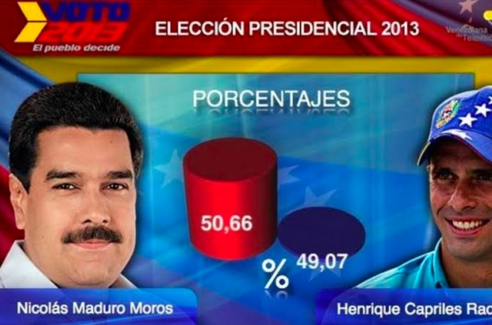
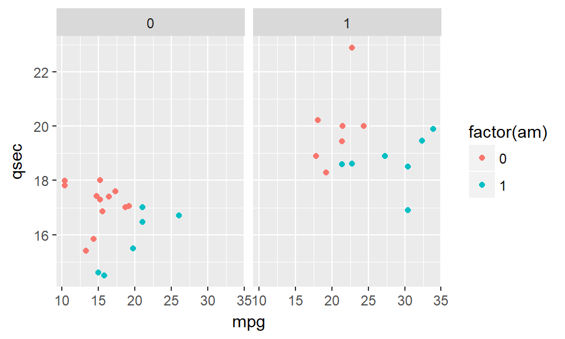

class: title-slide, middle, right 

```{css, echo = F}
/* -------------------------------------------------------
 *
 *     !! This file was generated by xaringanthemer !!
 *
 *  Changes made to this file directly will be overwritten
 *  if you used xaringanthemer in your xaringan slides Rmd
 *
 *  Issues or likes?
 *    - https://github.com/gadenbuie/xaringanthemer
 *    - https://www.garrickadenbuie.com
 *
 *  Need help? Try:
 *    - vignette(package = "xaringanthemer")
 *    - ?xaringanthemer::style_xaringan
 *    - xaringan wiki: https://github.com/yihui/xaringan/wiki
 *    - remarkjs wiki: https://github.com/gnab/remark/wiki
 *
 *  Version: 0.4.1
 *
 * ------------------------------------------------------- */
@import url(https://fonts.googleapis.com/css?family=Lato:400,400i&display=swap);
@import url(https://fonts.googleapis.com/css?family=Lato&display=swap);
@import url(https://fonts.googleapis.com/css?family=Lato&display=swap);
@import url(https://fonts.googleapis.com/css?family=Arial+Narrow&display=swap);

:root {
  /* Fonts */
  --text-font-family: Lato;
  --text-font-is-google: 1;
  --text-font-family-fallback: -apple-system, BlinkMacSystemFont, avenir next, avenir, helvetica neue, helvetica, Ubuntu, roboto, noto, segoe ui, arial;
  --text-font-base: sans-serif;
  --header-font-family: Lato;
  --header-font-is-google: 1;
  --header-font-family-fallback: Georgia, serif;
  --code-font-family: Lato;
  --code-font-is-google: 1;
  --base-font-size: 20px;
  --text-font-size: 1rem;
  --code-font-size: 53%;
  --code-inline-font-size: 1em;
  --header-h1-font-size: 2.75rem;
  --header-h2-font-size: 2.25rem;
  --header-h3-font-size: 1.75rem;

  /* Colors */
  --text-color: #333333;
  --header-color: #DD3333;
  --background-color: #FFFFFF;
  --link-color: #DD3333;
  --text-bold-color: #FF5252;
  --code-highlight-color: rgba(255,255,0,0.5);
  --inverse-text-color: #FFFFFF;
  --inverse-background-color: #DD3333;
  --inverse-header-color: #FFFFFF;
  --inverse-link-color: #DD3333;
  --title-slide-background-color: #FFFFFF;
  --title-slide-text-color: #DD3333;
  --header-background-color: #DD3333;
  --header-background-text-color: #FFFFFF;
  --primary: #FFFFFF;
  --secondary: #DD3333;
}

html {
  font-size: var(--base-font-size);
}

body {
  font-family: var(--text-font-family), var(--text-font-family-fallback), var(--text-font-base);
  font-weight: 400;
  color: var(--text-color);
}
h1, h2, h3 {
  font-family: var(--header-font-family), var(--header-font-family-fallback);
  font-weight: 600;
  color: var(--header-color);
}
.remark-slide-content {
  background-color: var(--background-color);
  font-size: 1rem;
  padding: 0.4em 2.4em 0.4em 2.4em;
  width: 100%;
  height: 100%;
}
.remark-slide-content h1 {
  font-size: var(--header-h1-font-size);
}
.remark-slide-content h2 {
  font-size: var(--header-h2-font-size);
}
.remark-slide-content h3 {
  font-size: var(--header-h3-font-size);
}
.remark-code, .remark-inline-code {
  font-family: var(--code-font-family), Menlo, Consolas, Monaco, Liberation Mono, Lucida Console, monospace;
}
.remark-code {
  font-size: var(--code-font-size);
}
.remark-inline-code {
  font-size: var(--code-inline-font-size);
  color: #DD3333;
}
.remark-slide-number {
  color: #333333;
  opacity: 1;
  font-size: 0.9rem;
}
strong {
  font-weight: bold;
  color: var(--text-bold-color);
}
a, a > code {
  color: var(--link-color);
  text-decoration: none;
}
.footnote {
  position: absolute;
  bottom: 60px;
  padding-right: 4em;
  font-size: 0.9em;
}
.remark-code-line-highlighted {
  background-color: var(--code-highlight-color);
}
.inverse {
  background-color: var(--inverse-background-color);
  color: var(--inverse-text-color);
  
}
.inverse h1, .inverse h2, .inverse h3 {
  color: var(--inverse-header-color);
}
.inverse a, .inverse a > code {
  color: var(--inverse-link-color);
}
.title-slide, .title-slide h1, .title-slide h2, .title-slide h3 {
  color: var(--title-slide-text-color);
}
.title-slide {
  background-color: var(--title-slide-background-color);
}
.title-slide .remark-slide-number {
  display: none;
}
/* Two-column layout */
.left-column {
  width: 20%;
  height: 92%;
  float: left;
}
.left-column h2, .left-column h3 {
  color: #DD333399;
}
.left-column h2:last-of-type, .left-column h3:last-child {
  color: #DD3333;
}
.right-column {
  width: 75%;
  float: right;
  padding-top: 1em;
}
.pull-left {
  float: left;
  width: 47%;
}
.pull-right {
  float: right;
  width: 47%;
}
.pull-right + * {
  clear: both;
}
img, video, iframe {
  max-width: 100%;
}
blockquote {
  border-left: solid 5px #DD333380;
  padding-left: 1em;
}
.remark-slide table {
  margin: auto;
  border-top: 1px solid #666;
  border-bottom: 1px solid #666;
}
.remark-slide table thead th {
  border-bottom: 1px solid #ddd;
}
th, td {
  padding: 5px;
}
.remark-slide thead, .remark-slide tfoot, .remark-slide tr:nth-child(even) {
  background: #FFFFFF;
}
table.dataTable tbody {
  background-color: var(--background-color);
  color: var(--text-color);
}
table.dataTable.display tbody tr.odd {
  background-color: var(--background-color);
}
table.dataTable.display tbody tr.even {
  background-color: #FFFFFF;
}
table.dataTable.hover tbody tr:hover, table.dataTable.display tbody tr:hover {
  background-color: rgba(255, 255, 255, 0.5);
}
.dataTables_wrapper .dataTables_length, .dataTables_wrapper .dataTables_filter, .dataTables_wrapper .dataTables_info, .dataTables_wrapper .dataTables_processing, .dataTables_wrapper .dataTables_paginate {
  color: var(--text-color);
}
.dataTables_wrapper .dataTables_paginate .paginate_button {
  color: var(--text-color) !important;
}

/* Horizontal alignment of code blocks */
.remark-slide-content.left pre,
.remark-slide-content.center pre,
.remark-slide-content.right pre {
  text-align: start;
  width: max-content;
  max-width: 100%;
}
.remark-slide-content.left pre,
.remark-slide-content.right pre {
  min-width: 50%;
  min-width: min(40ch, 100%);
}
.remark-slide-content.center pre {
  min-width: 66%;
  min-width: min(50ch, 100%);
}
.remark-slide-content.left pre {
  margin-left: unset;
  margin-right: auto;
}
.remark-slide-content.center pre {
  margin-left: auto;
  margin-right: auto;
}
.remark-slide-content.right pre {
  margin-left: auto;
  margin-right: unset;
}

/* Slide Header Background for h1 elements */
.remark-slide-content.header_background > h1 {
  display: block;
  position: absolute;
  top: 0;
  left: 0;
  width: 100%;
  background: var(--header-background-color);
  color: var(--header-background-text-color);
  padding: 2rem 2.4em 1.5rem 2.4em;
  margin-top: 0;
  box-sizing: border-box;
}
.remark-slide-content.header_background {
  padding-top: 7rem;
}

@page { margin: 0; }
@media print {
  .remark-slide-scaler {
    width: 100% !important;
    height: 100% !important;
    transform: scale(1) !important;
    top: 0 !important;
    left: 0 !important;
  }
}

.primary {
  color: var(--primary);
}
.bg-primary {
  background-color: var(--primary);
}
.secondary {
  color: var(--secondary);
}
.bg-secondary {
  background-color: var(--secondary);
}

/* Extra CSS */
.remark-slide-scaler {
  overflow-y: auto;
}
.gray {
  color: #aaaaaa;
}
.black {
  color: #bc7777;
}
.darkgreen {
  color: #45503B;
}
.darkred {
  color: #591F0A;
}
.small {
  font-size: 90%;
}
.pull_c {
  float: center;
  width: 30%;
  height: 50%;
  padding-left: 40%;
}
.pull_c_title {
  height: 90%;
}
.pull_l_70 {
  float: left;
  width: 72%;
  font-size: 90%;
}
.pull_r_30 {
  float: right;
  width: 23%;
  font-size: 90%;
}
.pull_left {
  float: left;
  width: 47%;
  height: 100%;
  padding-right: 2%;
}
.pull_right {
  float: right;
  width: 47%;
  height: 100%;
  padding-left: 2%;
}
.small_left {
  float: left;
  width: 47%;
  height: 50%;
  padding-right: 2%;
}
.small_right {
  float: right;
  width: 47%;
  height: 50%;
  padding-left: 2%;
}
.left_code {
  float: left;
  width: 47%;
  height: 100%;
  padding-right: 2%;
  font: Roboto;
}
.code_out {
  float: right;
  width: 47%;
  height: 100%;
  padding-left: 2%;
  font: Roboto;
}
.text_180 {
  font-size: 180%;
}
.text_170 {
  font-size: 170%;
}
.text_160 {
  font-size: 160%;
}
.text_150 {
  font-size: 150%;
}
.text_140 {
  font-size: 140%;
}
.text_130 {
  font-size: 130%;
}
.text_120 {
  font-size: 120%;
}
.text_110 {
  font-size: 110%;
}
.text_110 {
  font-size: 110%;
}
.text_100 {
  font-size: 100%;
}
.code_10 {
  code-inline-font-size: 60%;
  overflow-y: scroll !important;
  overflow-x: scroll !important;
  max-height: 5vh !important;
  line-height: 0.75em;
}
.code_10_pre {
  code-inline-font-size: 60%;
  overflow-y: scroll !important;
  overflow-x: scroll !important;
  max-height: 15vh !important;
  line-height: 0.75em;
  min-height: 0.5em;
}
.code_15 {
  code-inline-font-size: 15%;
  overflow-y: scroll !important;
  overflow-x: scroll !important;
  max-height: 10vh !important;
}
.text_90 {
  font-size: 90%;
}
.text_80 {
  font-size: 80%;
}
.text_70 {
  font-size: 70%;
}
.text_65 {
  font-size: 65%;
}
.text_60 {
  font-size: 60%;
}
.text_50 {
  font-size: 50%;
}
.text_40 {
  font-size: 40%;
}
.text_30 {
  font-size: 30%;
}
.text_20 {
  font-size: 20%;
}
.line_space_15 {
  line-height: 1.5em;;
}
.line_space_13 {
  line-height: 1.3em;;
}
.line_space_11 {
  line-height: 1.1em;;
}
.line_space_15 {
  line-height: 1.5em;;
}
.line_space_09 {
  line-height: 0.9em;;
}
.line_space_07 {
  line-height: 0.7em;;
}
.line_space_05 {
  line-height: 0.5em;;
}
.largest {
  font-size: 2.488em;;
}
.larger {
  font-size: 2.074em;;
}
.large {
  font-size: 1.44em;;
}
.small {
  font-size: 0.833em;;
}
.smaller {
  font-size: 0.694em;;
}
.smallest {
  font-size: 0.579em;;
}
.limity150 {
  max-height: 150px;;
  overflow-y: auto;;
}
.tiny_text {
  font-size: 70%;
}
.large_text {
  font-size: 150%;
}
.slide_blue {
  background-color: #FEDA3F;
  color: #3C3C3B;
}
.center_image {
  margin: 0;
  position: absolute;
  top: 50%;
  left: 50%;
  -ms-transform: translate(-50%, -50%);
  transform: translate(-50%, -50%);
}
.center_left_img {
  top: 50%;
  left: 35%;
}
.center_left_image {
  margin: 0;
  position: absolute;
  top: 50%;
  left: 35%;
  -ms-transform: translate(-50%, -50%);
  transform: translate(-50%, -50%);
}
.center_down_image {
  margin: 0;
  position: absolute;
  top: 90%;
  left: 50%;
  -ms-transform: translate(-50%, -50%);
  transform: translate(-50%, -50%);
}
.center_top_image {
  margin: 0;
  position: absolute;
  top: 10%; /* Adjust to place the image at the top */
  left: 50%;
  -ms-transform: translate(-50%, -50%);
  transform: translate(-50%, -50%);
}
slides > slide {
  overflow-x: auto !important;
  overflow-y: auto !important;
}
.superbigimage {
  white-space: nowrap;
  overflow-y: scroll;
}
```

```{r setup_theme0, include = FALSE}
rm(list=ls());gc()

# # Read in file with correct encoding
# contents <- readLines("xaringan-themer.css", encoding = "Windows-1252")
# 
# # Replace offending character
# clean_contents <- gsub("\x93", "", contents)
# 
# # Write cleaned contents back out with desired encoding
# writeLines(clean_contents, "xaringan-themer3.css", useBytes = TRUE)

#if(!grepl("4.1.2",R.version.string)){stop("Different version (must be 4.1.2)")}
pacman::p_unlock(lib.loc = .libPaths()) #para no tener problemas reinstalando paquetes

if(!require(devtools)){install.packages("devtools", type = "win.binary", dependencies=T)}

options(servr.daemon = TRUE)
```

```{cat, engine.opts=list(file = "mylibs/zoom.html"), include=F}
<script src="https://lab.hakim.se/zoom-js/js/zoom.js" type="text/javascript"></script>
<script type="text/javascript">
	slideshow.on( "beforeHideSlide", function( slide ) {
		zoom.out();
	} );
	slideshow.on( "afterShowSlide", function( slide ) {
		document.querySelector( ".remark-visible" ).addEventListener( "dblclick", function( event ) {
			event.preventDefault();
			zoom.to( {element: event.target} );
		} );
	} );
</script>
```

```{r setup, include = FALSE}
local({r <- getOption("repos")
       r["CRAN"] <- "https://cran.dcc.uchile.cl/"
       options(repos=r)
})

if(!require(pacman)){install.packages("pacman")}

if(!require(rcanvas)){devtools::install_github("daranzolin/rcanvas")}

pacman::p_load(devtools, here, showtext, ggpattern, RefManageR, pagedown, magick, bibtex, DiagrammeR, xaringan, xaringanExtra, xaringanthemer, fontawesome, widgetframe, datapasta, tidyverse, psych, tidyverse, cowplot, pdftools, showtext, compareGroups, ggiraph, sf, distill, data.tree,
               widgetframe, install= T)

if(!require(xaringanBuilder)){devtools::install_github("jhelvy/xaringanBuilder",upgrade = "never")}
if(!require(icons)){remotes::install_github("mitchelloharawild/icons",upgrade = "never")}

test_fontawesome<- function(x="github"){
tryCatch({
  invisible(fontawesome::fa(name = x))
  return(message("fontawesome installed"))
},
# ... but if an error occurs, tell me what happened: 
error=function(error_message) {
  message("Installing fontawesome")
  icons::download_fontawesome()  
})
}

vec_col<-c("#660600","#6F3930","#745248","#786B60","#E6E6E6","#738FBC","#003891","#3C5279","#786B60","#B48448","#EF9D2F","#D99155","#E3D1C2","#E0BC9E","#ABB0BF","#835F69","#5A0D13")
plot_prueba<-barplot(1:length(vec_col), col=vec_col)

#https://coolors.co/21177a-fe4a17-788aa3-45503b
xaringanthemer::style_duo( #ABB0BF
  primary_color = "#FFFFFF",  #555555 gris oscuro
  secondary_color = "#DD3333",#"#FF5252"))) 
  text_color = "#333333", #bc7777
  text_bold_color = "#FF5252",
  #base_color = '#bc7777',
  background_position = 'center',
  header_font_google = google_font("Lato"),#Josefin Sans
  text_font_google   = google_font("Lato", "400", "400i"),
  code_font_google   = google_font("Lato"),
  code_font_size = '53%', #sirve
  padding = "0.4em 2.4em 0.4em 2.4em",
  extra_fonts = list(google_font("Arial Narrow")),
 # title_slide_background_image = "./_figs/bg_portada.svg",
#  title_slide_background_size = "cover",
 # background_image = "./_figs/bg.svg",
  background_size = "cover",
  extra_css =
  list(
  ".remark-slide-scaler" = list("overflow-y" = "auto"), # para no tener limites de extensión
 # ".remark-slide-number" = list("display" = "none"), #oculta el reloj también
 # "pre"= list("line-height"= "0.2em"),
  ".gray"   = list(color = "#aaaaaa"),
  ".black"   = list(color = "#bc7777"),
  ".darkgreen"   = list(color = "#45503B"),
  ".darkred"   = list(color = "#591F0A"),
  ".small" = list("font-size" = "90%"),
  ".pull_c" = list("float" = "center","width" = "30%", "height" = "50%", "padding-left" = "40%"),
  ".pull_c_title" = list("height" = "90%"),
  ".pull_l_70" = list("float"= "left","width"= "72%", "font-size"= "90%"),
  ".pull_r_30" = list("float"= "right","width"= "23%", "font-size"= "90%"),
  ".pull_left"  = list("float"= "left","width"= "47%", "height"= "100%", "padding-right"= "2%"),
  ".pull_right" = list("float"= "right","width"= "47%", "height"= "100%", "padding-left"= "2%"),
  ".small_left"  = list("float"= "left", "width"= "47%", "height"= "50%", "padding-right"= "2%"),
  ".small_right" = list("float"= "right","width"= "47%", "height"= "50%", "padding-left"= "2%"),
  ".left_code" = list("float"="left","width"="47%","height"="100%","padding-right"="2%",    "font"="Roboto"),
  ".code_out"  = list("float"="right","width"="47%","height"="100%","padding-left"="2%",    "font"="Roboto"),
  ".text_180" = list("font-size" = "180%"),
  ".text_170" = list("font-size" = "170%"),
  ".text_160" = list("font-size" = "160%"),    
  ".text_150" = list("font-size" = "150%"),
  ".text_140" = list("font-size" = "140%"),  
  ".text_130" = list("font-size" = "130%"),
  ".text_120" = list("font-size" = "120%"),
  ".text_110" = list("font-size" = "110%"),
  ".text_110" = list("font-size" = "110%"),
  ".text_100" = list("font-size" = "100%"),
  ".code_10" = list("code-inline-font-size"= "60%",
                    "overflow-y" = "scroll !important",
                    "overflow-x" = "scroll !important",
                    "max-height" = "5vh !important",
                    "line-height"= "0.75em"),
   ".code_10_pre" = list("code-inline-font-size"= "60%",
                    "overflow-y" = "scroll !important",
                    "overflow-x" = "scroll !important",
                    "max-height" = "15vh !important",
                    "line-height"= "0.75em",
                    "min-height"="0.5em"
                    ),
  ".code_15" = list("code-inline-font-size"= "15%",
                    "overflow-y" = "scroll !important",
                    "overflow-x" = "scroll !important",
                    "max-height" = "10vh !important"),
  ".text_90" = list("font-size" = "90%"),
  ".text_80" = list("font-size" = "80%"),
  ".text_70" = list("font-size" = "70%"),
  ".text_65" = list("font-size" = "65%"),
  ".text_60" = list("font-size" = "60%"),
  ".text_50" = list("font-size" = "50%"),
  ".text_40" = list("font-size" = "40%"),
  ".text_30" = list("font-size" = "30%"),
  ".text_20" = list("font-size" = "20%"),
  ".line_space_15" = list("line-height" = "1.5em;"),
  ".line_space_13" = list("line-height" = "1.3em;"),
  ".line_space_11" = list("line-height" = "1.1em;"),
  ".line_space_15" = list("line-height" = "1.5em;"),
  ".line_space_09" = list("line-height" = "0.9em;"),
  ".line_space_07" = list("line-height" = "0.7em;"),
  ".line_space_05" = list("line-height" = "0.5em;"),
  ".largest" =  list("font-size" = "2.488em;"),
  ".larger" =  list("font-size" = "2.074em;"),
  ".large" =  list("font-size" = "1.44em;"),
  ".small" =  list("font-size" = "0.833em;"),
  ".smaller" =  list("font-size" = "0.694em;"),
  ".smallest" =  list("font-size" = "0.579em;"),
  ".limity150" = list("max-height" = "150px;",
                     "overflow-y" = "auto;"
      ),
    ".tiny_text" = list(
      "font-size"= "70%"
      ),
    ".large_text" = list(
      "font-size"= "150%"
      ),
    ".slide_blue" = list(
      "background-color" = "#FEDA3F",
      "color" = "#3C3C3B"
      ),
  ".center_image" = list(
    margin  = "0",
    position = "absolute",
    top      = "50%",
    left     = "50%",
    '-ms-transform' = "translate(-50%, -50%)",
    transform = "translate(-50%, -50%)"
    ),
    ".center_down_image" = list(
    margin  = "0",
    position = "absolute",
    top      = "90%",
    left     = "50%",
    '-ms-transform' = "translate(-50%, -50%)",
    transform = "translate(-50%, -50%)"
    ),
    "slides > slide" = list(
    "overflow-x"  = "auto !important",
    "overflow-y" = "auto !important"
    ),
 #   "pre" = list(
#    "white-space"  = "pre !important",
#    "overflow-y" = "scroll !important",
#    "max-height" = "40vh !important",
#    "font-size" = "0.8em"
#    ),
    ".superbigimage" = list(
    "white-space"  = "nowrap",
    "overflow-y" = "scroll"
    )
  )
)

options(htmltools.preserve.raw = FALSE)


#knitr::opts_chunk$set(comment = NA) # lo saqué pa probar por si
knitr::opts_chunk$set(dpi=720)
#options(htmltools.preserve.raw = FALSE)#A recent update to rmarkdown (in version 2.6) changed how HTML widgets are included in the output file to use pandoc's raw HTML blocks. Unfortunately, this feature isn't compatible with the JavaScript markdown library used by xaringan. You can disable this feature and resolve the issue with htmlwidgets in xaringan slides by setting
#https://stackoverflow.com/questions/65766516/xaringan-presentation-not-displaying-html-widgets-even-when-knitting-provided-t/65768952#65768952


xaringanExtra::use_progress_bar(color = "#12636B", location = "top")#, height = "550px")
xaringanExtra::use_animate_css()
xaringanExtra::use_scribble() #son los lapices
xaringanExtra::use_tile_view()
xaringanExtra::use_panelset()
xaringanExtra::use_editable(expires = 1)
xaringanExtra::use_fit_screen()

#https://gist.github.com/gadenbuie/61b27108ceec6c7a55cd9966609128d7

# padding-top: 0.4em;
# padding-right: 2.4em;
# padding-bottom: 0.4em;
# padding-left: 2.4em;
invisible("https://www.youtube.com/watch?v=M3skTMQbCD0")
invisible("https://zane.lol/slides/adirondack/#39")
#https://titanwolf.org/Network/Articles/Article?AID=3896fe2c-1b3b-4ebd-9906-1f9ed1675b35#gsc.tab=0
#https://annakrystalli.me/talks/xaringan/xaringan.html#55
#https://bookdown.org/yihui/rmarkdown/some-tips.html
#https://arm.rbind.io/slides/xaringan.html#90
#https://stackoverflow.com/questions/62069400/font-size-of-figure-in-xaringan-slide-too-small
#https://irene.vrbik.ok.ubc.ca/blog/2021-07-14-xaringan-slides/

#https://evamaerey.github.io/doublecrochet/
#devtools::install_github("paulhendricks/anonymizer")
check_code <- function(expr, available){
  if(available){
    eval(parse(text = expr))
  } else {
    expr
  }
}
path2<-dirname(rstudioapi::getSourceEditorContext()$path)
#knitr::opts_chunk$set(message = FALSE,warning = FALSE, error = FALSE)

```

<br> 
 
.line_space_15[ 
## .text_80[Estadística Aplicada y <br> Procesamiento de Datos con R]
]

<br>

.line_space_11[
    
<br>

.text_70[[Código en: `r fontawesome::fa(name = "github")`](https://github.com/AGSCL/Curso_UDP)]

.text_110[Clase 5. Ggplot e Introducción a RMarkdown y Quarto]

]


.bg-text[


`r withr::with_locale(new = c('LC_TIME' = 'es_ES'), code =format(Sys.time(),'%d de %B, %Y'))`


.text_100[Andrés González Santa Cruz]

.text_65[andres.gonzalezs@mail.udp.cl] [`r fontawesome::fa(name = "github")`](https://github.com/AGSCL) [`r fontawesome::fa(name = "orcid", fill="green")`](https://orcid.org/0000-0002-5166-9121)
]

.text_100[José Ruiz-Tagle Maturana]

.text_65[jose.ruiztagle@mail.udp.cl] [`r fontawesome::fa(name = "orcid", fill="green")`](https://orcid.org/0000-0002-4866-5701)

<br>
  
```{r echo=FALSE, out.width = '15%'}

```

???
*#_#_#_#_#_#_#_#_#_#_
**NOTA**
*#_#_#_#_#_#_#_#_#_#_

Visualización de datos con ggplot2
- Gramática, lógica de capas y propiedades de gráficos
- Buenas prácticas en elaboración y publicación de gráficos
- Ejemplos 
- Scatter
- Boxplots
- Bargraphs
Introducción a RMarkdown y Quarto
- Reproducibilidad y replicabilidad
- Formatos
- Estructura
- Ventajas y desventajas de cada uno

---
layout: true
class: animated, fadeIn
---
## Introducción

- GGPLOT:
  - Gramática de los gráficos por capas (<http://vita.had.co.nz/papers/layered-grammar.pdf>)
  - Permite seguir los pasos y los distintos componentes del gráfico
  - Permite una fácil forma de iteración para distintos gráficos

[**Torpedo sobre ggplot*](https://res.cloudinary.com/dyd911kmh/image/upload/v1666806657/Marketing/Blog/ggplot2_cheat_sheet.pdf)


---
## Elementos

 Gramática          | Explicación
 :----------------    | :-----------------------------
 **Datos**          | Base de datos a graficar
 **Geométrica**     | Forma geométrica que representará los datos
                    | (e.g., diagrama de cajas  y puntos, histogramas)
 **Estética**       | La estética del objeto geométrico
                    | (e.g., color, tamaño, forma)
.line_space_05[
.text_60[
*Traducción del github de @oliviergimenez*
  ]
]

- Signo `+`

- `geom_point()` es un gráfico de puntos, `geom_line()` is un gráfico de líneas, `geom_col()` es un gráfico de columnas o barras, etc.

- `aes()` dinámico/variable

- Algunos argumentos son `color` (colores líneas o puntos), `fill`(rellenar el área), `linetype` para ver el tipo de línea (discontinua, continua, con puntos),`pch` estilo de puntos (forma), `size` tamaño o grueso de las líneas y `alpha` que es la opacidad (transparencia, de 1 a 0)

???
*#_#_#_#_#_#_#_#_#_#_
**NOTA**
*#_#_#_#_#_#_#_#_#_#_

-LOs gráficos se componen de datos, la información que se quiere visualizar y el mapeo (cómo se configura)
- Los componentes del mapping: **capa** (elementos geométricos y transformaciones estadísticas), puntos líneas, y transformaciones como resumen (contar observaciones o dividir para un histograma), las **escalas** ubican los valores en los datos en un espacio estético (colores, forma o tamaño) y también dibujan la leyenda y los ejes, un **coord** que describe las coordenadas cartesianas pero también polares o proyecciones de mapas (latitud), una faceta permite generar y dividir en partes de datos (latticing), y un **tema** controla los despliegues como la fuente y el color de fondo.

- `data= `, `geom_*`, `aes()`
- **+** = añadir capas
- **aes()**, lo que está fuera puede ser fijado (ej., tamaño= 1)
- No se hará una leyenda de eso

---
## Elementos (2)


```{r Fig-2, fig.align="center", message=FALSE, warning=FALSE, cache=T, echo =F, out.width = "300x"}
#knitr::include_graphics("https://rstudio-conf-2020.github.io/r-for-excel/img/rstudio-cheatsheet-ggplot.png")
image_colorize(image_read(path = "https://rstudio-conf-2020.github.io/r-for-excel/img/rstudio-cheatsheet-ggplot.png"),35,"red")
```

---
## Aplicación

.panelset.sideways[

.panel[.panel-name[Estructura hipotética]

- Generamos los datos 

.details-code[
```{r 3, eval=T, echo=T, error=T, message=FALSE, warning=FALSE}
covid19_chile_coq_val <- 
    readr::read_csv("https://raw.githubusercontent.com/ivanMSC/COVID19_Chile/master/covid19_chile.csv") %>% 
    dplyr::select(Fecha, Region, `Nuevo Confirmado`) %>%
    dplyr::mutate(Fecha=as.Date.character(Fecha,tryFormats = "%d-%m-%Y")) %>% 
    dplyr::filter(Region %in% c("Valparaíso","Coquimbo"))

```
]

- Hacemos un código en que definimos que haremos un gráfico desde la base de datos `covid19_chile_coq_val` .

```{r message=FALSE, warning=FALSE, paged.print=FALSE, out.width = '400cm', out.height='400cm', fig.align = "center", eval=T}
library(ggplot2)
covid19_chile_coq_val %>% 
ggplot()
```

]

.panel[.panel-name[Añadimos]

```{r message=FALSE, warning=FALSE, paged.print=FALSE, out.width = '400cm', out.height='400cm', fig.align = "center", eval=T}
covid19_chile_coq_val %>% 
ggplot()+ 
      geom_line(aes(x=as.Date(Fecha), y=`Nuevo Confirmado`, color=Region)) #<<
```

]

.panel[.panel-name[Añadimos una etiqueta para el eje x y un formato]

```{r message=FALSE, warning=FALSE, paged.print=FALSE, out.width = '400cm', out.height='400cm', fig.align = "center", eval=T}
covid19_chile_coq_val %>% 
ggplot()+ 
      geom_line(aes(x=as.Date(Fecha), y=`Nuevo Confirmado`, color=Region))+
      scale_x_date()+ #<<
      xlab("Fecha") #<<
```

]

.panel[.panel-name[Añadimos un tema y la ubicación de leyenda]
```{r message=FALSE, warning=FALSE, paged.print=FALSE, out.width = '400cm', out.height='400cm', fig.align = "center", eval=T, fig.cap= ""}
library(sjPlot)
covid19_chile_coq_val %>% 
ggplot()+ 
      geom_line(aes(x=as.Date(Fecha), y=`Nuevo Confirmado`, color=Region))+
      scale_x_date()+ 
      xlab("Fecha")+ 
      sjPlot::theme_blank()+ #<<
      theme(legend.position="bottom")+#<<
      scale_color_manual(values=c("#DD3333","#333333"))#<<
```
 
] 


.panel[.panel-name[Se dividen los gráficos por región]
```{r message=FALSE, warning=FALSE, paged.print=FALSE, out.width = '400cm', out.height='400cm', fig.align = "center", eval=T, fig.cap= ""}
library(sjPlot)
covid19_chile_coq_val %>% 
ggplot()+ 
      geom_line(aes(x=as.Date(Fecha), y=`Nuevo Confirmado`, color=Region))+
      scale_x_date()+ 
      xlab("Fecha")+ 
      sjPlot::theme_blank()+ 
      theme(legend.position="bottom")+ 
      scale_color_manual(values=c("#DD3333","#333333"))+#<<
      facet_wrap(~Region)#<<
      
#guardamos los datos
ggplot2::ggsave("./_figs/1.png", width = 5, height = 10, dpi = 100)    
```

]

]

---
## Observaciones

- Autoexplicativo

- Los gráficos pueden estar sujetos a sesgos (cc. o icc.)

- Es necesario explicitar cómo se construyó el gráfico

- Misma escala

- Orden de los datos

- Citar fuentes (con caption)


Ejemplos:

- [Datos Victimización](https://www.adnradio.cl/politica/2017/11/06/el-extrano-grafico-que-presento-sebastian-pinera-para-justificar-la-baja-de-victimizacion-3630063.html)

- [Datos ENUSC](https://www.biobiochile.cl/noticias/nacional/chile/2021/08/30/adopcion-homoparental-comision-aprueba-proyecto-en-general-y-pasa-a-votacion-en-sala-del-senado.shtml)

- [Datos CASEN](https://www.eldesconcierto.cl/nacional/2018/08/21/graficos-vuelven-a-penar-a-pinera-la-curiosa-forma-de-presentar-los-datos-de-distrubucion-de-ingresos-en-la-casen.html)

- [Desafíos gobierno](https://www.concierto.cl/2019/11/mega-es-el-canal-mas-denunciado-por-su-cobertura-de-la-crisis/)

- [Tasa de positividad](https://twitter.com/leosoto/status/1280474285199503366?s=20)

- [Días sandwich](https://twitter.com/salinas_chile/status/1336114088863289346/photo/1)

- [Gráfico ritmo vacunación](https://www.biobiochile.cl/noticias/nacional/chile/2021/04/22/grafico-evidencia-como-baja-ritmo-de-vacunacion-minsal-lo-mostro-en-otra-escala.shtml)

- [Aprobación presidencial](https://www.theclinic.cl/2020/11/30/la-version-de-mega-por-cuestionado-grafico-que-mostraba-aprobacion-y-rechazo-de-pinera-en-la-cadem/)


```{r, echo=FALSE,  fig.align="center", out.width=300, error=T}



```

???
*#_#_#_#_#_#_#_#_#_#_
**NOTA**
*#_#_#_#_#_#_#_#_#_#_
- Debe simplificar, no complicar; no debe depender de un texto
- Elegir el título, la escala, leyendas, etc. MUY BIEN
- Gráficos de barra, ordenar de mayor a menor o por algún criterio ordinal si lo hay
- Indicar la fuente de los datos si son ajenos
- Alterar la escala de medición o truncarla (ej. exagerar diferencias)
- Filtrar valores extremos sin reportar
- Agrupar valores que no corresponde agrupar para ocultar anomalías 
- La importancia de ejemplos reproducibles
- En los textos aparece el gráfico de pie/sector. Yo personalmente no lo recomiendo porque requiere mucha información adicional (mejor una tabla)
  - más recomendable utilizarlo para variables nominales con pocas categorías.
- Los gráficos de polígonos como los de líneas, los veremos posteriormente

---
background-image: url("./_figs/71746538_1513071482177691_7543072537354174464_n.jpg")


---
## Aplicación (2)

.panelset.sideways[

.panel[.panel-name[Estructura hipotética]
```{r message=FALSE, warning=FALSE, paged.print=FALSE, out.width = '400cm', out.height='400cm', fig.align = "center", eval=T}
library(jsonlite)

history1 = fromJSON("_data/StreamingHistory0.json", flatten = TRUE)
history2 = fromJSON("_data/StreamingHistory1.json", flatten = TRUE)

st = rbind(history1,history2)
rm(history1,history2)
# what does the dataframe contain.
head(st) %>% 
  knitr::kable("markdown")
```

]

.panel[.panel-name[Usamos la base, la transformamos y hacemos un gráfico de barra]
```{r message=FALSE, warning=FALSE, paged.print=FALSE, out.width = '400cm', out.height='400cm', fig.align = "center", eval=T}
st %>%
  dplyr::count(artistName, sort = TRUE) %>%
  dplyr::top_n(20) %>%
  dplyr::mutate(artistName = reorder(artistName, n)) %>%
  ggplot(aes(x = artistName, y = n)) + #<<
  geom_bar(aes(fill=n),   #<<
           stat="identity") #<<
```
]


.panel[.panel-name[Añadimos una temática con una escala de colores]
```{r message=FALSE, warning=FALSE, paged.print=FALSE, out.width = '400cm', out.height='400cm', fig.align = "center", eval=T}
st %>%
  dplyr::count(artistName, sort = TRUE) %>%
  dplyr::top_n(20) %>%
  dplyr::mutate(artistName = reorder(artistName, n)) %>%
  ggplot(aes(x = artistName, y = n)) + 
  geom_bar(aes(fill=n),   
           stat="identity") + 
    scale_fill_viridis_c(option = "magma",direction = -1) + #<< 
  xlab(NULL)  #<<
```

]

.panel[.panel-name[Se definen etiquetas y se gira el gráfico de barras, se pone el gráfico en mínimo]
```{r message=FALSE, warning=FALSE, paged.print=FALSE, out.width = '400cm', out.height='400cm', fig.align = "center", eval=T}
st %>%
  dplyr::count(artistName, sort = TRUE) %>%
  dplyr::top_n(20) %>%
  dplyr::mutate(artistName = reorder(artistName, n)) %>%
  ggplot(aes(x = artistName, y = n)) + 
  geom_bar(aes(fill=n),   
           stat="identity") + 
  scale_fill_viridis_c(option = "magma",direction = -1) + 
  xlab(NULL) + 
  coord_flip() + #<<
  labs(x = "Artistas", #<<
       title = "Artistsas que más he escuchado el 2021", #<<
       fill = "Recuento") + #<<
  theme_minimal() #<<
```

]

]

---
## Ejercicio 1

- Con los siguientes datos (`mtcars`), llegue al siguiente gráfico:

```{r, include=F, eval=F}
ggplot(data = mtcars) + 
  geom_point(aes(mpg, qsec, colour = factor(am))) +
  facet_grid(~vs)
```

```{r, echo=FALSE,  fig.align="center", out.width=250, error=T}

```


???
*#_#_#_#_#_#_#_#_#_#_
**NOTA**
*#_#_#_#_#_#_#_#_#_#_

---
## Otros paquetes relacionados

- `ggstatsplot`

- `gganimate`

- `ggplotly`

- `ggvis` 

- [`esquise`](https://dreamrs.github.io/esquisse/)


```{r, echo=FALSE,  fig.align="center", out.width=800, error=T}

knitr::include_graphics('https://dreamrs.github.io/esquisse/reference/figures/esquisse.gif')

```


???
*#_#_#_#_#_#_#_#_#_#_
**NOTA**
*#_#_#_#_#_#_#_#_#_#_

- Hay otros que son más interactivos, otros con información estadísitca

(https://rpubs.com/agscl/plot)
(https://rpubs.com/agscl/com_quar)

---
## Ejercicio demostrativo

`r flipbookr::chunk_reveal("ej_dem")`

.details-code[
```{r ej_dem, eval=T, message=FALSE, warning=FALSE, include=T}
starwars %>% 
ggplot2::ggplot() +
  geom_point(aes(x = birth_year, 
                 y = height),color = "red")+ 
  scale_y_continuous(limits = c(0,200))+
  labs(title = "Un ggplot")+
   theme_bw()
``` 
]
          

---
## Ejercicio 2

- Genere el gráfico que corresponda para analizar la distribución de los datos presentados más abajo. De acuerdo a las lecturas y fuentes que corresponda (busque en internet), indique su distribución.

- set.seed(2125);datos<-runif(100,50,500)

```{r message=FALSE, warning=FALSE, paged.print=FALSE, out.width = '400cm', out.height='400cm', fig.align = "center", eval=F, include=F}
datos %>%
  as.data.frame() %>% 
  ggplot(aes(.))+
  geom_density()+
  labs(y="Densidad", x="Datos", title="Diagrama de densidad de los datos")+
  theme_minimal()
# Uniforme, aunque podría describirse como bimodal, o una distribución dirichlet en la que cada agrupación representa distribuciones latentes superpuestas en torno a una cateogría K; O una funcion de probabilidad binomial con distinto número de  éxitos
```


- Use la base `ChickWeight` y haga un diagrama de puntos entre el tiempo y el peso. Grafique la dispersión de los puntos y añada una línea suavizada (`smooth`) para ver si hay alguna tendencia. Añada etiquetas y un tema en blanco y negro.

```{r message=FALSE, warning=FALSE, paged.print=FALSE, out.width = '400cm', out.height='400cm', fig.align = "center", eval=F, include=F}
library(ggplot2)
ggplot(ChickWeight, aes(Time, weight))+ #incluimos las 2 variables, una en el eje x y el otro en Y
  geom_jitter(width = 0.75)+# esoecificamos os puntos, puede ser geom_point ---> lo hice para separar los puntos
  #######  ocupar una regresión no lineal para ver la relación
  geom_smooth(span = 0.8)+
  #######  utilizamos un tema que simplifique los colores del plot
  theme_bw()+
  #######  especificamos las etiqueta
  ylab("Peso (gramos)")+
  xlab("Tiempo")

```


---
## Ejercicio 3

- Use `ggplot()` y especifique la base de datos `gapminder` como input, pero habiendo filtrado sólo los datos del 2007. (Debe instalar la librería gapminder antes de cargar los datos).

- Agregue la capa `geom_point` al gráfico y cree un  diagrama de puntos (*scatterplot*) mostrando el producto interno bruto per-capita `gdpPercap` en el eje x y la esperanza de vida `lifeExp` en el eje y.

- Use la estética color para indicar cada continente con un color diferente

- Use la estética de tamaño para ajustar el tamaño de los puntos según el tamaño de la población

- Use `scale_size_area()` para que el tamaño de los puntos refleje las diferencias de la población actual y configure el tamaño máximo de los puntos (`max_size`) de cada punto a 15.

- Determine el nivel de opacidad/transparencia de cada punto a 70% mediante el parámetro `alpha` (no debe ser visible en las leyendas).

.text_40[
*(Quartango Blog, 2020, Julio 28, https://www.r-bloggers.com/2020/07/specify-additional-aesthetics-for-points/)*
]

???
*#_#_#_#_#_#_#_#_#_#_
**NOTA**
*#_#_#_#_#_#_#_#_#_#_

- respuesta:
gapminder %>% dplyr::filter(year==2007) %>% 
ggplot() + 
  geom_point(aes(x = gdpPercap, y = lifeExp, size = pop,
                 color = continent),alpha = 0.5)+ #sale de la leyenda si lo saca de estética.
                 scale_size_area(max_size = 15)

---
## Ejercicio 4

- Cargue una base de datos del Bono Bodas de Oro correspondiente a Enero 2021 [aquí](https://datos.gob.cl/dataset/bono-bodas-de-oro)

- Tip: Lea el contenido, información, diccionario de datos, etc.

- Seleccione la región 13

- Genere un histograma del total de beneficiados (`Total Nº`), que contenga 10 quiebres.

- Genere un gráfico de barras con la frecuencia de los distintos niveles educacionales


```{r message=FALSE, warning=FALSE, paged.print=FALSE, out.width = '400cm', out.height='400cm', fig.align = "center", eval=F, include=F}
bono_21_01<-
    rio::import("https://datos.gob.cl/dataset/3592c0f9-ac98-4bcd-aef7-683dbc8cb4f1/resource/e9e7e4c5-b35f-483d-8744-87466138869c/download/bo-012021.xlsx", skip=4)

bono_21_01 %>% 
  dplyr::filter(`Región` %in% c("13")) %>% 
ggplot(aes(x=`Total Nº`))+
geom_histogram(bins=10)+
labs(x="N total beneficiados", y="Frecuencia", title="Histograma de número total de beneficiados")
```


???
*#_#_#_#_#_#_#_#_#_#_
**NOTA**
*#_#_#_#_#_#_#_#_#_#_

---
# Rmarkdown y Quarto

.right[$Fuente: Prof.\,Matias\,Placencio-Castro\,(placenci@bc.edu)$]

- **Markdown**: Lenguaje de marcado ligero para formatear texto.

- Creador: John Gruber, 2004

- Uno de los lenguajes de formateo más populares.

- **Rmarkdown**: Extensión de Markdown para integrar código R y otros lenguajes.

- Usos: 
  - Comunicar resultados para toma de decisiones.
  - Colaboración en investigaciones, incluyendo pasos seguidos.
  - Ambiente de trabajo moderno que captura procesos y flujo de trabajo

- **Quarto**: Extensión avanzada de Markdown.

- Integración fácil con Python y otros lenguajes.

- Mejora en el procesamiento de Markdown en "trabajos".

.center_down_image[
```{r, "md", echo=F, warning=F, message=F}
image_colorize(image_read(path = "./_figs/md.png"),35,"red")
```
]

???
*#_#_#_#_#_#_#_#_#_#_
**NOTA**
*#_#_#_#_#_#_#_#_#_#_

- **Qué es markdown**: Lenguaje de marcado/formateo ligero que se puede usar para agregar elementos de formato a documentos de texto plano. Creado por John Gruber en 2004, es ahora uno de los lenguajes de formateo mas populares del mundo (https://www.markdownguide.org)

- **Qué es Rmarkdown**: R Markdown es un formato de archivo para crear documentos dinamicos con R ´ . Un documento R Markdown esta escrito en markdown y puede contener fragmentos de coodigo R (o algun otro lenguaje), resultados, y prosa/comentarios. Estos documentos se utilizan generalmente de tres formas:
1. Para comunicar resultados orientados a la toma de decisiones (individuos que no necesariamente estan interesados en el codigo)
2. Para colaborar con otros investigadores interesados no solo en los resultados y conclusiones, sino tambien en los pasos seguidos.
3. Como un ambiente de trabajo moderno, que captura no solo lo que uno hizo sino tambien lo que pudo haber pensado y anotado.

- **Qué es quarto**: Es markdown en esteroides. Permite integrar otros lenguajes de programación como python de manera más fácil y fluida. También mejora la forma de procesar el markdown en "trabajos" (por lo que puedo renderizar/producir múltiples)

- decir algo de xaringan, presentaciones, etc

- de ahi shiny
  
---
## Ventajas y desventajas

.pull-left[

- Todo en un mismo lugar

- Automatiza

- Facilita colaboración (claridad en pasos, rastreables, etc.)

]

.pull-right[

- Difícil lectura (mucho código)

- No es tan rapido manejarlo

- Difícil aprender al principio

]

**Apuntes**

- [Apuntes Quarto](https://campusesp.uchile.cl/plataformas/2023/postgrado/pluginfile.php/2198/mod_resource/content/0/Quarto%20Cheat%20Sheet.pdf)

- [Apuntes Rmarkdown](https://campusesp.uchile.cl/plataformas/2023/postgrado/pluginfile.php/2197/mod_resource/content/0/Rmarkdown%20Cheat%20Sheet.pdf)


???
*#_#_#_#_#_#_#_#_#_#_
**NOTA**
*#_#_#_#_#_#_#_#_#_#_


- A diferencia the aplicaciones WYSIWYG (Microsoft Word y NotePad, Apple Pages, etc.) los cambios de formato y organizacion del documento no se realizan clickeando botones. Cuando crea un archivo con formato de Markdown, agrega la sintaxis de Markdown al texto para indicar que palabras y frases deben verse diferentes. 

---
## Estructura (1): YAML

.pull-left[
````markdown
---
title: "Untitled"
author: "ags"
date: '2023-08-15'
output: html_document
---

````

- Quarto

````markdown
---
title: "Untitled"
format: html
editor: visual
---

````

]

.pull-right[

- PDF

````markdown
---
title: "Untitled"
author: "ags"
date: '2023-08-15'
output: pdf_document
---
````

- PDF (xelatex)

````markdown
---
title: "Untitled"
author: "ags"
date: '2023-08-15'
output:
   pdf_document:
     latex_engine: xelatex
---
````
]

???
*#_#_#_#_#_#_#_#_#_#_
**NOTA**
*#_#_#_#_#_#_#_#_#_#_
    
- YAML: Es la metadata. En pdf es especialmente difíci, ya que se requiere instalar otros paquetes para hacer compatibles como install.packages('tinytex'); tinytex::install_tinytex(); xelatex

- Cada paquete de compilación tiene sus propios argumentos: bookdown, beamer, xaringan, posterdown, etc.

- TIPS: Usar `rm(list=ls());gc()` al principio y luego cargar todos los paquetes en cada documento

---
## Estructura (2): Chunks

.pull_r_30[
```{r, "pandoc", echo=F, warning=F, message=F, out.width=500}
image_colorize(image_read(path = "./_figs/pandoc.png"),35,"red")
```
]

.text_70[
.line_space_09[
| Argumento         | Ejemplo (por defecto)   | Función                                                                                                                                                                  |
|-------------------|------------------------|---------------------------------------------------------------------------------------------------------------------------------------------------------------------------|
| `eval`            | `eval=TRUE`            | El código corre y los resultados se incluyen en la salida.                                                                                                               |
| `include`         | `include=TRUE`         | ¿Se incluye el código y el resultado en la salida?                                                                                                                        |
| `echo`            | `echo=TRUE`            | ¿Se despliega el código junto con los resultados?                                                                                                                         |
| `warning`         | `warning=TRUE`         | ¿Se despliegan los mensajes de advertencia?                                                                                                                               |
| `error`           | `error=FALSE`          | ¿Se despliegan los errores?, ¿sigue la compilación si hay errores?                                                                                                       |
| `message`         | `message=TRUE`         | ¿Se despliegan los mensajes?                                                                                                                                              |
| `tidy`            | `tidy=FALSE`           | ¿Se formatea el código para que parezca “limpio”?                                                                                                                         |
| `results`         | `results="markup"`     | "Cómo se ven los resultados? ""hide"" = sin resultados ""asis"" = resultados sin formato ""hold"" = se compilan los resultados al final del chunk (usar si hay muchos comandos)" |
| `cache`           | `cache=FALSE`          | ¿Se guarda en el cache para compilaciones futuras?                                                                                                                        |
| `comment`         | `comment="##"`         | ¿Cuál es el signo en que los caracteres no se evalúan?                                                                                                                    |
| `fig.width, fig.height` | `fig.width=7`  | ¿Cuál es el ancho y largo (en pies) de la figura?                                                                                                                         |
| `fig.cap`         | `fig.cap=""`           | Título de la figura                                                                                                                                                       |
| `fig.align`       | `fig.align="left"`     | Ubicación de la imagen: (izquierda) "left" (derecha) "right" (centro) "center"                                                                                                                                                   |
]
]

.text_70[
*Fuente: https://ourcodingclub.github.io/tutorials/rmarkdown/*
]

Nota: En quarto, los argumentos de cada chunk se presentan en formato `#|` debajo de cada chunk

???
*#_#_#_#_#_#_#_#_#_#_
**NOTA**
*#_#_#_#_#_#_#_#_#_#_

- dpi o fig.retina también se recomiendan para imágenes
- Se recomienda al final de un markdown dejar lo siguiente: Sys.getenv("R_LIBS_USER") ; rstudioapi::getSourceEditorContext() ; sessionInfo()
- unlink("*_cache", recursive = TRUE)

---
## Ejemplos


````markdown
`r ''````{r, "rmarkdown-output", echo = F, eval=TRUE, out.width = '50%', fig.align = 'center', fig.cap="Ejemplo markdown"}

url <- './_figs/rmarkdown.PNG'

knitr::include_graphics(url)
```
````

Salida:
```{r, "rmarkdown-output", echo = F, eval=TRUE, out.width = '50%', fig.align = 'center', fig.cap="Ejemplo markdown"}
url <- './_figs/rmarkdown.PNG'

knitr::include_graphics(url)
```


- La media de 5 números es 18. Si uno es excluido, la media es 16. ¿Cuál es el número excluido?

````markdown
$$
\frac{(a + b+ c+ d+ x)}5=18
$$

$$
\frac{(a + b+ c+ d)}4=16
$$

$$
64+x=90
$$

````

$$
\frac{(a + b+ c+ d+ x)}5=18
$$

$$
\frac{(a + b+ c+ d)}4=16
$$

$$
64+x=90
$$

???
*#_#_#_#_#_#_#_#_#_#_
**NOTA**
*#_#_#_#_#_#_#_#_#_#_


---
## Ejemplos (2)


Necesario para hacer la interfaz con Python:

`if(!require(reticulate)){install.packages("reticulate")}`

````markdown
`r ''````{python, "ejercicio-python", echo = F}
import numpy as np
np.random.seed(42) 
data = np.random.randn(100)
mean_data = np.mean(data)
mean_data
```
`r ''````{r,"ejercicio-r", echo = F}
set.seed(42) 
r_data <- rnorm(100)
mean_r_data <- mean(r_data)
mean_r_data
```
````

Salida:
```{python, "ejercicio-python", echo = F, eval=TRUE, out.width = '50%', fig.align = 'center', fig.cap="Ejemplo markdown"}
import os
os.system("pip install numpy")
import numpy as np
np.random.seed(42) 
data = np.random.randn(100)
mean_data = np.mean(data)
mean_data
```
```{r, "ejercicio-r", echo = F}
set.seed(42) 
r_data <- rnorm(100)
mean_r_data <- mean(r_data)
mean_r_data
```

???
*#_#_#_#_#_#_#_#_#_#_
**NOTA**
*#_#_#_#_#_#_#_#_#_#_

---
## Ejercicio 5

Despliegue el siguiente ejercicio en un markdown en formato .html

- De algunas de las base de datos de permisos de circulación pagados y tramitados en la Municipalidad de Cochamó el 2016 (https://datos.gob.cl/dataset/permisoscirculacion2016cochamo), 
  
  - Obtenga el porcentaje por columna, según corresponda al tipo de variable y nivel de medición.
  
  - Obtenga la media y la mediana, según corresponda al tipo de variable y nivel de medición.
  
  - **EXTRA**: Obtenga una tabla de 2 vías, según corresponda al tipo de variable y nivel de medición.

---
## Ejercicio 6

De los datos sobre interrupción voluntaria del embarazo, genere un gráfico de lineas en que el eje x sea el AÑO y las líneas sean la frecuencia. Cada línea debe representar cada causal (rojo= Causal 1: Peligro para la vida de la mujer; azul=Causal 2: Inviabilidad fetal de carácter letal; morado= Causal 3: Embarazo por violación), **utilizando tidyverse**

```{r,"ej 6", out.width = '50%', fig.align = 'center'}
#https://deis.minsal.cl/#tableros
#notese, que no escribimos con ñ por notación
data_df <- data.frame(
  ANIO = c(2018, 2018, 2018, 2019, 2019, 2019, 2020, 2020, 2020, 2021, 2021, 2021, 2022, 2022, 2022, 2023, 2023, 2023),
  Frecuencia = c(262, 346, 124, 267, 414, 137, 160, 348, 154, 250, 442, 130, 254, 368, 209, 103, 162, 142),
  CAUSAL = c("Causal 1", "Causal 2", "Causal 3", "Causal 1", "Causal 2", "Causal 3", "Causal 1", "Causal 2", "Causal 3",
             "Causal 1", "Causal 2", "Causal 3", "Causal 1", "Causal 2", "Causal 3", "Causal 1", "Causal 2", "Causal 3")

)

#Ejemplo de un gráfico con el total, sin división en causales
data_df %>% 
    group_by(ANIO) %>% 
    summarise(total=sum(Frecuencia, na.rm=T)) %>% 
    ggplot(aes(ANIO, total, group=1))+ #en algunos casos podría solicitarle el último argumento
    geom_point()+ #líneas
  theme_minimal() #temática
```


???
*#_#_#_#_#_#_#_#_#_#_
**NOTA**
*#_#_#_#_#_#_#_#_#_#_

ggplot(data = data_df, aes(x = ANIO, y = Frecuencia, color = CAUSAL)) +
  geom_line() +
  scale_color_manual(values = c("red", "blue", "purple"), 
                     breaks = c("Causal 1", "Causal 2", "Causal 3"),
                     labels = c("Causal 1: Peligro para\nla vida de la mujer",
                                "Causal 2: Inviabilidad\nfetal de carácter letal",
                                "Causal 3: Embarazo\npor violación")) +
  labs(x = "Año", y = "Frecuencia", color = "Causal") +
  theme_minimal()

---
class: center, middle

# Gracias!

<br>
  
<div class="centered"> Contacto: CANVAS </div>

<br>

<br>

<br>

```{r, echo=FALSE,  fig.align="center", out.width=300, error=T}

```
<br>

---
## Fuentes

- Ballari, D. (2018). Funcion ggplot() de ggplot2. https://rpubs.com/daniballari/ggplot

- Close, G. (2022). Technical Writing and Publishing Data-Rich Articles with Quarto. Unpublished. https://doi.org/10.13140/RG.2.2.14862.43846/1

- Dogucu, M., & Çetinkaya-Rundel, M. (2022). Tools and Recommendations for Reproducible Teaching. In Journal of Statistics and Data Science Education (Vol. 30, Issue 3, pp. 251–260). Informa UK Limited. https://doi.org/10.1080/26939169.2022.2138645

- Donovan, K. (2019, Julio 11). Data Analysis and Processing with R based on IBIS data. https://bookdown.org/kdonovan125/ibis_data_analysis_r4/creating-graphs-with-ggplot2.html

- Krewinkel A, Bazán J, Smith AM. (2022). JATS from Markdown: Developer friendly single-source scholarly publishing. In: Journal Article Tag Suite Conference (JATS-Con) Proceedings 2022 [Internet]. Bethesda (MD): National Center for Biotechnology Information (US). Disponible desde: https://www.ncbi.nlm.nih.gov/books/NBK579698/

- Lowndes, J. & Horst, A. (2021, Enero 08). R for Excel Users. RStudio Conference 2020. https://rstudio-conf-2020.github.io/r-for-excel/ggplot2.html

- Hyndman, R. (2010, Agosto 06). Twenty rules for good graphics. https://robjhyndman.com/hyndsight/graphics/

- Nordmann E, McAleer P, Toivo W, Paterson H, DeBruine LM. Data Visualization Using R for Researchers Who Do Not Use R. Advances in Methods and Practices in Psychological Science. 2022;5(2). doi:10.1177/25152459221074654

- Patil, I. (2021). Visualizations with statistical details: The 'ggstatsplot' approach. Journal of Open Source Software, 6(61), 3167, doi:10.21105/joss.03167

- Plavskin, E. (2019, November 12). Intro to ggplot. https://learn.gencore.bio.nyu.edu/intro-to-ggplot/

- Wickham, H. (2010) A Layered Grammar of Graphics, Journal of Computational and Graphical Statistics, 19:1, 3-28, DOI: 10.1198/jcgs.2009.07098


```{r exp, eval=F,echo=F, results="asis"}
library(pagedown)
gsub(".Rmd",".html",rstudioapi::getSourceEditorContext()$path)
#para exportar la presentación a PDF
xaringanBuilder::build_pdf(gsub(".Rmd",".html",rstudioapi::getSourceEditorContext()$path),complex_slides = TRUE,output_file="Clase5.pdf")
```
