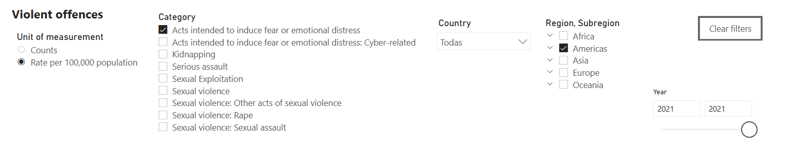
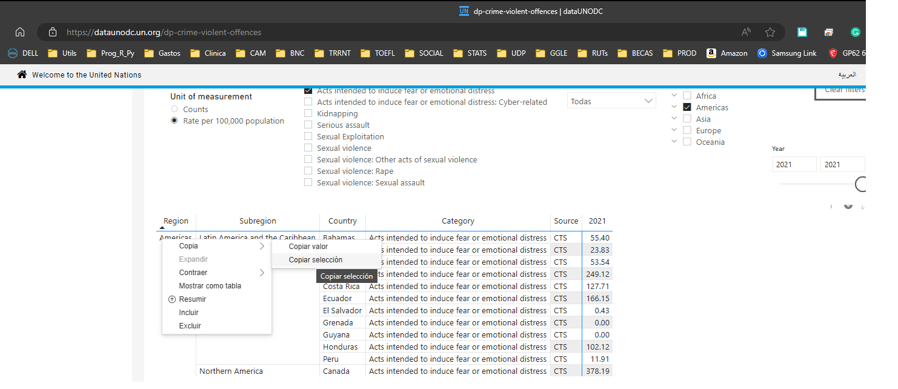

<!---
output:
  pdf_document:
    latex_engine: xelatex
    toc: true
    number_sections: true
--->

```{css zoom-lib-src, echo = FALSE}
script src = "https://ajax.googleapis.com/ajax/libs/jquery/3.4.1/jquery.min.js"
```

```{js zoom-jquery, echo = FALSE}
 $(document).ready(function() {
    $('body').prepend('<div class=\"zoomDiv\"></div>');
    // onClick function for all plots (img's)
    $('img:not(.zoomImg)').click(function() {
      $('.zoomImg').attr('src', $(this).attr('src')).css({width: '100%'});
      $('.zoomDiv').css({opacity: '1', width: 'auto', border: '1px solid white', borderRadius: '5px', position: 'fixed', top: '50%', left: '50%', marginRight: '-50%', transform: 'translate(-50%, -50%)', boxShadow: '0px 0px 50px #888888', zIndex: '50', overflow: 'auto', maxHeight: '100%'});
    });
    // onClick function for zoomImg
    $('img.zoomImg').click(function() {
      $('.zoomDiv').css({opacity: '0', width: '0%'}); 
    });
  });
  
```

# 1) Bases teóricas tidyverse y ggplot 

## I.1) Indique si las uniones de funciones de tidyverse con un homólogo de una función en R base son verdaderas o falsas (justifique las falsas)

- Verdadero - Falso = merge y select
- Verdadero - Falso = arrange y transform
- Verdadero - Falso = left_join y merge
- Verdadero - Falso = filter y subset
- Verdadero - Falso = summarise y order

```{r, include=F}
#F, F, V, T, F
```

## I.2) Elección de alternativas:

- **Instale el paquete "tidyr", busque la base de datos con título "Some data about the Smith family." y complete la siguiente función "unite(smiths, "edad_peso", c("age", "weight"))". ¿Cuál es el resultado para Mary Smith?**

a) NA_NA, b) NANA, c) 33_90, d) 3390, e) entrega error: no corre y se reinicia el computador

- **Instale el paquete ("ggplot2"), busque los datos titulados "2d Density Estimate Of Old Faithful Data" y ocupe el comando "qplot" para obtener la densidad ("density"). ¿Qué gráfico representa el resultado de esta operación?**

a)
```{r, echo=F, out.width="50%"}
knitr::include_graphics('./_figs/ggplot2_resp1.png')
```

b)
```{r, echo=F, out.width="50%"}
knitr::include_graphics('./_figs/ggplot2_resp2.png')
```

c)
```{r, echo=F, out.width="50%"}
knitr::include_graphics('./_figs/ggplot2_resp3.png')
```

- **Corra el siguiente código (active la librería que deba activar):** `data("women"); ggplot(women)+ geom_line( aes(height, weight))`**, ¿qué es lo que hace `geom_line` en este contexto?**

a) De los datos women, traza una línea de height y weight en los ejes X e Y, respectivamente

b) Proporciona las líneas horizontales y verticales del gráfico

c) Separa las observaciones que están a la izquierda de las que están en la derecha


<br>

# 2) Aplicación: Trauma ocular

```{r 0, echo=T, message=T, error=T, eval=T, results='hold'}
### 0. Limpiar completamente el entorno global environment
rm(list = ls()) 

### 1. Cargar y activar paquetes 

#si carga dplyr, aunque no era necesario
if(!require(dplyr)){install.packages("dplyr")}
#si carga todos los paquetes compuestos por tidyverse
if(!require(tidyverse)){install.packages("tidyverse")}
```

Importe la siguiente base de datos

```{r, error=T}
data15a64_rn_ratio_its <- 
  haven::read_dta("https://drive.google.com/uc?export=download&id=1IJ-fkYu3JMKaN5hVcFhuKhOBwYkQVWWw")

# si no funciona: if(!require(rio)){install.packages("rio")}; require(rio);rio::import("https://drive.google.com/uc?export=download&id=1IJ-fkYu3JMKaN5hVcFhuKhOBwYkQVWWw")
```

El estudio buscaba determinar si durante el período de mayor confrontación entre  protestantes y carabineros en Santiago, hubo un incremento en las admisiones a  servicios de urgencia debido a lesiones o eventos traumáticos relacionados con las manifestaciones. Se planteó que, además, las dificultades de acceso a la  atención médica durante este período podrían haber llevado a un retraso en las consultas, resultando en una mayor gravedad de los casos presentados y, por ende, en una mayor necesidad de hospitalización.
 
Se usaron datos estadísticos semanales de enero de 2015 a diciembre de 2019, enfocándose en admisiones por causas traumáticas y del sistema respiratorio de personas entre 15 y 64 años. Se tomaron registros de tres servicios públicos de urgencia cercanos a Plaza Italia, centro de las protestas: Posta Central, Hospital del Salvador y Hospital San José. No se tuvieron en cuenta clínicas privadas ni el hospital de Carabineros por falta de acceso a sus datos.
 
Con esta información, se construyó una serie temporal que considera 10 semanas de exposición a las protestas, desde el 18 de octubre hasta finales de 2019. 

1) **Entregue valores descriptivos como media, desviación estándar, percentiles 25, 50 y 75 y utilizando tidyverse, de la razón de las hospitalizaciones (`hosp_trauma`) por  #consultas (`cons_trauma`), antes del evento de interés (2019-10-18, pero entendiendo que se agruparon los recuentos por semanas, el primer día de la semana siguiente fue 2019-10-21) (variable `did`) qué puede interpretar de lo siguiente?**

```{r, include=F}
data15a64_rn_ratio_its %>%
  dplyr::mutate(hosp_cons= hosp_trauma/cons_trauma) %>%
  dplyr::group_by(did) %>%
  dplyr::summarise(mean_hosp_cons=mean(hosp_cons,na.rm=T),
                   sd_hosp_cons=sd(hosp_cons,na.rm=T),
                   p25=quantile(hosp_cons,.25,na.rm=T),
                   p50=quantile(hosp_cons,.5,na.rm=T),
                   p75=quantile(hosp_cons,.75,na.rm=T))
```


2) **Diseñe un grafico con la razón de las hospitalizaciones por consultas, de acuerdo a la semana ("date") añada etiquetas a los ejes añada un título añada una temática clásica punto adicional: añada una linea vertical que marca el evento de interés (2019-10-18), en rojo y con un ancho de 1**

```{r, include=F}
  dplyr::mutate(data15a64_rn_ratio_its, hosp_cons= hosp_trauma/cons_trauma) %>%
  ggplot()+
  geom_line(aes(x=date, y=hosp_cons, group=1))+
    geom_vline(aes(xintercept = as.Date("2018-10-18")), color="red", linewidth=1) +
    theme_classic()+
    labs(x="Fecha", y="Razón de hospitalizaciones por consultas", title="Gráfico")
```


<br>

# 2) Aplicación: Delitos violentos

Utilizando los datos de delitos violentos y sexuales, (UNODC (2023), Portal de Investigación de la UNODC - Datos sobre Delitos Violentos y Sexuales. https://dataunodc.un.org/dp-crime-violent-offences (Accedido el [26 Septiembre 2023])), 

**Información de Metadatos UNODC - Delitos Violentos y Sexuales**: Las tablas sobre delitos violentos y sexuales incluyen cifras nacionales sobre delitos y víctimas de delitos seleccionados registrados por la policía u otras agencias de aplicación de la ley. #Estos datos son enviados por los Estados Miembros a través de la Encuesta de las Naciones Unidas sobre Tendencias del Delito y Operaciones de los Sistemas de Justicia Penal (UN-#CTS) u otros medios.

Características del conjunto de datos: Enlace de acceso: https://dataunodc.un.org/dp-crime-violent-offences; Última actualización: 12/05/2023; Periodo base: Año calendario; Fuentes de datos: Datos nacionales sobre delitos y víctimas recopilados a través de la Encuesta de las Naciones Unidas sobre Tendencias del Delito y Sistemas de Justicia Penal, datos de #población de UN DESA, División de Población.

Acts intended to induce fear of emotional distress (ICCS 0208): Actos destinados a inducir miedo o angustia emocional (ICCS 0208): Miedo o angustia emocional causada por el comportamiento o acto de una persona. La angustia emocional, como mínimo, es dolor mental o psicológico.

```{r, echo=F, out.width="99%"}

```
Para bajar la base, úbiquese en la columna Región e indique "copiar selección" y luego importar la base: `unodc<-read.delim("clipboard")`

```{r, echo=F, out.width="99%"}

```

Péguelo en un excel. 
(Si puede, puede obtener la base de datos desde aquí: https://dataunodc.un.org/sites/dataunodc.un.org/files/data_cts_violent_and_sexual_crime.xlsx y  filtrarla manualmente, mejor)

1)
**Utilizando tidyverse, genere un gráfico de barras con las tasas por cada 100.000 habitantes de los actos destinados a inducir miedo o angustia emocional de los estados de la región de las Américas el año 2021.**
1) Las etiquetas del eje x deben indicar el nombre del país, ya sea abreviado (código ISO3) o completo.
2) Los países deben estar ordenados de mayor a menor tasa.
3) Punto adicional: El eje Y debe estar en escala logarítmica

```{r, include=F, error=T}

unodc <- cbind.data.frame(
    Region = c("Americas", "Americas", "Americas", "Americas", "Americas", "Americas", "Americas", "Americas", "Americas", "Americas", "Americas", "Americas"),
    Subregion = c("Latin America and the Caribbean", "Latin America and the Caribbean", "Latin America and the Caribbean", "Latin America and the Caribbean", "Latin America and the Caribbean", "Latin America and the Caribbean", "Latin America and the Caribbean", "Latin America and the Caribbean", "Latin America and the Caribbean", "Latin America and the Caribbean", "Latin America and the Caribbean", "Northern America"),
    Country = c("Bahamas", "Barbados", "Chile", "Colombia", "Costa Rica", "Ecuador", "El Salvador", "Grenada", "Guyana", "Honduras", "Peru", "Canada"),
    Category = c("Acts intended to induce fear or emotional distress", "Acts intended to induce fear or emotional distress", "Acts intended to induce fear or emotional distress", "Acts intended to induce fear or emotional distress", "Acts intended to induce fear or emotional distress", "Acts intended to induce fear or emotional distress", "Acts intended to induce fear or emotional distress", "Acts intended to induce fear or emotional distress", "Acts intended to induce fear or emotional distress", "Acts intended to induce fear or emotional distress", "Acts intended to induce fear or emotional distress", "Acts intended to induce fear or emotional distress"),
    Source = c("CTS", "CTS", "CTS", "CTS", "CTS", "CTS", "CTS", "CTS", "CTS", "CTS", "CTS", "CTS"),
    Year = c(2021, 2021, 2021, 2021, 2021, 2021, 2021, 2021, 2021, 2021, 2021, 2021),
    Primera.fecha..Value.fmt = c(55.40, 23.83, 53.54, 249.12, 127.71, 166.15, 0.43, 0.00, 0.00, 102.12, 11.91, 378.19)
)

unodc %>% 
  # Genero el gráfico de barras
  ggplot(aes(x = reorder(Country, desc(Primera.fecha..Value.fmt)), y =Primera.fecha..Value.fmt)) +
  geom_bar(stat = "identity") +
  scale_y_log10() +  # Dejo el eje Y en escaa log
  #añadir las etiquetas de ejes y títulos
  labs(title = "Tasa de Violencia Sexual por 100,000 habitantes en las Américas (2021)",
       x = "País",
       y = "Tasa (Logarítmica)") +
  theme_minimal()
```

**Punto adicional**: genere este archivo en formato Rmarkdown.

