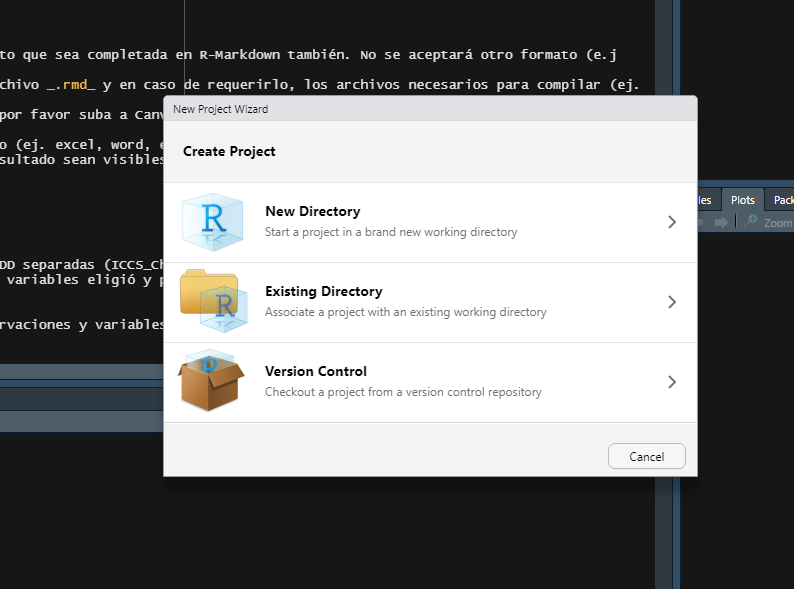

```{css zoom-lib-src, echo = FALSE}
script src = "https://ajax.googleapis.com/ajax/libs/jquery/3.4.1/jquery.min.js"
```

```{js zoom-jquery, echo = FALSE}
 $(document).ready(function() {
    $('body').prepend('<div class=\"zoomDiv\"></div>');
    // onClick function for all plots (img's)
    $('img:not(.zoomImg)').click(function() {
      $('.zoomImg').attr('src', $(this).attr('src')).css({width: '100%'});
      $('.zoomDiv').css({opacity: '1', width: 'auto', border: '1px solid white', borderRadius: '5px', position: 'fixed', top: '50%', left: '50%', marginRight: '-50%', transform: 'translate(-50%, -50%)', boxShadow: '0px 0px 50px #888888', zIndex: '50', overflow: 'auto', maxHeight: '100%'});
    });
    // onClick function for zoomImg
    $('img.zoomImg').click(function() {
      $('.zoomDiv').css({opacity: '0', width: '0%'}); 
    });
  });
```

<style type="text/css">
.tablelines table, .tablelines td, .tablelines th {
        border: 1px solid black;
        }
.centrado {
    text-align: center;
}
.table.center {
    margin-left:auto; 
    margin-right:auto;
  }
.table_wrapper{
    display: block;g
    overflow-x: auto;
    white-space: nowrap;
}
code.r{
  font-size: 8px;
}
body{ /* Normal  */
      text-align: justify;
  }
.superbigimage{
    overflow-y:scroll;
    white-space: nowrap;
}
.superbigimage img{
    overflow-y: scroll;
    overflow-x: hidden;
}
</style>


```{r setup, include=T}
# output:
  # pdf_document:
  #   highlight: pygments
  #   number_sections: yes
  #   toc: yes
  #   toc_depth: 4
  #   keep_tex: yes
  #   fig_height: 6
  #   fig_width: 8
  #   latex_engine: xelatex
rm(list=ls());gc() #Siempre es necesario borrar la memoria de 0 antes de correr un proyecto. 
#Lo anterior para chequear que no hayan objetos (información como bases de datos, 
#nombres de columnas, etiquetas, etc.) anidados que no estamos llamando, 
unlink('*_cache', recursive = TRUE) #También limpiamos la memoria caché de cualquier otro elemento 
#que esté alojado en nuestra memoria. Recuerde que quien abra su proyecto no 
#contará con otro objeto que los que llame conforme a las instrucciones que escriba en el documento.

#Veo desde donde consigo los datos, desde que servidor de R
# Esta es una de las direcciones del CRAN (Comprehensive R Archive Network) correspondiente a Chile. 
#Es recomendable definir por defecto un CRAN cercano. 
options(repos=structure(c(CRAN="https://cran.dcc.uchile.cl/"))) 

knitr::opts_chunk$set(echo = TRUE)

#instalo lo que instala paquetes
if(!require(pacman)){install.packages("pacman")}
#INSTALO PAQUETES
pacman::p_load(knitr, dplyr)
if(!require(tiktokrmd)){remotes::install_github("gadenbuie/tiktokrmd@main")}

```


# Cómo bajar R y Rstudio


<div class="warning" style='padding:0.1em; background-color:#acdce3; color:#12636B'>
<span>
<p style='margin-top:1.5em; text-align:center'>
Este tutorial sólo es **uno de muchos que usted podrá encontrar para instalar estos programas**. Posiblemente, existan alternativas mucho más personalizadas para instalar R y Rstudio en línea. Ahora bien, creo firmemente en que esta es la opción más **rápida y simple** de instalarlos, por lo que recomiendo que en una primera instancia **no se aleje de las instrucciones**, de lo contrario tendrá problemas para instalar el programa y no podrá avanzar en las etapas del taller.
</span>
</div>

<br>

## Paso 1: Bajar R

Haga click en el siguiente enlace si usted tiene de sistema operativo Windows <https://cran.r-project.org/bin/windows/base/>. Posiblemente y si se lo solicita el programa, una vez que instale R y Rstudio deberá instalar Rtools (<https://cran.r-project.org/bin/windows/Rtools/>). **Pueda dar doble click para acercar la imagen si abre este archivo en .html**

```{r Fig Instalacion_win_prin, fig.align="center", message=FALSE, warning=FALSE, cache=T, echo =F}
knitr::include_graphics("./_figs/Instalacion R- Win (0).png")
```

Si usted tiene un MAC, favor dirigirse a este enlace: <https://cran.r-project.org/bin/macosx/>.

```{r Fig Instalacion_mac_prin, fig.align="center", message=FALSE, warning=FALSE, cache=T, echo =F}
knitr::include_graphics("./_figs/Instalacion R- MAC (0).png")
```

O por último, puede encontrar aquí una alternativa plausible para MacOS para bajar R y Rstudio:

```{r Fig tiktok1, fig.align="center", message=FALSE, warning=FALSE, cache=T, echo =F, error=T, eval=F}
tt_url <- "https://www.tiktok.com/@ivelasq3/video/7027084397421546758"
tt <- tiktok_embed(tt_url)
tt
```


**Advertencia:** Favor siga las instrucciones al momento de bajar los archivos. Es necesario que instale en primer lugar R commander, y posteriormente RStudio. Si usted ya bajó una versión de R o RStudio que no ha funcionado bien, que cree muy desactualizada o que nunca supo ocupar, **favor desinstalarlo(s) y reiniciar su computador**.

## Paso 2: Instalar R (ejemplo en Windows)

A continuación, pueden ver las capturas de pantalla de una instalación en windows. Favor seguir todos los pasos.

```{r Fig Instalacion2, fig.align="center", message=FALSE, warning=FALSE, cache=T, echo =F}
knitr::include_graphics("./_figs/Instalacion R- Win (2).png")
```

```{r  Fig Instalacion3, warning=FALSE, fig.align = "center", message=F, cache=T, echo =F}
knitr::include_graphics("./_figs/Instalacion R- Win (3).png")
```


```{r  Fig Instalacion4, warning=FALSE, fig.align = "center", message=F, cache=T, echo =F}
knitr::include_graphics("./_figs/Instalacion R- Win (4).png")
```

```{r  Fig Instalacion5, warning=FALSE, fig.align = "center", message=F, cache=T, echo =F}
knitr::include_graphics("./_figs/Instalacion R- Win (5).png")
```

```{r  Fig Instalacion6, warning=FALSE, fig.align = "center", message=F, cache=T, echo =F}
knitr::include_graphics("./_figs/Instalacion R- Win (6).png")
```

```{r  Fig Instalacion7, warning=FALSE, fig.align = "center", message=F, cache=T, echo =F}
knitr::include_graphics("./_figs/Instalacion R- Win (7).png")
```

**Observación:** Favor no abrir R directamente, sino sólo a través de R Studio. Dejar vacío los cuadros contorneados por la línea roja.

```{r  Fig Instalacion8, warning=FALSE, fig.align = "center", message=F, cache=T, out.width="60%", echo =F}
knitr::include_graphics("./_figs/Instalacion R- Win (8).png")
```


## Paso 3: Bajar e instalar RStudio

Una vez **reiniciado el computador** y habiendo cumplido con el paso previo, diríjase al siguiente enlace (<https://rstudio.com/products/rstudio/download/#download>). Seleccione el instalador que se adapte a la capacidad de su computador. Debe tener en cuenta que si su computador no se encuentra actualizado a sistemas operativos más recientes, no podrá contar con la última versión de los productos presetados aquí.

```{r  Fig pag_install_rstudio, warning=FALSE, fig.align = "center", message=F, cache=T, out.width="60%", echo =F}
knitr::include_graphics("./_figs/Instalacion R- Win (9).png")
```


A continuación se muestra cómo bajarlo para Windows:

```{r  Fig Instalacion_RStudio, warning=FALSE, fig.align = "center", message=F, cache=T, echo =F, error=T}

```

Una vez ya bajado de internet, favor abrir y apretar el botón siguiente en todos sus campos. **Observación**: Existen opciones para personalizar las acciones que hicimos aquí. De todas formas este es un taller introductorio, por lo que no se ahondarán en estas alternativas.

```{r  Fig Instalacion_RStudio2, warning=FALSE, fig.align = "center", message=F, cache=T, echo =F, error=T}

```

**Reinicie el computador una vez finalizada la instalación**
 
## Paso 4: Prueba (Opcional)

Abra una nueva sesión en Rstudio (abra el programa).

Habiendo cumplido con el paso previo, abra R Studio y corra el siguiente comando en la Consola (siga los pasos de la imagen): `install.packages("janitor")`.

```{r  Fig Instalacion_RStudio3, warning=FALSE, fig.align = "center", message=F, cache=T, echo =F, error=T}
knitr::include_graphics("./_figs/instalacion_Rstudio3.gif")
```

¿Obtuvo el siguiente mensaje?, si lo obtuvo es porque la instalación fue exitosa.

```{r  Fig Instalacion_RStudio_comprobacion, warning=FALSE, fig.align = "center", message=F, cache=T, echo =F}
knitr::include_graphics("./_figs/Instalacion_final.png")
```

## Comentarios y Dificultades del Proceso de Instalación

Si presenta problemas, favor dirigirse al siguiente enlace y reportarlo:
<span style="background-color: #FFFF00">
[**ENLACE**](https://docs.google.com/forms/d/e/1FAIpQLSdPhIwiY_7at09GM-KkAgklmWHamWcWaPY-yeoPVMoWeIRI2w/viewform?usp=sf_link)
</span>

Si requiere instalar en Ubuntu, favor ver el siguiente enlace: https://www.digitalocean.com/community/tutorials/how-to-install-r-on-ubuntu-20-04

<br>

---

# ¿Cómo hacer un proyecto?

- RStudio tiene la gran ventaja de que permite diferenciar proyectos en que el entorno será distinto

<div class="warning" style='padding:0.1em; background-color:#acdce3; color:#12636B'>
<span>
<p style='margin-top:1.5em; text-align:center'>
**ES MUY IMPORTANTE QUE DEFINAN UNA CARPETA PARA CADA UNO DE SUS PROYECTOS. ES UNA MUY BUENA PRÁCTICA. PORQUE ASÍ LES VA A LEER DE MANERA MÁS FÁCIL LOS ARCHIVOS COMO IMAGENES QUE QUIERAN CARGAR, BASES DE DATOS, ETC.**
</span>
</div>

## Paso 1. Nuevo proyecto

- Abro Rstudio, voy a la carpeta y abro New Project (**haga click en las imágenes para ampliarlas, si lo abren en .html**).

```{r 1, eval=T, echo=T, out.width="60%", fig.align="center"}
knitr::include_graphics("./_figs/1.PNG")
```

- Si les aparece este mensaje, en lo posible intenten no guardar. La gracia es que todo esté guardado en código. De todas formas, fíjense bien en que no pierdan información. Si no, guarden por si acaso.

<br>

```{r 2, eval=T,echo=T, out.width="60%", fig.align="center"}

```

- Van aquí y ponen "New Directory (Nuevo directorio/carpeta)", si es que quieren empezar el proyecto en una nueva carpeta, o "Existing Directory (Directorio existente)", si es que quieren hacerlo en una carpeta que ya tienen. En este ejemplo lo hacemos en un New Directory. Este directorio será el mismo cuando utilicemos `getwd()`. Esto además hace no necesario utilizar `setwd()`

<br>

```{r 3, eval=T,echo=T, out.width="60%", fig.align="center"}

```

- Ahí defino el nombre de la carpeta, dentro de qué carpeta estará, y si la abriré en otra sesión (en otra ventana de Rstudio).

<br>

```{r 4, eval=T,echo=T, out.width="60%", fig.align="center"}

```

- Se abre la nueva ventana. Aquí todavía no tenemos ningún archivo en la carpeta del directorio. Si no se ve de esta forma puede dar click a `Cntrl+ Alt+ Shift+ 0` en Windows, y `Cmd+ Alt+ Shift+ 0` en Mac, para ver los cuatro principales módulos de R.

<br>

## Paso 2. Abriendo código

<br>

```{r 5, eval=T,echo=T, out.width="60%", fig.align="center"}

```

- Puede abrir un archivo ya sea generando una libreta de texto abierto, o bien cargar otro archivo un .RMD (en este ejemplo. )

<br>

```{r 6, eval=T,echo=T, out.width="60%", fig.align="center"}

```

- Vamos a abrir un archivo.

<br>

```{r 7, eval=T,echo=T, out.width="60%", fig.align="center"}

```


- Antes decidí incorporar a la carpeta el Rmarkdown (.RMD) en la carpeta de mi proyecto como buena práctica.

<br>

```{r 8, eval=T,echo=T, out.width="60%", fig.align="center"}

```


- Abro el .RMD

<br>

```{r 9, eval=T,echo=T, out.width="60%", fig.align="center"}

```

- Ahora, dado que en este proyecto estoy trabajando con figuras (capturas de pantalla), las incorporaré también a este carpeta aunque las dejaré en una subcarpeta llamada "figs", cosa que sea fácil llamarlas con un `knitr::include_graphics("./_figs/9.PNG")`, por ejemplo.

<br>

```{r 10, eval=T,echo=T, out.width="60%", fig.align="center"}

```

- Nos fijamos que nuestro avance quede guardado en nuestro *RMarkdown*, siempre que podamos. Ya sea con el disco duro redondeado o presionando `Cntrl+S`.

<br>

```{r 11, eval=T,echo=T, out.width="60%", fig.align="center"}

```

## Paso 3. Probar el código

- Si queremos probar nuestro código, a ver si funciona. Debemos seleccionar el botón con la flecha para abajo `All chunks above`, para correr todos los chunks anteriores, o bien la flecha verde a la derecha para sólo desplegar (`Run current chunk`).

<br>

```{r 12, eval=T,echo=T, out.width="60%", fig.align="center"}

```

 - Vemos si hay errores en los chunks. Si no los hay, podemos generar un chunk nuevo cargando las variables. En este caso instalo `pacman`, y cargo `knitr` y `dplyr`. Luego cargo la base de datos `mtcars` del paquete dplyr.
  
<br>

```{r 13, eval=T,echo=T, out.width="60%", fig.align="center"}
if(!require(pacman)){install.packages("pacman")}
#INSTALO PAQUETES
pacman::p_load(knitr, dplyr)
#Traigo la base mtcars
data(mtcars)
```

```{r 13b, eval=T,echo=T, out.width="60%", fig.align="center"}

```

- Ahora tendré la base de datos como promesa (`promise`) arriba. Si le doy a escribir la estructura usando en la consola `str(mtcars)`, me aparecerá en mi entorno.

<br>

```{r 14a, eval=T,echo=T, out.width="60%", fig.align="center"}

```

```{r 14b, eval=T,echo=T, out.width="60%", fig.align="center"}

```


- Una vez que tengo mi base de datos lista, además de guardar mi Rmarkdown (Cntrl+ S), puedo guardar mis datos de R para cargarlos a futuro. Recuerde que el formato de los datos guardados será `*.RData`.

<br>

```{r 15, eval=T,echo=T, out.width="60%", fig.align="center"}

```

- Una vez que tengo mi base de datos lista, además de guardar mi Rmarkdown (Cntrl+ S), puedo guardar mis datos de R para cargarlos a futuro. Recuerde que el formato de los datos guardados será `*.RData`.

<br>

## Paso 4. Cerrar proyecto

```{r 16, eval=T,echo=T, out.width="60%", fig.align="center"}

```

- Ahora que guardamos todo, podemos cerrar el proyecto (cerrar R). Si se fijan, nos abrirá automáticamente el último proyecto abierto (en nuestro caso, este). Debemos **siempre generar un proyecto nuevo, ojalá en otra carpeta, siempre que trabajemos en una tarea distinta**. Por lo mismo, debemos siempre seguir los pasos aquí, y partir nuestro proyecto limpiando el entorno, y limpiando el espacio virtual (la RAM)  `rm(list=ls());gc()`.

<br>


